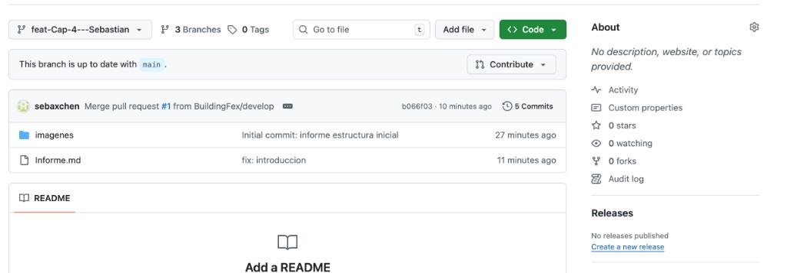

# 🏢 BuildingFex – Plataforma SaaS para Administración de Edificios y Condominios

**Universidad Peruana de Ciencias Aplicadas**

| | |
| --- | --- |
| **Curso** | Ingeniería de Software |
| **Código** | Aplicaciones Web - Virtual 1ASI0730-2610-10203 |
| **NRC** | 2610 |
| **Profesor** | Alex Humberto Sánchez Ponce |
| **Documento** | Informe de Trabajo Final (entrega TB1) |
| **Ciclo** | 2026-01 |
| **Facultad** | Facultad de Ingeniería |

**Startup:** BuildingFex  
**Producto:** Plataforma SaaS para administración de edificios y condominios  

### Problema a resolver

Las administradoras de edificios y las juntas de propietarios gestionan presupuestos de miles de dólares mensuales usando herramientas obsoletas e informales (Excel, grupos de WhatsApp, cuadernos físicos), donde:

- La comunicación con los vecinos es caótica y propensa a conflictos.
- Existe un alto índice de morosidad debido a la fricción manual para cobrar.
- No hay transparencia en tiempo real sobre el uso del dinero del mantenimiento.
- La reserva de áreas comunes y el control de visitas generan problemas diarios en recepción.

### Integrantes del equipo

| Miembro | Código |
| --- | --- |
| Sebastian Martin Beingolea Montalvo | U202217853 |
| Villanueva Rodríguez Giuseppe Adrián | U20221c554 |
| Saul Ortega Muñoz | U20231c019 |
| Alejandro Manuel Jave Chang | U202312510 |
| Valentin Nicolas Medina Mamani | U202316829 |

*Diciembre 2025*

---

## Registro de versiones del informe

El objetivo de esta sección es resumir las modificaciones relevantes que se realizan al informe durante el ciclo de vida del proyecto.

| Versión | Fecha | Autor | Descripción de modificación |
| --- | --- | --- | --- |
| 0.1 | 08/09/2025 | Saul Ortega Muñoz | Creación y primera versión del informe |
| 0.2 | 17/09/2025 | Sebastian Martin Beingolea Montalvo | Se añadió el Capítulo 1 en su totalidad |
| 0.3 | 18/09/2025 | Villanueva Rodríguez Giuseppe Adrián, Saul Ortega Muñoz, Valentin Nicolas Medina Mamani | Se desarrolló el Landing Page |
| 0.4 | 19/09/2025 | Alejandro Manuel Jave Chang | Se añadió el Capítulo 2 en su totalidad |
| 0.5 | 19/09/2025 | Valentin Nicolas Medina Mamani | Se añadió el Capítulo 3 en su totalidad |
| 0.6 | 19/09/2025 | Villanueva Rodríguez Giuseppe Adrián | Se añadió el Capítulo 4 en su totalidad |
| 0.7 | 19/09/2025 | Saul Ortega Muñoz | Se añadió el Capítulo 5 en su totalidad |

---

## Project Report Collaboration Insights

En esta sección, el equipo presenta un análisis de la colaboración durante el desarrollo del informe del proyecto en el marco de la **TB1**. Se describe el progreso alcanzado, el trabajo individual y colectivo, los commits realizados y las evidencias gráficas del flujo colaborativo en GitHub.

Se detalla el trabajo realizado en esta entrega, con evidencias visuales de participación en el repositorio del report en GitHub y un resumen de los principales commits del equipo.

### Enlaces del proyecto (alcance TB1)

| Recurso | Enlace |
| --- | --- |
| Reporte del equipo | [BuildingFex — Report](https://github.com/BuildingFex/Report.git) |
| Landing page | [BuildingFex — LandingPage](https://github.com/BuildingFex/LandingPage.git) |

---

### TB1

La entrega del **TB1** finalizó con éxito y está documentada en el repositorio de GitHub de la organización del equipo:

- **Organización:** [BuildingFex](https://github.com/BuildingFex)

Durante el desarrollo del informe se siguieron estos lineamientos:

- Los contenidos asignados a cada miembro fueron redactados en **Markdown**, con presentación clara y estandarizada.
- Cada cambio quedó respaldado con **commits** en el repositorio (trazabilidad y control de versiones).
- Se crearon los artefactos con las herramientas recomendadas.
- Las imágenes se obtuvieron desde la carpeta `assets` o desde **Imgur** para su integración en el informe.
- Hubo reuniones periódicas para coordinar el informe y el avance del **Sprint 1** (alcance inicial y diseño preliminar).

Los cambios están alineados con el **Registro de versiones** y reflejan el trabajo colaborativo del equipo.

Este historial coincide con el trabajo del TB1 y muestra el avance continuo y colaborativo del informe.

#### Actividad en GitHub — TB1 (septiembre 2025)

Gráfico de actividad durante la preparación del TB1. Los commits reflejan progreso constante y colaboración entre integrantes.

| Evidencia | Descripción |
| --- | --- |
| Actividad TB-1 Report (BuildingFex) |  |
| Actividad TB-1 Landing (BuildingFex) | *(pendiente: captura del repositorio del landing)* |
| Commits TB-1 Report | *(pendiente: captura de commits del reporte)* |
| Network TB-1 | *(pendiente: network graph del reporte)* |
| Network TB-1 Landing | *(pendiente: network graph del landing)* |

*Nota: las rutas de imagen son relativas a este archivo; convención ``.*

---

## Contenido

### Registro de versiones del informe

*(Sección anterior en este documento.)*

### Project Report Collaboration Insights

*(Sección anterior en este documento.)*

### Student Outcome

*(Ver sección [Student Outcome](#student-outcome).)*

### Capítulo I: Introducción

- 1.1 Startup Profile  
  - 1.1.1 Descripción de la Startup  
  - 1.1.2 Perfiles de integrantes del equipo  
- 1.2 Solution Profile  
  - 1.2.1 Antecedentes y problemática  
  - 1.2.2 Lean UX Process  
    - 1.2.2.1 Lean UX Problem Statements  
    - 1.2.2.2 Lean UX Assumptions  
    - 1.2.2.3 Lean UX Hypothesis Statements  
    - 1.2.2.4 Lean UX Canvas  
- 1.3 Segmentos objetivo  

### Capítulo II: Requirements Elicitation & Analysis

- 2.1 Competidores  
  - 2.1.1 Análisis competitivo  
  - 2.1.2 Estrategias y tácticas frente a competidores  
- 2.2 Entrevistas  
  - 2.2.1 Diseño de entrevistas  
  - 2.2.2 Registro de entrevistas  
  - 2.2.3 Análisis de entrevistas  
- 2.3 Needfinding  
  - 2.3.1 User Personas  
  - 2.3.2 User Task Matrix  
  - 2.3.3 User Journey Mapping  
  - 2.3.4 Empathy Mapping  
  - 2.3.5 As-is Scenario Mapping  
- 2.4 Ubiquitous Language  

### Capítulo III: Requirements Specification

- 3.1 To-Be Scenario Mapping  
- 3.2 User Stories  
- 3.3 Impact Mapping  
- 3.4 Product Backlog  

### Capítulo IV: Product Design

- 4.1 Style Guidelines  
  - 4.1.1 General Style Guidelines  
  - 4.1.2 Web Style Guidelines  
- 4.2 Information Architecture  
  - 4.2.1 Organization Systems  
  - 4.2.2 Labeling Systems  
  - 4.2.3 SEO Tags and Meta Tag  
  - 4.2.4 Searching Systems  
  - 4.2.5 Navigation Systems  
- 4.3 Landing Page UI Design  
  - 4.3.1 Landing Page Wireframe  
  - 4.3.2 Landing Page Mock-up  
- 4.4 Web Applications UX/UI Design  
  - 4.4.1 Web Applications Wireframes  
  - 4.4.2 Web Applications Wireflow Diagrams  
  - 4.4.3 Web Applications Mock-ups  
  - 4.4.4 Web Applications User Flow Diagrams  
- 4.5 Web Applications Prototyping  
- 4.6 Domain-Driven Software Architecture  
  - 4.6.1 Software Architecture Context Diagram  
  - 4.6.2 Software Architecture Container Diagrams  
  - 4.6.3 Software Architecture Components Diagrams  
- 4.7 Software Object-Oriented Design  
  - 4.7.1 Class Diagrams  
  - 4.7.2 Class Dictionary  
- 4.8 Database Design  
  - 4.8.1 Database Diagram  

### Capítulo V: Product Implementation, Validation & Deployment

- 5.1 Software Configuration Management  
  - 5.1.1 Software Development Environment Configuration  
  - 5.1.2 Source Code Management  
  - 5.1.3 Source Code Style Guide & Conventions  
  - 5.1.4 Software Deployment Configuration  
- 5.2 Landing Page, Services & Applications Implementation  
  - 5.2.1 Sprint 1 *(alcance TB1)*  
- 5.3 Validation Interviews  
  - 5.3.1 Diseño de entrevistas  
  - 5.3.2 Registro de entrevistas  
  - 5.3.3 Validación según heurísticas  

### Bibliografía

*(Contenido según el cuerpo del informe.)*

### Anexos

*(Contenido según el cuerpo del informe.)*

---

## Student Outcome

En esta sección se presenta la relación entre el trabajo realizado por el equipo y las dimensiones del Student Outcome establecido. Cada integrante ha colaborado en la redacción conjunta de los sustentos y evidencias que demuestran cómo las actividades desarrolladas en la **TB1** han contribuido al logro de este objetivo. A través de las acciones individuales y colectivas, se busca evidenciar de manera clara y organizada el impacto del proyecto en el desarrollo de las competencias señaladas.

### Comunica oralmente con efectividad a diferentes rangos de audiencia

#### Alejandro Manuel Jave Chang

**TB1:** Gracias a la TB1 he podido desarrollar mi comunicación oral, ya sea al momento de tener que llegar a un acuerdo con mi equipo o al tener que exponer y explicar mi trabajo frente a personas ajenas al proyecto.

#### Sebastian Martin Beingolea Montalvo

**TB1:** Gracias a la TB1 pude mejorar mi comunicación oral, ya que tuve que explicar ideas en reuniones de equipo y presentar avances del proyecto a personas externas.

#### Villanueva Rodríguez Giuseppe Adrián

**TB1:** La TB1 me permitió desarrollar habilidades para expresar y defender mis puntos de vista en reuniones con el equipo y en presentaciones generales del proyecto.

#### Saul Ortega Muñoz

**TB1:** Gracias a la TB1 practiqué cómo comunicarme verbalmente con efectividad tanto en discusiones internas con el equipo como en presentaciones externas.

#### Valentin Nicolas Medina Mamani

**TB1:** Participar en la TB1 me ayudó a expresarme mejor durante las reuniones y a comunicar avances del proyecto de manera entendible para todos.

> **Conclusión grupal:** Como grupo, concluimos que las actividades realizadas durante la TB1 fueron fundamentales para comenzar a consolidar nuestras habilidades de comunicación oral en diversos contextos. En esta etapa inicial avanzamos en expresarnos con mayor claridad y en adaptar nuestro lenguaje según la audiencia (técnica o de negocio), fortaleciendo la base para seguir desarrollando el proyecto en las siguientes entregas del curso.

### Comunica por escrito con efectividad a diferentes rangos de audiencia

#### Alejandro Manuel Jave Chang

**TB1:** Al hacer el desarrollo de este proyecto no podía estar comunicándome verbalmente con mi equipo todo el tiempo, así que tuve que empezar a comunicar mis ideas de manera escrita de forma concisa y clara, no solo con mensajes para mi equipo sino también para comunicarme con distintas personas que no podía hacerlo en persona.

#### Sebastian Martin Beingolea Montalvo

**TB1:** Durante el proyecto tuve que comunicarme constantemente por escrito, lo que me ayudó a expresar mis ideas de manera clara y precisa para mi equipo y otras áreas interesadas.

#### Villanueva Rodríguez Giuseppe Adrián

**TB1:** Aprendí a redactar mensajes y reportes con información clara y organizada para distintos públicos involucrados en el proyecto.

#### Saul Ortega Muñoz

**TB1:** Tuve que elaborar comunicaciones escritas dirigidas a diferentes personas, lo que mejoró mi habilidad para transmitir ideas de manera breve y clara.

#### Valentin Nicolas Medina Mamani

**TB1:** Durante el proyecto aprendí a sintetizar información y a transmitirla por escrito a diferentes audiencias de manera efectiva.

> **Conclusión grupal:** Concluimos que durante la TB1 la comunicación escrita fue esencial para la coordinación del equipo y el avance del informe. Aprendimos a estructurar nuestras ideas de manera clara y a adaptar nuestros entregables a distintos destinatarios, sentando las bases para una trazabilidad y una colaboración eficientes en las fases siguientes del proyecto.

**Capítulo II: Requirements Elicitation & Analysis**

**2.1. Competidores**

### Condo Control
Es una plataforma SaaS especializada en la gestión de comunidades residenciales, principalmente en Norteamérica. Permite administrar unidades, gestionar comunicaciones internas, controlar reservas de áreas comunes y llevar registros de visitantes. También ofrece herramientas básicas de reportes y gestión operativa.

### Buildium
Plataforma digital enfocada en la administración de propiedades residenciales y asociaciones. Incluye herramientas para la gestión financiera, cobranza automatizada, generación de reportes y administración de mantenimiento.

### ComunidadFeliz
Plataforma orientada al mercado latinoamericano para la gestión de condominios. Permite gestionar cobros, comunicaciones, reservas de espacios y reportes financieros dentro de una misma plataforma.

**2.1.1. Análisis competitivo**

| | **BuildingFex** | **Condo Control** | **Buildium** | **ComunidadFeliz** |
|---|---|---|---|---|
| **Perfil** | | | | |
| *Overview* | Plataforma SaaS web para administración integral de edificios en Perú. Centraliza procesos operativos, financieros y de comunicación. | Plataforma SaaS para comunidades residenciales en Norteamérica. Permite gestionar operaciones, comunicación y reservas. | Software de gestión inmobiliaria enfocado en propiedades y asociaciones, con fuerte enfoque financiero. | Plataforma orientada a la administración de condominios en Latinoamérica, integrando cobros, comunicación y reservas. |
| *Ventaja competitiva*<br>¿Qué valor ofrece a los clientes? | - Centralización total en una sola plataforma<br>- Adaptado al contexto peruano<br>- Simplicidad y transparencia | - Mejora la organización operativa<br>- Experiencia en el mercado | - Optimización financiera y de cobros<br>- Marca consolidada | - Enfoque en LATAM<br>- Facilidad de uso en gestión de condominios |
| **Perfil de Marketing** | | | | |
| *Mercado objetivo* | Administradoras y juntas de edificios en Perú. | Condominios en EE.UU. y Canadá. | Empresas inmobiliarias y property managers. | Edificios y condominios en Latinoamérica. |
| *Estrategias de marketing* | - Marketing digital<br>- Alianzas locales<br>- Enfoque educativo del sector | - Marketing B2B tradicional y digital | - Posicionamiento global<br>- Marca fuerte | - Marketing digital regional |
| **Perfil de Producto** | | | | |
| *Productos & Servicios* | Plataforma modular: cobranza, reservas, accesos, incidencias, comunicación, etc. | Gestión de comunidad + comunicación + reservas | Gestión financiera + mantenimiento | Gestión de condominios + comunicación + reservas |
| *Precios & Costos* | Suscripción SaaS escalable (planes accesibles) | Suscripción (alto costo) | Suscripción premium | Suscripción accesible |
| *Canales de distribución* | Web (principal) | Web + móvil | Web + móvil | Web + móvil |

| **Análisis SWOT** | | | | |
|---|---|---|---|---|
| **Fortalezas** | - Plataforma todo en uno<br>- Simplicidad y buena UX<br>- Adaptado a Perú | - Plataforma robusta<br>- Experiencia en el mercado | - Fuerte en finanzas<br>- Marca consolidada | - Presencia en LATAM<br>- Adaptación regional |
| **Debilidades** | - Startup nueva<br>- Sin posicionamiento fuerte<br>- Recursos limitados | - No adaptado a Perú<br>- Costos elevados | - Complejo para usuarios no técnicos<br>- No centrado en comunidad | - Menor diferenciación<br>- Funcionalidades menos avanzadas |
| **Oportunidades** | - Baja digitalización en Perú<br>- Crecimiento del sector<br>- Adopción tecnológica | - Expansión internacional | - Crecimiento inmobiliario | - Expansión en Perú |
| **Amenazas** | - Entrada de competidores internacionales<br>- Resistencia al cambio | - Soluciones locales más adaptadas | - Plataformas más simples | - Nuevas startups locales |

**2.1.2. Estrategias y tácticas frente a competidores**

### Diferenciación por adaptación al mercado peruano
A diferencia de plataformas como Condo Control y Buildium, que están orientadas a mercados internacionales, BuildingFex se diseñará específicamente para el contexto peruano. Se integrarán métodos de pago locales, manejo en moneda nacional (PEN) y funcionalidades alineadas a la realidad de las juntas de propietarios. Esta adaptación será comunicada como un valor diferencial clave en campañas de marketing.

### Plataforma integral “todo en uno”
Mientras algunos competidores se enfocan solo en ciertos aspectos (finanzas, comunicación o gestión operativa), BuildingFex ofrecerá una solución unificada que integra cobranza, reservas, control de accesos, incidencias y comunicación en una sola plataforma. Esto permitirá reducir la dependencia de herramientas dispersas como Excel o WhatsApp, destacando la eficiencia y centralización como ventaja competitiva.

### Enfoque en transparencia y confianza como propuesta de valor
Frente a uno de los principales problemas del sector (falta de transparencia en el uso del dinero), BuildingFex destacará sus módulos de reportes financieros y trazabilidad como un elemento diferenciador clave, generando confianza entre vecinos y juntas de propietarios.

**2.2. Entrevistas**

A continuación, presentamos las preguntas diseñadas para las entrevistas de validación. Las hemos estructurado en dos bloques: un grupo de preguntas transversales para ambos segmentos (para entender el perfil general y uso de tecnología) y preguntas específicas enfocadas en los dolores particulares de cada tipo de administrador.

### Información a recolectar (transversal a los 2 segmentos)

#### 1. Datos demográficos y profesionales básicos
- ¿Cuál es su edad?
- ¿En qué distrito reside o en qué zona opera principalmente?
- ¿Cuál es su ocupación principal o cargo actual?
- ¿Cuál es su nivel educativo o formación profesional?

#### 2. Contexto de gestión y equipo de trabajo
- ¿Cuenta con el apoyo de un equipo administrativo, conserjes o contadores en su día a día?
- ¿Con qué frecuencia coordina con ellos para revisar temas del edificio?
- ¿Quién se encarga específicamente de hacer los cobros y cuadrar las cuentas?

#### 3. Estilo de trabajo y relación con la tecnología
- ¿Cómo describiría un día típico gestionando los temas del condominio?
- ¿Qué tareas administrativas le consumen más tiempo a la semana?
- ¿Cómo se considera respecto al uso de nuevas plataformas o software: le resulta fácil, regular o prefiere lo tradicional?

#### 4. Dispositivos de preferencia y canales digitales
- ¿Qué dispositivo utiliza más para gestionar el edificio: la computadora de escritorio/laptop o el celular?
- ¿Qué herramientas usa actualmente para comunicarse con los vecinos (WhatsApp, correos, murales físicos)?
- ¿Cómo prefiere organizar los datos financieros: cuadernos, Excel, algún software genérico?

#### 5. Objetivos y motivaciones
- ¿Qué es lo más importante para usted al momento de entregar las cuentas a fin de mes?
- ¿Qué le motivaría a cambiar su método actual por una plataforma digital de pago por suscripción?
- ¿Qué significa para usted tener "tranquilidad" en la gestión de un edificio?

#### 6. Frustraciones y problemas actuales
- ¿Qué dificultades reales tiene hoy en día para cobrar puntualmente el mantenimiento?
- ¿Cómo maneja actualmente el control de las reservas de áreas comunes y el registro de visitas? ¿Le genera problemas?
- ¿Cuál es la queja más frecuente que recibe por parte de los residentes?

#### 7. Background y experiencia
- ¿Podría contarme brevemente cómo empezó a administrar edificios o cómo asumió el cargo en la directiva?
- ¿Recuerda alguna "historia de terror" o conflicto grave relacionado con cuentas poco claras o vecinos morosos?
- Si pudiera, ¿qué proceso de su gestión diaria automatizaría de inmediato?

**2.2.1. Diseño de entrevistas**

### Segmento 1: Junta de Directiva (Propietarios que administran su propio edificio)

**Objetivo:**  
Entender la carga que representa administrar el edificio "ad honorem" o como tarea extra, la fricción directa con sus propios vecinos y su necesidad de una herramienta muy simple que no requiera conocimientos contables.

#### Preguntas principales
- Al ser vecino y directivo a la vez, ¿cómo maneja la incomodidad de tener que cobrarle la mora a alguien con quien se cruza en el ascensor?
- ¿Cuánto tiempo de su vida personal o fines de semana le dedica a cuadrar los pagos de mantenimiento?
- ¿Alguna vez han tenido problemas de desconfianza por parte de otros vecinos respecto a cómo se gasta el dinero?
- ¿Qué tan útil sería para la junta que el sistema aplique las multas y envíe recordatorios de pago automáticamente sin que ustedes den la cara?
- ¿Qué barreras cree que tendrían los vecinos más mayores de su edificio para usar una app para ver sus recibos?

#### Preguntas complementarias
- ¿Cómo se organizan actualmente cuando un vecino quiere reservar la zona de parrillas o el salón de usos múltiples?
- Si la directiva cambia el próximo año, ¿qué tan difícil es pasarle toda la información (cuentas, morosos, historial) a la nueva gestión?

### Segmento 2: Empresas de Gestión de Edificios (Administradores profesionales)

**Objetivo:**  
Explorar cómo manejan el volumen (varios edificios a la vez), cómo estandarizan sus procesos para no tener que contratar un contador por cada edificio nuevo, y cómo un software les ayudaría a escalar su negocio.

#### Preguntas principales
- ¿Cuántos edificios o condominios maneja su empresa actualmente en total?
- ¿Qué proceso se vuelve un "cuello de botella" cuando intentan sumar un nuevo edificio a su cartera de clientes?
- ¿Cómo consolidan actualmente la información financiera de distintos edificios para rendir cuentas a cada junta de propietarios?
- ¿Han perdido algún contrato de administración por problemas de comunicación o falta de transparencia percibida por los vecinos?
- En términos de negocio, ¿valorarían más una herramienta que les ahorre horas hombre en contabilidad, o una que mejore la experiencia del residente con una buena app?

#### Preguntas complementarias
- ¿Han intentado usar algún software de administración antes? ¿Qué les gustó o disgustó de esa experiencia?
- ¿Qué tan importante es para su empresa poder ofrecer a los condominios integraciones con pasarelas de pago o bancos locales para automatizar la conciliación?

**2.2.2. Registro de entrevistas**

### Segmento 1: Junta de Directiva (Propietarios que administran su propio edificio)

#### Entrevista 1

| Campo | Detalle |
|------|--------|
| **Segmento** | Junta de Directiva |
| **Nombre** | Ismael |
| **Apellidos** | Paredes |
| **Edad** | 73 |
| **Distrito** | Jesus Maria |
| **Screenshot** |  |
| **URL** | https://upcedupe-my.sharepoint.com/:v:/g/personal/u202316829_upc_edu_pe/IQAjOrj36WAbS7yjtkqR3BOjAYmhb5EJho0nURxlr5DQ3h0?e=ruuATc |
| **Duración** | 6:02 |
| **Resumen** | Prefiere trato personal antes que automatización en cobranzas. Maneja deudas mediante conversación y confianza directa. Percibe que la confianza reduce conflictos entre vecinos. Considera que el software puede ser útil, pero no indispensable en edificios pequeños. Tiene preocupaciones sobre privacidad y seguridad de datos. Ve la digitalización como tendencia, pero prioriza el factor humano. |

#### Entrevista 2

| Campo | Detalle |
|------|--------|
| **Segmento** | Junta de Directiva |
| **Nombre** | Antonio |
| **Apellidos** | Chan |
| **Edad** | 50 |
| **Distrito** | Jesus Maria |
| **Screenshot** |  |
| **URL** | https://upcedupe-my.sharepoint.com/:v:/g/personal/u202316829_upc_edu_pe/IQCeaFiAnHVMS4osYS6VReweAdCzF57CR0YvpEt6g_Fkdjc?e=Vk1CG6&nav=eyJyZWZlcnJhbEluZm8iOnsicmVmZXJyYWxBcHAiOiJTdHJlYW1XZWJBcHAiLCJyZWZlcnJhbFZpZXciOiJTaGFyZURpYWxvZy1MaW5rIiwicmVmZXJyYWxBcHBQbGF0Zm9ybSI6IldlYiIsInJlZmVycmFsTW9kZSI6InZpZXcifX0%3D |
| **Duración** | 5:51 |
| **Resumen** | La administración ejecuta, la junta planifica y supervisa. Dedica tiempo a presupuestos y proyección financiera. Identifica la falta de comunicación como principal problema. Reconoce la importancia de la transparencia financiera. Considera útil la automatización (recordatorios, pagos), pero como apoyo. Valora el software por su capacidad de organización y control. |

### Segmento 2: Empresas de Gestión de Edificios (Administradores profesionales)

#### Entrevista 4

| Campo | Detalle |
|------|--------|
| **Segmento** | Empresas de Gestión de Edificios |
| **Nombre** | Manuel |
| **Apellidos** | Mera |
| **Edad** | 45 |
| **Distrito** | San Borja |
| **Screenshot** |  |
| **URL** | upc-pre-202610-1asi0730-6818-BuildingFex-needfinding-sprint-4.mp4 |
| **Duración** | 17:37 |
| **Resumen** | Manuel es un profesional que trabaja de forma remota y reside en un edificio de departamentos. Relata incidentes de gas y electricidad con procesos frustrantes: depende de recomendaciones, búsquedas en Google o apoyo limitado del conserje. Su principal problema es la falta de confianza en técnicos y la dificultad para encontrar especialistas calificados rápidamente. |
| **Personalidad** | - Precavido y analítico: investiga antes de contratar.<br>- Pragmático: busca soluciones directas.<br>- Escéptico: desconfía de servicios informales. |
| **Marcas** | - WhatsApp: comunicación y contactos.<br>- Excel: control de cuentas e información. |
| **Dispositivos** | - Smartphone: comunicación y búsquedas rápidas.<br>- Laptop: trabajo e investigación. |
| **Flujos principales** | - Búsqueda y selección de confianza<br>- Gestión de la emergencia<br>- Validación y pago<br>- Post-servicio (garantía) |

#### Entrevista 5

| Campo | Detalle |
|------|--------|
| **Segmento** | Empresas de Gestión de Edificios |
| **Nombre** | Carlos |
| **Apellidos** | Chang |
| **Edad** | 24 |
| **Distrito** | San Borja |
| **Screenshot** |  |
| **URL** | upc-pre-202610-1asi0730-6818-BuildingFex-needfinding-sprint-5.mp4 |
| **Duración** | 12:12 |
| **Resumen** | Administrador general de 24 años que gestiona 18 edificios (~700 departamentos) en Lima Moderna. Depende fuertemente de procesos manuales y Excel. Su principal problema es la conciliación bancaria y la cobranza. Ve la digitalización como clave para reducir horas-hombre y escalar su negocio, siempre que el software esté adaptado al contexto peruano y automatice pagos. |
| **Personalidad** | - Pragmático y enfocado en eficiencia (busca reducir carga administrativa).<br>- Detallista y orientado a la confianza financiera.<br>- Cauteloso con software nuevo (prefiere soluciones simples e intuitivas). |
| **Marcas** | - Excel: base actual de gestión financiera.<br>- WhatsApp: comunicación operativa diaria.<br>- Yape / Plin: clave para automatizar cobros. |
| **Dispositivos** | - Laptop/PC: tareas complejas (reportes, cuentas).<br>- Smartphone: uso diario para coordinación y emergencias. |
| **Flujos principales** | - Conciliación de pagos y cobranza<br>- Gestión de reservas<br>- Onboarding de edificios<br>- Mantenimiento e incidencias |


**2.2.3. Análisis de entrevistas**

### Segmento 1: Junta de Directiva (Propietarios que administran su propio edificio)

---

#### Entrevista a Ismael Paredes

Entrevistamos al doctor **Ismael Paredes**, de 73 años, quien forma parte de la junta directiva de un edificio ubicado en el distrito de **Jesús María**. Nos comenta que cuenta con el apoyo de un equipo conformado por un abogado, contador y otros miembros de la junta, lo que le permite distribuir las responsabilidades administrativas.

En cuanto a la gestión de cobranzas, menciona que evita métodos impersonales y prefiere el trato directo con los vecinos. Señala que ha conversado personalmente con los principales deudores, logrando acuerdos basados en la confianza mutua. Considera que este enfoque ha sido efectivo y ha permitido mantener una convivencia armoniosa.

Respecto a la transparencia, reconoce que puede existir cierta desconfianza inicial por parte de algunos vecinos sobre el uso del dinero, pero afirma que esta disminuye con el tiempo a medida que se construye confianza mediante la interacción directa.

Sobre el uso de herramientas tecnológicas, comenta que ha utilizado previamente un software de administración, pero decidió dejar de usarlo debido a su costo y porque considera que, dado el tamaño del edificio, una gestión más directa resulta suficiente. Además, muestra cierta resistencia a la automatización total, especialmente en temas sensibles como la cobranza, ya que considera importante comprender la situación personal de cada vecino antes de tomar decisiones.

Sin embargo, reconoce que la integración con pasarelas de pago puede ser útil, aunque expresa preocupación por la privacidad de la información y el posible mal uso de datos financieros por terceros, especialmente en contextos de ciberseguridad.

En general, el entrevistado valora más la confianza, el trato humano y la gestión personalizada por encima de la automatización completa, aunque reconoce que existe una tendencia hacia la digitalización en la administración de edificios.

---

#### Entrevista a Antonio Chan

Entrevistamos a **Antonio Chan**, de 50 años, miembro de la junta directiva de un edificio ubicado en el distrito de **Jesús María**. Nos comenta que, a diferencia de lo que suele pensarse, la junta directiva no se encarga directamente de la cobranza, sino que esta función recae principalmente en la administración del edificio, la cual opera bajo lineamientos establecidos por la junta y aprobados en asamblea de propietarios.

En cuanto a la gestión del tiempo, señala que, aunque la administración ejecuta las operaciones diarias, la junta directiva invierte una cantidad considerable de tiempo en la planificación financiera, especialmente en la elaboración de presupuestos, proyección de gastos e ingresos, y definición de las cuotas de mantenimiento. Estas decisiones deben ser aprobadas en asamblea para su posterior ejecución.

Respecto a la confianza, menciona que uno de los principales problemas en los edificios es la falta de comunicación entre los propietarios, lo que genera desinformación, dudas y cuestionamientos sobre el uso del dinero. Indica que esta falta de información puede provocar conflictos innecesarios dentro de la comunidad.

Sobre la automatización, considera que el uso de sistemas para enviar recordatorios de pago y aplicar multas es útil como mecanismo de apoyo, ya que ayuda a reforzar el cumplimiento de las obligaciones de los residentes. Sin embargo, señala que la junta directiva siempre debe mantener un rol activo y dar la cara ante cualquier situación.

En relación al uso de software, comenta que durante su gestión no utilizaban herramientas digitales, pero reconoce que actualmente existen soluciones que aportan valor, especialmente en la organización, control de pagos, acceso a información financiera y mejora de la transparencia, lo cual considera un aspecto clave para evitar conflictos entre vecinos.

En general, el entrevistado destaca la importancia de la comunicación, la transparencia y la organización financiera en la gestión de edificios, y reconoce que la tecnología puede ser un apoyo importante para mejorar estos aspectos.

**2.3. Needfinding**

**2.3.1. User Personas**

A partir de la información recopilada en las entrevistas, hemos construido dos User Personas que representan nuestros segmentos objetivos principales. Estos arquetipos ideales nos permiten empatizar con las necesidades, frustraciones y metas reales de los usuarios que interactuarán con la plataforma BuildingFex.

### User Persona 1: Segmento: Junta directiva


### User Persona 2: Segmento: Empresas de Gestión de Edificios


**2.3.2. User task matrix**

Esta sección permite identificar las tareas clave que realizan los usuarios de los segmentos objetivos, evaluando su frecuencia e importancia. El análisis resalta coincidencias, diferencias y puntos críticos que la plataforma BuildingFex debe atender, especialmente en los cuellos de botella operativos de cada perfil.

| Tarea (Taks) | Directivo Roberto (Frecuencia) | Directivo Roberto (Importancia) | Administradora Valeria (Frecuencia) | Administradora Valeria (Importancia) |
|------|-------------------------------|---------------------------------|------------------------------------|--------------------------------------|
| Generar y enviar recibos | Baja (mensual) | Alta | Alta (varios edificios) | Muy alta |
| Conciliación bancaria | Media (fin de mes) | Muy alta | Muy alta (diario/semanal) | Muy alta |
| Recordatorios a morosos | Baja (evita hacerlo) | Alta | Alta (constante) | Alta |
| Reportes financieros | Baja (mensual) | Alta | Media (por edificio) | Muy alta |
| Reservas áreas comunes | Media (fines de semana) | Media | Media (supervisión) | Media |
| Incidencias y quejas | Alta (diario WhatsApp) | Media | Muy alta (diario) | Alta |
| Configuración inicial | Muy baja (una vez) | Alta | Media (nuevos clientes) | Muy alta |
| Dashboard (estado) | Media (revisión rápida) | Alta | Alta (diario) | Muy alta |

Análisis de la matriz:

Por un lado, la conciliación bancaria y el envío de recordatorios a morosos son tareas de muy alta importancia para ambos segmentos. Para el directivo representan una carga emocional (incomodidad vecinal) y pérdida de tiempo libre, mientras que para el administrador representan un freno económico (necesidad de contratar más personal contable). BuildingFlex debe priorizar la automatización absoluta de estas dos tareas.

Por otro lado, mientras el directivo realiza la carga de datos inicial solo una vez en su vida, el administrador lo hace cada vez que consigue un nuevo cliente. Por ello, el módulo de Onboarding o importación masiva desde Excel debe ser tan robusto como sencillo, para satisfacer la necesidad de crecimiento de las empresas administradoras

**2.3.3. User journey mapping**

En esta sección se presenta el User Journey Mapping para la plataforma de gestión de condominios BuildingFlex, destacando las interacciones clave de los usuarios desde que descubren su problema hasta la etapa final de su ciclo en la plataforma.

Se detallan las acciones, problemas y emociones de cada etapa, lo que nos permite identificar oportunidades clave para mejorar el desarrollo.

### Segmento 1: Junta Directiva


### Segmento 2: Empresa de gestión de edificios


**2.3.4. Empathy Mapping**

### User Persona 1 Empathy Map: Segmento: Junta directiva


### User Persona 2: Segmento: Empresas de Gestión de Edificios


**2.4. Big Picture EventStorming**


**2.5. Ubiquitous Language**

1. **Building (Edificio)**  
   A physical property composed of one or more units that are managed under a single administration within the platform.

2. **Unit (Unidad / Departamento)**  
   An individual property within a building, such as an apartment or office, assigned to a resident or owner.

3. **Resident (Residente)**  
   A person who lives in a unit, either as an owner or tenant, and interacts with the building services.

4. **Owner (Propietario)**  
   A person who legally owns a unit and is responsible for financial obligations such as maintenance fees.

5. **Tenant (Inquilino)**  
   A person who occupies a unit but does not own it, usually paying rent to the owner.

6. **Board Member (Miembro de la junta directiva)**  
   A person elected by residents to oversee building management and make administrative decisions.

7. **Building Administrator (Administrador del edificio)**  
   A person or company responsible for the operational and financial management of one or more buildings.

8. **Maintenance Fee (Cuota de mantenimiento)**  
   A recurring payment required from unit owners or residents to cover building expenses.

9. **Payment (Pago)**  
   A transaction made by a resident or owner to fulfill financial obligations such as maintenance fees.

10. **Outstanding Balance (Morosidad / Deuda pendiente)**  
    The amount of unpaid fees or charges owed by a resident or owner.

11. **Common Area (Área común)**  
    Shared spaces within a building, such as gyms, meeting rooms, or recreational areas.

12. **Reservation (Reserva)**  
    A request made by a resident to use a common area at a specific date and time.

13. **Maintenance Request (Solicitud de mantenimiento)**  
    A report submitted by a resident or administrator regarding an issue that requires repair or attention.

14. **Work Order (Orden de trabajo)**  
    A task created to resolve a maintenance request, assigned to a responsible party.

15. **Announcement (Comunicado)**  
    An official message published by the administration for residents or board members.

16. **Visitor (Visitante)**  
    A person who is authorized to enter the building temporarily.

17. **Access Control (Control de accesos)**  
    The process of managing and recording entry and exit of visitors or residents.

18. **Subscription Plan (Plan de suscripción)**  
    A pricing model that defines the features and limits available to a building or administrator.

19. **Report (Reporte)**  
    A structured summary of financial or operational data related to the building.

20. **Provider (Proveedor)**  
    An external party that offers services such as maintenance, cleaning, or security for the building.


**Capítulo IV: Product Design**

**4.1. Style Guidelines**

En esta sección se define un repositorio centralizado y debidamente organizado para el uso de todo el equipo, el cual incluye recursos como assets, tipografías y demás elementos necesarios. Su finalidad es asegurar una presentación coherente, estandarizada y alineada en todo el proyecto.

**4.1.1. General Style Guidelines**

Buscamos transmitir **transparencia, solidez y eficiencia**. Para reflejar la idea de una gestión inmobiliaria moderna y una administración libre de conflictos, integramos una identidad visual basada en estructuras arquitectónicas y una paleta de colores que proyecta profesionalismo y autoridad en el manejo de activos y finanzas.

La identidad visual de **BuildingFex** se construye sobre la base de:

- **Misión:** Transformar la administración de condominios y edificios en una experiencia digital eficiente, transparente y automatizada, permitiendo a las administradoras escalar su gestión y a los residentes disfrutar de una convivencia organizada y moderna.
- **Visión:** Consolidarnos como la plataforma SaaS líder en el mercado inmobiliario peruano, reconocida por integrar innovación tecnológica y transparencia financiera que impacte positivamente en la plusvalía de los inmuebles y la armonía de las comunidades.

**Logo**

El logotipo de **BuildingFex** proyecta una imagen de **seguridad, estabilidad y orden**. Utiliza una iconografía de líneas geométricas que forman la silueta de torres residenciales, simbolizando el respaldo tecnológico a la infraestructura física. Se emplean tonos azul oscuro para reforzar el profesionalismo y la confianza en la gestión de fondos comunes.


**Typography**

La tipografía debe transmitir **claridad, modernidad y precisión**, elementos vitales al manejar estados de cuenta y registros de seguridad. Por esta razón, hemos seleccionado **Montserrat** y **Inter**:

- **Montserrat** → Para títulos, encabezados y mensajes de marca. Su estructura geométrica refleja solidez y una estética de software B2B moderno.
- **Inter** → Para párrafos, tablas de datos, formularios y texto funcional. Fue elegida por su altísima legibilidad en pantallas y dispositivos móviles, facilitando la lectura de cifras financieras y avisos oficiales.


**Tipografía de Diseño (Font Scale)**

| **Tipo de Texto** | **Fuente** | **Tamaño** | **Peso** |
| --- | --- | --- | --- |
| **Display 1** | Inter | 54px | Bold |
| **Display 2** | Inter | 48px | Bold |
| **Heading 1** | Poppins | 32px | Bold |
| **Heading 2** | Inter | 28px | Bold |
| **Heading 3** | Inter | 24px | SemiBold |
| **Heading 4** | Inter | 20px | SemiBold |
| **Paragraph 1** | Inter | 18px | Bold |
| **Paragraph 2** | Inter | 16px | Bold |
| **Text** | Inter | 16px | Regular |
| **Text Small** | Inter | 12px | Light |

**Colors**

Elegimos los siguientes colores buscando plasmar una paleta que influya **seguridad, calma y profesionalismo**:

- **Base**: `#F5F5F5` → Fondo neutro, limpio y profesional.
- **Muted**: `#CCD0DA` → Gris suave para elementos secundarios.
- **CC Bold Green**: `#36837B` → Verde profundo para estados positivos y acciones principales.
- **CC Green**: `#26B5A6` → Verde vibrante para alertas de éxito y botones CTA.
- **CC Red**: `#E63946` → Rojo para alertas críticas y errores.
- **CC Dark Blue**: `#1A2A33` → Azul oscuro para textos importantes y encabezados.
- **Text Primary**: `#0D0D0D` → Negro para texto principal.
- **Text Secondary**: `#333333` → Gris oscuro para subtítulos.
- **Text Secondary-2**: `#FAFAFF` → Blanco para textos sobre fondos oscuros.
- **Text CC**: `#416072` → Azul grisáceo para etiquetas y estados.
- **Text CC (alerta)**: `#F66D77` → Rosa rojizo para notificaciones de riesgo.


**Spacing**

En este proyecto el espaciado cumple un papel clave para mantener la **legibilidad, accesibilidad y equilibrio visual**. Por ello:

- **Párrafos:** Se añade un espacio de 16px entre líneas y 24px entre párrafos.
- **Elementos interactivos:** 8px–12px de separación entre botones, enlaces u otros componentes.
- **Márgenes y padding:** 16px–24px alrededor del contenido para evitar saturación visual.
- **Base modular:** Sistema de espaciado en múltiplos de 8px para consistencia en todas las vistas.

**Communication Tone**

| **Dimensión** | **Nivel Adoptado** |
| --- | --- |
| Divertido/Serio | Medio-Serio |
| Formal/Casual | Semi-Formal |
| Respetuoso/Irreverente | Muy Respetuoso |
| Entusiasta/Sereno | Sereno y Empático |

Decidimos mantener una comunicación **clara, cálida y profesional**, porque este enfoque nos permite conectar de manera efectiva con el público, usamos lenguaje humano, evitamos tecnicismos innecesarios y priorizamos la empatía en cada mensaje.

**4.1.2. Web Style Guidelines**

Para garantizar que la plataforma se adapte a diferentes tamaños de pantalla (Desktop, Tablet, Mobile), se empleará **CSS con media queries**. Esto permite que la barra de navegación y los dashboards financieros se ajusten automáticamente.

**Principios de Interacción:**

- **Jerarquía visual clara:** Las métricas de morosidad y estados de cuenta siempre visibles.
- **Acciones prioritarias:** Botones de **"Registrar Pago"**, **"Generar Invitación QR"** y **"Reservar Área Común"** con alto contraste.
- **Navegación intuitiva:** Menú superior/lateral con acceso a Dashboard, Unidades, Cobranzas, Visitas y Reportes.
- **Feedback visual (Chips de estado):**
    - **Verde (#26B5A6):** Cuota pagada / Espacio disponible.
    - **Rojo (#E63946):** Unidad morosa / Incidencia crítica.
    - **Azul (#416072):** Trámite en proceso.

| **Dispositivo** | **Ancho mínimo** | **Ejemplo de uso** |
| --- | --- | --- |
| Mobile | ≥ 320px | Teléfonos |
| Tablet | ≥ 768px | iPad / tablets genéricas |
| Laptop | ≥ 1024px | Monitores y laptops |
| Wide Screen | ≥ 1440px | Pantallas grandes o TV |

La interfaz prioriza:

- **Jerarquía visual clara**: Alertas y métricas vitales siempre visibles.
- **Acciones prioritarias**: Botones de “Registrar ”, “Ver alertas críticas” y “Comunicar ” con alto contraste.
- **Navegación intuitiva**: Menú superior con acceso rápido a Dashboard, , Alertas, Reportes y Configuración.
- **Feedback visual**: Chips de estado (verde = estable, amarillo = advertencia, rojo = crítico) y animaciones sutiles para confirmaciones.

**4.2. Information Architecture**

**4.2.1. Organization Systems**

Nuestro propósito es garantizar una **experiencia de usuario coherente, intuitiva y sin fricciones** en la plataforma web, adaptada a las necesidades de nuestros dos segmentos principales: **Administradores/Juntas de Propietarios** y **Residentes**.

La estructura visual ha sido diseñada estratégicamente para facilitar el **control financiero transparente**, la **seguridad en los accesos** y la **gestión de activos comunes** de manera eficiente.

Para lograr esto, aplicamos los siguientes sistemas:

1. **Organización Jerárquica:** El contenido se despliega desde lo general (Dashboard del edificio) hacia lo particular (Detalle de una unidad o historial de un residente).
2. **Organización por Audiencia:** * **Vista Administrador:** Enfocada en la gestión masiva de datos, reportes financieros y configuración de edificios.
    - **Vista Residente:** Simplificada para el autoservicio (pagos, reservas y consultas de documentos).
3. **Organización Secuencial:** Flujos paso a paso para procesos críticos como el **Módulo de Cobranza** o el **Módulo de Gestión de Incidencias**, asegurando que no se omitan pasos importantes en la trazabilidad.

**Flujo de Usuario de funcionalidades** 

La arquitectura de **BuildingFex** ha sido diseñada para optimizar la operatividad del administrador y facilitar el autoservicio del residente, estructurándose de la siguiente manera:

- **Landing Page:** Punto de entrada para nuevos clientes (administradoras y juntas). Presenta la propuesta de valor basada en transparencia financiera, beneficios de automatización y llamados a la acción (CTA) para seleccionar un plan (Essential, Standard, Scale).
- **Inicio de Sesión / Registro:**
    - **Crear cuenta manual:** Formulario para administradores y residentes con validación de unidad (torre/departamento).
    - **Registro con Google:** Opción rápida para acceso de residentes.
    - **Validación de identidad:** Registro de DNI y verificación para garantizar que solo propietarios u ocupantes autorizados accedan a la información del edificio.
- **Dashboard (Residente):**
    - **Gestión de pagos:** Visualización de recibos de mantenimiento y botones de pago.
    - **Reservas:** Calendario de áreas comunes (parrillas, SUM, gimnasio).
    - **Seguridad:** Generación de códigos QR para pre-registro de visitas.
    - **Comunicación:** Acceso a anuncios oficiales y documentos del condominio.
- **Dashboard (Administrador):**
    - **Consola de edificios:** Vista de todas las torres y unidades bajo su gestión.
    - **Control de morosidad:** Filtros por niveles de deuda y alertas de cobro.
    - **Monitoreo de incidencias:** Gráficos de tickets de mantenimiento internos pendientes.
    - **Gestión financiera:** Generación masiva de reportes y estados de cuenta en PDF.
- **Perfil y Preferencias:**
    - **Configuración de la unidad:** Actualización de datos de contacto y vehículos.
    - **Idioma y accesibilidad:** Ajuste de interfaz (EN/ES) y preferencias de lectura.
    - **Gestión de notificaciones:** Configuración de alertas por correo o push para avisos de cobranza.
- **Soporte y Tutoriales:**
    - **Guías interactivas:** Tutoriales sobre cómo reservar áreas o pagar cuotas.
    - **FAQ:** Preguntas frecuentes sobre el uso de la plataforma.
    - **Soporte Técnico (Help Desk):** Contacto directo para incidencias con la herramienta BuildingFex.

Este flujo garantiza que los **residentes** tengan el control total sobre sus obligaciones y beneficios, y que los **administradores** tomen decisiones informadas, logrando una gestión transparente y eficiente.

**4.2.2. Labeling Systems**

Los sistemas de etiquetado de **BuildingFex** siguen una estructura clara, consistente y centrada en el lenguaje del administrador y el residente. Se priorizan verbos de acción y sustantivos comprensibles para evitar confusiones en la gestión financiera.

**Navegación principal (App):**

| **Sección** | **Contenido** |
| --- | --- |
| **Inicio** | Panel principal con métricas de cobranza y alertas de seguridad. |
| **Pagos** | Registro de cuotas de mantenimiento, historial y comprobantes. |
| **Reservas** | Calendario de áreas comunes (SUM, parrillas, gimnasio). |
| **Visitas** | Registro de invitados, generación de códigos QR y autorizaciones. |
| **Incidencias** | Reporte de fallas (mantenimiento) y seguimiento de reparación. |
| **Documentos** | Actas de junta, reglamentos internos y estados financieros. |
| **Comunicados** | Avisos oficiales de la administración y noticias del edificio. |
| **Perfil** | Datos de la unidad, vehículos registrados y configuración. |

**Call to Action (CTA):**

- **Para Residentes:** “Pagar mantenimiento”, “Reservar área”, “Invitar visita”, “Reportar falla”.
- **Para Administradores:** “Generar recibos”, “Ver morosidad”, “Aprobar gasto”, “Publicar aviso”.

**4.2.3. SEO Tags and Meta Tags**

La **Landing Page** está diseñada para atraer a empresas administradoras y juntas de propietarios. Las etiquetas se centran en captar tráfico interesado en **administración de edificios, software para condominios y transparencia financiera**.

HTML

```
<title>BuildingFex – Software SaaS para Administración de Edificios</title>

<meta name="description" content="BuildingFex es la plataforma integral que automatiza la cobranza de mantenimiento, gestiona reservas de áreas comunes y mejora la transparencia en condominios y edificios residenciales.">

<meta name="keywords" content="administración de edificios, software condominios, gestión inmobiliaria, cuotas de mantenimiento, control de visitas, reserva de áreas comunes, transparencia financiera, SaaS inmobiliario Perú">

<meta name="author" content="Startup BuildingFex – Equipo 1ASI0730">
```

### 4.2.4. Searching Systems

**BuildingFex** incorpora sistemas de búsqueda y filtrado inteligentes diseñados para que administradores y residentes encuentren registros financieros o de seguridad de forma rápida.

- **Búsqueda global en registros:** Disponible en el dashboard de ambos roles. Permite buscar por fecha, número de unidad (departamento), tipo de concepto (mantenimiento, multas, reservas) o nombre de propietario.
- **Filtros avanzados por contexto:**
    - **Administradores:** Filtrar unidades por nivel de morosidad, filtrar gastos por proveedor o filtrar incidencias por estado (pendiente, en proceso, resuelto).
    - **Residentes:** Filtrar historial de pagos por año o filtrar disponibilidad de áreas comunes por tipo de espacio.
- **Panel interactivo con selección visual:** Los administradores pueden interactuar con los gráficos de morosidad para seleccionar un mes específico y ver el listado detallado de unidades deudoras automáticamente.

**4.2.5. Navigation Systems**

La navegación de **BuildingFex** es intuitiva y adaptable, priorizando las tareas críticas según el rol del usuario.

**Estructura de la Landing Page:**

- **Inicio:** Propuesta de valor y CTAs de registro.
- **Soluciones:** Detalle de módulos (Cobranzas, Seguridad, Reservas).
- **Planes:** Tabla comparativa: **Essential, Standard y Scale**.
- **Testimonios:** Experiencias de juntas de propietarios y administradores.
- **Contacto:** Soporte técnico y ventas.

**Navegación en la Aplicación (por rol):**

- **Para Residentes (Barra inferior en móvil):** Inicio (Dashboard), Pagos (Finanzas), Reservas (Calendario), Visitas (QR) y Soporte.
- **Para Administradores (Sidebar lateral en Web):** Dashboard, Gestión de Unidades, Cobranzas, Proveedores, Reportes y Auditoría.

**CTAs estratégicos:**

- **Color Teal (#26B5A6):** Acciones principales de éxito (Registrar pago, Autorizar visita).
- **Color Rojo (#E63946):** Acciones de riesgo o críticas (Eliminar registro, Reportar incidencia urgente).
- **Ubicación fija:** Botones flotantes para acciones rápidas como "Generar QR" para el residente.

**Beneficio clave:** Reduce el tiempo de gestión administrativa, evita errores en la conciliación de pagos y permite que el residente complete sus obligaciones en menos de 3 clics.

# FALTA

**4.3. Landing Page UI Design**

La interfaz de la **Landing Page de BuildingFex** es clave para el proyecto, pues constituye la primera impresión del producto ante administradores y juntas de propietarios. Su diseño limpio, moderno y funcional transmite **confianza, solidez y profesionalismo** —valores esenciales en la gestión inmobiliaria y financiera—, combinando una tipografía clara (**Poppins e Inter**), una paleta de colores en tonos **Deep Navy y Teal**, y botones estratégicos que destacan las acciones principales según el plan elegido. Esta estructura estética y técnica atrae de inmediato a los visitantes, proyectando una plataforma SaaS robusta y confiable que los impulsa a digitalizar la administración de sus edificios.

**4.3.1. Landing Page Wireframe**

> ** Enlace al prototipo interactivo en Figma:**
> 
> 
> [https://www.figma.com/design/TQT3UEzzMXhelZfd0bPylJ/ChroniCare?node-id=0-1&t=eNHIEflEvJ79drV8-1](https://www.figma.com/design/0k3SyuVUNtf05VdscXvbR2/Sin-t%C3%ADtulo?node-id=0-1&t=4PVAGkbTTyat0EHZ-1)
> 

Los wireframes representan la estructura básica y funcional de la landing page de **BuildingFex**, abstrayendo los elementos visuales finales para centrarse en la arquitectura de la información. Su objetivo es definir la jerarquía de contenido, estableciendo dónde se ubicarán las propuestas de valor, la tabla de planes (**Essential, Standard, Scale**) y los flujos de navegación hacia el registro de administradores y residentes.

Esta etapa es fundamental para validar la disposición de los componentes clave, como el menú de navegación adaptativo y las secciones de beneficios, asegurando que el mensaje de **transparencia y eficiencia** sea el foco principal antes de la aplicación de la identidad visual y los estilos finales.

---

**Header y Hero**


*Define la primera impresión del usuario: logo, menú de navegación, llamado a acción principal  y espacio para imagen/video hero. Diseñado para captar atención en menos de 3 segundos y comunicar el valor central: prevención, adherencia y cuidado continuo.*

---

**¿Qué es BuildingFex?**


*Sección explicativa que comunica el propósito : conectar clientes y para mejorar la adherencia, prevenir complicaciones.*

---

**Funcionalidades Clave**


*Usa tarjetas modulares con ícono, título y descripción corta.*

---

**Footer**


*Contiene enlaces legales (Términos, Privacidad), contacto y logos de alianzas con instituciones de. Es la base de confianza y cierre de la página.*

---

**4.3.2. Landing Page Mock-up.**

> **🔗 Enlace al diseño final en Figma:**
> 
> 
> [https://www.figma.com/design/TQT3UEzzMXhelZfd0bPylJ/ChroniCare?node-id=0-1&t=eNHIEflEvJ79drV8-1](https://www.figma.com/design/0k3SyuVUNtf05VdscXvbR2/Sin-t%C3%ADtulo?node-id=0-1&t=4PVAGkbTTyat0EHZ-1)
> 

Los mock-ups son la versión visual final de la landing page, con colores, tipografías, imágenes reales y microinteracciones definidas. Representan la identidad de marca y la experiencia estética que el usuario final verá: **calma, confianza, claridad y cuidado humano**.

---

**Header y Hero**

*Header con fondo suave en tonos teal y blanco Tipografía Poppins en negrita para el título principal, botón CTA en teal (#26B5A6) con hover effect y sombra sutil. Transmite seguridad, accesibilidad y acompañamiento.*


---

**¿Qué es BuildingFex?**

*Diseño limpio  gradientes suaves y tarjetas con bordes redondeados.  Comunica empatía, prevención y tecnología al servicio .*


---

**Metodo de ingreso**

 Cards con todos nuestros planes de pago. con pequeños detalles que resaltan la profesionalidad del sitio. 


---

**Videos sobre el equipo y el producto** 

Se podrán visualizar los espacios donde estaran los videos sobre el producto y el equipo de desarrollo.


---

**Puntos Fuertes**


Sección de cards explicando al cliente por que somos mejores que la competencia.

---

**Preguntas** 


Se ve un buen diseño en la sección de preguntas con la barra de búsqueda a la izquierda y las preguntas a la derecha con pequeños detalles que resaltan el interfaz. 

## **4.4. Web Applications UX/UI Design.**