# 🏢 BuildingFex – Plataforma SaaS para Administración de Edificios y Condominios

**Universidad Peruana de Ciencias Aplicadas**


| | |
| --- | --- |
| **Curso** | Ingeniería de Software |
| **Código** | Aplicaciones Web - Virtual 1ASI0730-2610-10203 |
| **NRC** | 2610 |
| **Profesor** | Alex Humberto Sánchez Ponce |
| **Documento** | Informe de Trabajo Final (entrega TB1) |
| **Ciclo** | 2026-01 |
| **Facultad** | Facultad de Ingeniería |

**Startup:** BuildingFex  
**Producto:** Plataforma SaaS para administración de edificios y condominios  

### Problema a resolver

Las administradoras de edificios y las juntas de propietarios gestionan presupuestos de miles de dólares mensuales usando herramientas obsoletas e informales (Excel, grupos de WhatsApp, cuadernos físicos), donde:

- La comunicación con los vecinos es caótica y propensa a conflictos.
- Existe un alto índice de morosidad debido a la fricción manual para cobrar.
- No hay transparencia en tiempo real sobre el uso del dinero del mantenimiento.
- La reserva de áreas comunes y el control de visitas generan problemas diarios en recepción.

### Integrantes del equipo

| Miembro | Código |
| --- | --- |
| Sebastian Martin Beingolea Montalvo | U202217853 |
| Villanueva Rodríguez Giuseppe Adrián | U20221c554 |
| Saul Ortega Muñoz | U20231c019 |
| Alejandro Manuel Jave Chang | U202312510 |
| Valentin Nicolas Medina Mamani | U202316829 |

*Diciembre 2025*

---

## Registro de versiones del informe

El objetivo de esta sección es resumir las modificaciones relevantes que se realizan al informe durante el ciclo de vida del proyecto.

| Versión | Fecha | Autor | Descripción de modificación |
| --- | --- | --- | --- |
| 0.1 | 08/09/2025 | Saul Ortega Muñoz | Creación y primera versión del informe |
| 0.2 | 17/09/2025 | Sebastian Martin Beingolea Montalvo | Se añadió el Capítulo 1 en su totalidad |
| 0.3 | 18/09/2025 | Villanueva Rodríguez Giuseppe Adrián, Saul Ortega Muñoz, Valentin Nicolas Medina Mamani | Se desarrolló el Landing Page |
| 0.4 | 19/09/2025 | Alejandro Manuel Jave Chang | Se añadió el Capítulo 2 en su totalidad |
| 0.5 | 19/09/2025 | Valentin Nicolas Medina Mamani | Se añadió el Capítulo 3 en su totalidad |
| 0.6 | 19/09/2025 | Villanueva Rodríguez Giuseppe Adrián | Se añadió el Capítulo 4 en su totalidad |
| 0.7 | 19/09/2025 | Saul Ortega Muñoz | Se añadió el Capítulo 5 en su totalidad |

---

## Project Report Collaboration Insights

En esta sección, el equipo presenta un análisis de la colaboración durante el desarrollo del informe del proyecto en el marco de la **TB1**. Se describe el progreso alcanzado, el trabajo individual y colectivo, los commits realizados y las evidencias gráficas del flujo colaborativo en GitHub.

Se detalla el trabajo realizado en esta entrega, con evidencias visuales de participación en el repositorio del report en GitHub y un resumen de los principales commits del equipo.

### Enlaces del proyecto (alcance TB1)

| Recurso | Enlace |
| --- | --- |
| Reporte del equipo | [BuildingFex — Report](https://github.com/BuildingFex/Report.git) |
| Landing page | [BuildingFex — LandingPage](https://github.com/BuildingFex/LandingPage.git) |

---

### TB1

La entrega del **TB1** finalizó con éxito y está documentada en el repositorio de GitHub de la organización del equipo:

- **Organización:** [BuildingFex](https://github.com/BuildingFex)

Durante el desarrollo del informe se siguieron estos lineamientos:

- Los contenidos asignados a cada miembro fueron redactados en **Markdown**, con presentación clara y estandarizada.
- Cada cambio quedó respaldado con **commits** en el repositorio (trazabilidad y control de versiones).
- Se crearon los artefactos con las herramientas recomendadas.
- Las imágenes se obtuvieron desde la carpeta `imagenes`. 
- Hubo reuniones periódicas para coordinar el informe y el avance del **Sprint 1** (alcance inicial y diseño preliminar).

Los cambios están alineados con el **Registro de versiones** y reflejan el trabajo colaborativo del equipo.

Este historial coincide con el trabajo del TB1 y muestra el avance continuo y colaborativo del informe.

#### Actividad en GitHub 

Gráfico de actividad durante la preparación del TB1. Los commits reflejan progreso constante y colaboración entre integrantes.

| Evidencia | Descripción |
| --- | --- |
| Actividad TB-1 Report (BuildingFex) | 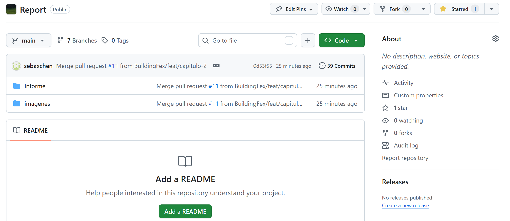 |
| Actividad TB-1 Landing (BuildingFex) | 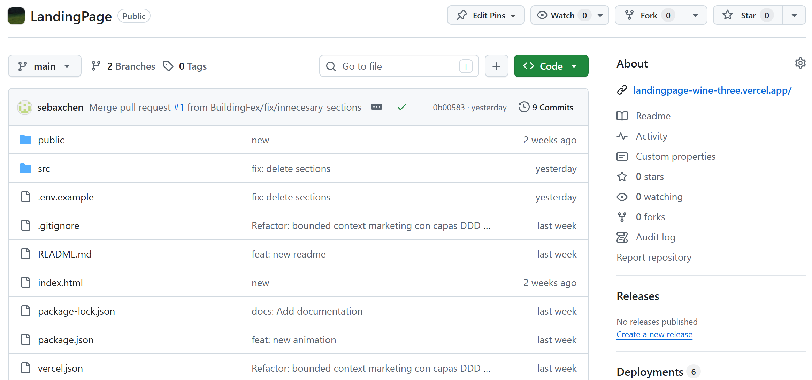 |
| Commits TB-1 Report | 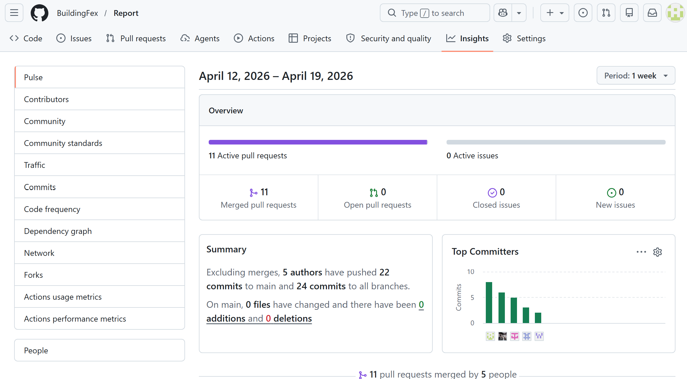 |
| Commits TB-1 Landing-Page | 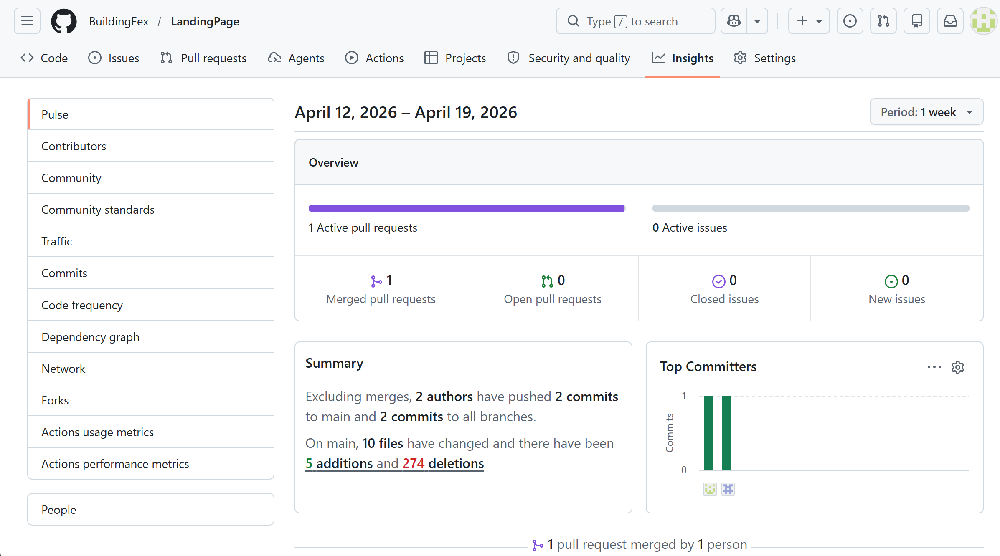 |
| Network TB-1 Report | 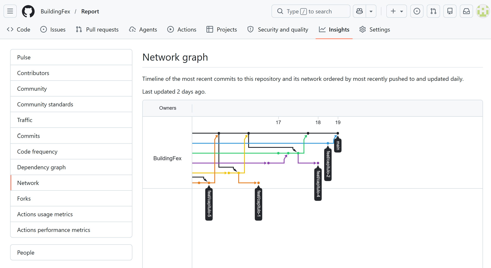 |
| Network TB-1 Landing page | 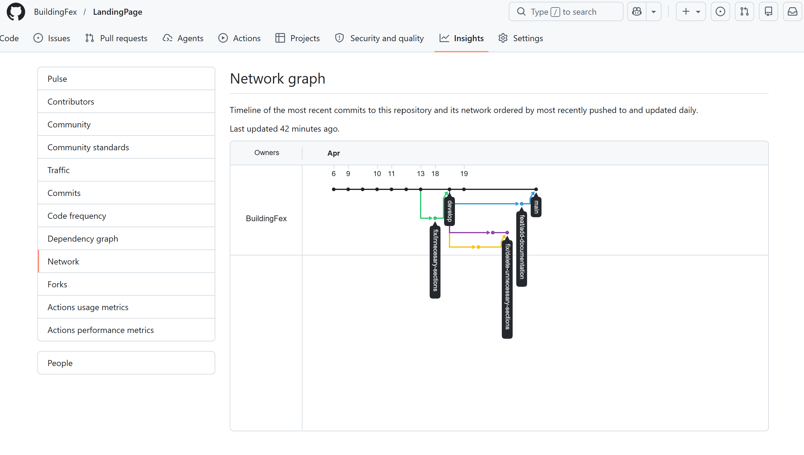 |


---

<a id="studentoutcome-rubrica-tb1"></a>
## ABET – EAC - Student Outcome 5

En esta sección se presenta la relación entre el trabajo realizado por el equipo y las dimensiones del Student Outcome establecido. Cada integrante ha colaborado en la redacción conjunta de los sustentos y evidencias que demuestran cómo las actividades desarrolladas en la **TB1** han contribuido al logro de este objetivo. A través de las acciones individuales y colectivas, se busca evidenciar de manera clara y organizada el impacto del proyecto en el desarrollo de las competencias señaladas.


| Criterio específico | Acciones realizadas (TB1) | Conclusiones |
| :--- | :--- | :--- |
| **5.c.1** Funciona eficazmente en un equipo compartiendo el liderazgo y creando un entorno colaborativo e inclusivo. | **Sebastian Martin Beingolea Montalvo — U202217853**<br>**TB1:** Durante la TB1, fomenté la participación activa de todos los miembros, asegurando que cada integrante tuviera un rol claro en el desarrollo y que las decisiones técnicas se tomaran por consenso.<br><br>**Villanueva Rodríguez Giuseppe Adrián — U20221c554**<br>**TB1:** Promoví un ambiente inclusivo donde se valoraron las sugerencias de mejora de cada compañero, facilitando la resolución de dudas grupales de manera conjunta.<br><br>**Saul Ortega Muñoz — U20231c019**<br>**TB1:** Colaboré activamente en la mediación de ideas durante las reuniones, asegurando que el equipo se mantuviera unido y enfocado en el bienestar colectivo del proyecto.<br><br>**Alejandro Manuel Jave Chang — U202312510**<br>**TB1:** Apoyé en la integración de las diferentes propuestas del equipo, fomentando un clima de respeto y apoyo mutuo para que todos pudiéramos aportar desde nuestras fortalezas.<br><br>**Valentin Nicolas Medina Mamani — U202316829**<br>**TB1:** Participé en la organización de las sesiones de trabajo, ayudando a que la comunicación entre nosotros fuera fluida y que nadie se quedara atrás en el avance del informe. | **Conclusión grupal:** Como grupo, concluimos que la TB1 fortaleció nuestra capacidad de liderazgo compartido. Logramos establecer un entorno colaborativo donde la inclusión y el respeto por las opiniones diversas permitieron consolidar una estructura de equipo sólida, fundamental para el éxito de las próximas fases del proyecto. |
| **5.c.2** Establece metas, planifica tareas y cumple objetivos. | **Sebastian Martin Beingolea Montalvo — U202217853**<br>**TB1:** Definí los hitos principales del backlog para la TB1 y cumplí con la entrega de mis componentes de software e imágenes en los plazos acordados para evitar cuellos de botella.<br><br>**Villanueva Rodríguez Giuseppe Adrián — U20221c554**<br>**TB1:** Organicé mis tareas individuales siguiendo el cronograma grupal, asegurando que cada entrega cumpliera con los estándares de calidad requeridos por el equipo.<br><br>**Saul Ortega Muñoz — U20231c019**<br>**TB1:** Realicé un seguimiento constante de los objetivos de la TB1, ajustando mis tiempos de trabajo para garantizar que el informe final se completara antes de la fecha límite.<br><br>**Alejandro Manuel Jave Chang — U202312510**<br>**TB1:** Participé en la estimación de tiempos para las tareas asignadas y cumplí responsablemente con mis entregables, permitiendo una integración de componentes sin retrasos.<br><br>**Valentin Nicolas Medina Mamani — U202316829**<br>**TB1:** Me enfoqué en alcanzar las metas semanales establecidas, planificando mis actividades diarias para contribuir de manera puntual al progreso general del reporte. | **Conclusión grupal:** Concluimos que el éxito de la TB1 se basó en una planificación estructurada y el compromiso individual con las metas grupales. El uso de herramientas de gestión y el cumplimiento estricto de los plazos permitieron alcanzar los objetivos trazados, estableciendo un flujo de trabajo eficiente para el futuro. |


### CONTENIDO

### Capítulo I: Introducción

- 1.1 Startup Profile  
  - 1.1.1 Descripción de la Startup  
  - 1.1.2 Perfiles de integrantes del equipo  
- 1.2 Solution Profile  
  - 1.2.1 Antecedentes y problemática  
  - 1.2.2 Lean UX Process  
    - 1.2.2.1 Lean UX Problem Statements  
    - 1.2.2.2 Lean UX Assumptions  
    - 1.2.2.3 Lean UX Hypothesis Statements  
    - 1.2.2.4 Lean UX Canvas  
- 1.3 Segmentos objetivo  

### Capítulo II: Requirements Elicitation & Analysis

- 2.1 Competidores  
  - 2.1.1 Análisis competitivo  
  - 2.1.2 Estrategias y tácticas frente a competidores  
- 2.2 Entrevistas  
  - 2.2.1 Diseño de entrevistas  
  - 2.2.2 Registro de entrevistas  
  - 2.2.3 Análisis de entrevistas  
- 2.3 Needfinding  
  - 2.3.1 User Personas  
  - 2.3.2 User Task Matrix  
  - 2.3.3 User Journey Mapping  
  - 2.3.4 Empathy Mapping  
  - 2.3.5 As-is Scenario Mapping  
- 2.4 Ubiquitous Language  

### Capítulo III: Requirements Specification

- 3.1 To-Be Scenario Mapping  
- 3.2 User Stories  
- 3.3 Impact Mapping  
- 3.4 Product Backlog  

### Capítulo IV: Product Design

- 4.1 Style Guidelines  
  - 4.1.1 General Style Guidelines  
  - 4.1.2 Web Style Guidelines  
- 4.2 Information Architecture  
  - 4.2.1 Organization Systems  
  - 4.2.2 Labeling Systems  
  - 4.2.3 SEO Tags and Meta Tag  
  - 4.2.4 Searching Systems  
  - 4.2.5 Navigation Systems  
- 4.3 Landing Page UI Design  
  - 4.3.1 Landing Page Wireframe  
  - 4.3.2 Landing Page Mock-up  
- 4.4 Web Applications UX/UI Design  
  - 4.4.1 Web Applications Wireframes  
  - 4.4.2 Web Applications Wireflow Diagrams  
  - 4.4.3 Web Applications Mock-ups  
  - 4.4.4 Web Applications User Flow Diagrams  
- 4.5 Web Applications Prototyping  
- 4.6 Domain-Driven Software Architecture  
  - 4.6.1 Software Architecture Context Diagram  
  - 4.6.2 Software Architecture Container Diagrams  
  - 4.6.3 Software Architecture Components Diagrams  
- 4.7 Software Object-Oriented Design  
  - 4.7.1 Class Diagrams  
  - 4.7.2 Class Dictionary  
- 4.8 Database Design  
  - 4.8.1 Database Diagram  

### Capítulo V: Product Implementation, Validation & Deployment

- 5.1 Software Configuration Management  
  - 5.1.1 Software Development Environment Configuration  
  - 5.1.2 Source Code Management  
  - 5.1.3 Source Code Style Guide & Conventions  
  - 5.1.4 Software Deployment Configuration  
- 5.2 Landing Page, Services & Applications Implementation  
  - 5.2.1 Sprint 1 *(alcance TB1)*  
- 5.3 Validation Interviews  
  - 5.3.1 Diseño de entrevistas  
  - 5.3.2 Registro de entrevistas  
  - 5.3.3 Validación según heurísticas  

### Bibliografía


### Anexos


---


<a id="capitulo-i-introduccion"></a>
# Capítulo I: Introducción

<a id="1-1-startup-profile"></a>
## 1.1. Startup Profile

<a id="1-1-1-descripcion-de-la-startup"></a>
### 1.1.1. Descripción de la Startup

La administración de condominios y torres residenciales implica gestionar múltiples procesos críticos: desde el control de las finanzas y la recaudación de cuotas, hasta el mantenimiento de las instalaciones y la comunicación con los residentes. Tradicionalmente, estas operaciones se manejan de forma fragmentada, utilizando hojas de cálculo, correos electrónicos y grupos de mensajería, lo que genera desorden, retrasos en los pagos y falta de transparencia.

A pesar de que existen algunas herramientas digitales en el mercado, muchas de ellas resultan demasiado complejas para los comités de administración o no ofrecen una experiencia unificada tanto para el gestor como para el residente. Esto provoca que la información sobre normativas, actas o estados de cuenta no sea fácilmente accesible para la comunidad.

Frente a esta situación, se requiere una plataforma centralizada y escalable que simplifique estas operaciones. Una solución en la nube que integre la gestión de áreas comunes, cobranzas, mantenimiento y comunicados en un solo entorno, mejorando la convivencia, optimizando el tiempo de los administradores y brindando total visibilidad a las juntas de propietarios.

<a id="1-1-2-perfiles-de-integrantes-del-equipo"></a>
### 1.1.2. Perfiles de integrantes del equipo

| Nombre | Descripción |
|---|---|
| <br><strong>Sebastian Martin Beingolea Montalvo</strong> | Me gusta el trabajo en equipo, tengo la experiencia y habilidades para el desarrolo de software. Me gusta cumplir con las fechas propuestas y ademas tengo conociemientos en base de datos, serverless, lenguajes de programacion. |
| <br><strong>Villanueva Rodríguez Giuseppe Adrián</strong> | Soy estudiante de Ingeniería de Software con un enfoque en el desarrollo de software. Me caracterizo por mi resiliencia y mi conocimiento en varias áreas de programación como el uso de .NET 8, C#, C++, JavaScript, Node, Python, HTML, Redis y SignalR. |
| <br><strong>Saul Ortega Muñoz</strong> | Soy estudiante de Ingeniería de Software con formación en programación y desarrollo web. Tengo conocimientos en algunos lenguajes de programacion. Me caracterizo por ser responsable, con capacidad de aprendizaje rápido y trabajo en equipo, aportando ideas prácticas para resolver problemas y mejorar proyectos tecnológicos. |
| <br><strong>Alejandro Manuel Jave Chang</strong> | Vengo de la carrera de Ingeniería de software, me gusta explorar diversas soluciones a desafíos tecnológicos y me apasiona aprender nuevas cosas. Mi enfoque dedicado a los proyectos que me apasionan me impulsa a explorar nuevas fronteras en mi carrera. |
| <br><strong>Valentin Nicolas Medina Mamani</strong> | Me describo como una persona curiosa y apasionada con la tecnología, lo que busco es aprender más. Actualmente tengo conocimientos de programación, base de datos y un poco de hacking ético. Finalmente al respecto sobre el trabajo en equipo soy muy puntual y responsable, además de trabajar siempre todos juntos. |


<a id="1-2-solution-profile"></a>
## 1.2. Solution Profile

El nombre de nuestro producto es **“BuildingFex”**. Este término fusiona la palabra inglesa "Building" (edificio), haciendo referencia directa a nuestro rubro inmobiliario, con "Fex", que evoca un sentido de eficiencia, agilidad y flexibilidad operativa. Este nombre transmite la misión principal de la plataforma: modernizar y agilizar las operaciones de los condominios y torres residenciales bajo un ecosistema robusto y profesional.

**Product Description:** BuildingFex es una plataforma SaaS (Software as a Service) integral diseñada para juntas de propietarios y empresas administradoras. El sistema unifica la operatividad del edificio ofreciendo una misma experiencia fluida tanto en la aplicación web como en la versión móvil. 

El software centraliza las siguientes operaciones clave:
- **Áreas Comunes:** Gestión de reservas, reglas y mantenimiento en una sola vista.
- **Cobranzas (Collections):** Visibilidad de pagos, cuotas y recordatorios para los residentes, disminuyendo la morosidad.
- **Mantenimiento:** Registro de solicitudes, control de proveedores y estado de las reparaciones de todo el edificio.
- **Comunicados y Documentos:** Emisión de avisos oficiales y un repositorio seguro para actas, reglamentos y archivos de la comunidad.
- **Accesos y Visitas:** Registros alineados con las políticas de seguridad del edificio.

De esta forma, BuildingFex garantiza una entrega de servicio responsable y estandarizada, guiada por normativas éticas y de transparencia para toda la comunidad.

**Monetización:** El modelo de negocio es B2B, basado en suscripciones mensuales (SaaS) facturadas en Soles Peruanos (PEN). Los planes están diseñados para escalar según el tamaño del condominio:

- **Plan Essential (S/ 40 al mes):** Dirigido a edificios pequeños o condominios boutique (10 a 15 departamentos). Incluye la consola web, gestión de áreas comunes, cobranzas, comunicados, documentos, registro de visitas y soporte por correo en días hábiles.
- **Plan Standard (S/ 80 al mes):** Diseñado para torres medianas y comunidades activas (16 a 40 departamentos). Suma a lo anterior una mayor capacidad, visibilidad más clara de deudas, notificaciones masivas para residentes y soporte operativo prioritario.
- **Plan Scale (S/ 120 al mes):** Enfocado en grandes complejos y portafolios de gran altura (41 a 80 departamentos). Incluye reportes avanzados para comités grandes, asistencia en la implementación (onboarding) y canales de soporte con tiempos de respuesta acordados.

<a id="1-2-1-antecedentes-y-problematica"></a>
### 1.2.1. Antecedentes y problemática

**Descripción de la problemática**
El problema central se encuentra en la ineficiencia logística y financiera que sufren las administraciones de inmuebles al no contar con un flujo de trabajo centralizado. La dependencia de procesos manuales dificulta el seguimiento de la morosidad, genera conflictos en la reserva de espacios compartidos y propicia la pérdida de información histórica del edificio (como actas o contratos con proveedores). 

Esta carencia de tecnología perjudica tanto a las empresas administradoras, que ven limitada su capacidad de gestionar más propiedades, como a los propietarios, que perciben una falta de transparencia sobre cómo se invierte su dinero y cómo se gestionan las incidencias del día a día.

**Objetivos**
- Desarrollar una plataforma SaaS que unifique la administración de finanzas, operaciones y comunicaciones de los edificios.
- Facilitar la visibilidad de los pagos y automatizar los recordatorios para reducir los índices de morosidad.
- Proveer un sistema transparente de reportes y almacenamiento de documentos accesibles para la comunidad.
- Escalar la capacidad operativa de los property managers mediante flujos de trabajo claros y estandarizados.

**Restricciones**
- La plataforma depende de la conexión a internet para la sincronización de datos en tiempo real entre la aplicación web y los usuarios.
- La adopción del sistema requiere un cambio de hábitos en los residentes, especialmente en aquellos menos familiarizados con herramientas digitales.
- La gestión de datos financieros y personales exige altos estándares de seguridad y protección de la privacidad.

**Antecedentes**
- **Administración tradicional:** El uso de herramientas genéricas como Excel y WhatsApp domina el mercado actual. Aunque son de bajo costo, no escalan, carecen de seguridad de datos y no ofrecen transparencia financiera en tiempo real.
- **Sistemas contables genéricos:** Existen programas de contabilidad robustos, pero no están enfocados en la convivencia comunitaria, dejando de lado módulos esenciales como la reserva de áreas comunes o el control de visitas.
- **Plataformas extranjeras:** Hay soluciones PropTech en otros países, pero sus planes de suscripción suelen ser elevados (facturados en dólares) y no siempre se adaptan a las dinámicas residenciales locales.

**Herramienta de 5W y 2H**
- **What - ¿Cuál es el problema?**
  - La gestión dispersa, poco transparente y manual de las operaciones y cobranzas en condominios y torres residenciales.
- **When - ¿Cuándo sucede el problema?**
  - Ocurre constantemente en el registro de visitas e incidencias diarias, y se agudiza a fin de mes durante los procesos de facturación y conciliación de pagos.
- **Where - ¿Dónde surge el problema?**
  - En la administración interna de edificios de departamentos y complejos residenciales.
- **Who - ¿Quiénes son afectados por el problema?**
  - Las empresas administradoras, las juntas de propietarios, los conserjes y, en última instancia, los residentes.
- **Why - ¿Cuál es la causa del problema?**
  - La falta de adopción de plataformas centralizadas y la dependencia de métodos informales para la comunicación y contabilidad.
- **How - ¿Cómo se manifiesta el problema?**
  - Mediante altos índices de pagos atrasados, desinformación sobre las normativas del edificio, cruces en reservas de áreas comunes y demoras en el mantenimiento.
- **How much - ¿Cuál es la magnitud del problema?**
  - Afecta directamente la salud financiera del condominio y genera horas de trabajo no productivo para los administradores, limitando el crecimiento de sus portafolios.

<a id="1-2-2-lean-ux-process"></a>
### 1.2.2. Lean UX Process.

<a id="1-2-2-1-lean-ux-problem-statements"></a>
#### 1.2.2.1. Lean UX Problem Statements.

La operación diaria de torres residenciales ha recaído históricamente en el esfuerzo manual de los administradores y en canales de comunicación no oficiales. Este enfoque, aunque funcional para edificios muy pequeños, genera cuellos de botella en la recaudación de cuotas, pérdida de trazabilidad en las reparaciones y frustración entre los propietarios por la falta de transparencia.

Debido a esto, los ecosistemas de gestión actuales están desconectados. Los administradores no tienen una única vista para controlar las áreas comunes y las finanzas al mismo tiempo, lo que reduce su capacidad de respuesta y profesionalismo.

Nuestro producto resuelve esta fricción al ofrecer BuildingFex, una plataforma centralizada que actúa como el núcleo operativo del edificio. 

**A través de esta plataforma unificada se cubren los frentes más críticos:**
- Los residentes pueden revisar sus deudas, reservar áreas comunes y leer comunicados oficiales desde una misma interfaz.
- Los administradores y juntas cuentan con una consola web para gestionar proveedores, emitir avisos, llevar el control de accesos y visualizar el estado financiero de la comunidad de manera estructurada.

A diferencia de los métodos improvisados, BuildingFex brinda flujos de trabajo claros, alineados con la ética profesional y términos de servicio transparentes, preparados para escalar desde un edificio boutique hasta un gran complejo.

**El éxito de la solución se medirá en función de:**
- La disminución de la cartera morosa gracias a la visibilidad de los pagos y recordatorios.
- El tiempo ahorrado por las empresas administradoras al gestionar múltiples tareas desde "una sola experiencia".
- La cantidad de suscripciones activas (MRR) en los diferentes planes (Essential, Standard, Scale).

<a id="1-2-2-2-lean-ux-assumptions"></a>
#### 1.2.2.2. Lean UX Assumptions.

En esta sección se detallan las suposiciones que validarán la viabilidad y adopción de BuildingFex. Se categorizan en impactos comerciales, beneficios para el usuario y funcionalidades clave del software.

##### Business Outcomes
- Creemos que al centralizar la visibilidad de las cobranzas, reduciremos la tasa de morosidad en los condominios afiliados en un 25%.
- Creemos que al ofrecer planes de suscripción escalonados basados en el número de departamentos, facilitaremos la adquisición de clientes de diversos tamaños.
- Creemos que el diseño responsivo y la interfaz estandarizada reducirán los tiempos de capacitación (onboarding) para las empresas administradoras en un 40%.
- Creemos que al proveer flujos de trabajo claros, las administradoras podrán gestionar más edificios simultáneamente, incrementando nuestra retención de clientes B2B.

##### Business Outcomes Assumptions
- Creemos que las juntas de propietarios están dispuestas a pagar entre S/ 40 y S/ 120 mensuales si perciben un incremento real en la transparencia y orden del edificio.
- Creemos que el mercado local requiere facturación en moneda nacional (PEN) para agilizar la aprobación de presupuestos en asambleas.
- Creemos que las agencias de administración prefieren un software unificado antes que utilizar múltiples aplicaciones desconectadas.

##### User Outcomes
- Creemos que al ofrecer un módulo digital de reservas, los residentes evitarán conflictos y malentendidos por el uso de áreas comunes.
- Creemos que al disponer de un repositorio de documentos en la nube, los propietarios tendrán la tranquilidad de consultar reglamentos y actas cuando lo necesiten.
- Creemos que los avisos oficiales en la plataforma mejorarán la tasa de lectura de comunicados en comparación con los correos electrónicos tradicionales.
- Creemos que el registro digital de visitas brindará un mayor sentido de seguridad y control a toda la comunidad.

##### User Outcomes Assumptions
- Creemos que los residentes demandan una manera rápida y transparente de verificar si sus pagos han sido registrados correctamente.
- Creemos que los comités de administración necesitan reportes consolidados para justificar sus decisiones frente a los vecinos.
- Creemos que la estandarización de procesos de mantenimiento calmará la ansiedad de los residentes frente a desperfectos en el edificio.

##### Features Assumptions
- Creemos que incluir un sistema de recordatorios de cobro será la característica más valorada por los tesoreros.
- Creemos que la consola web para administradores facilitará la gestión simultánea de múltiples propiedades.
- Creemos que ofrecer soporte segmentado (email en días hábiles vs. tiempos de respuesta acordados) aportará valor diferenciado a los planes superiores.
- Creemos que un dashboard que resuma áreas comunes, cobranzas e incidencias en "una sola vista" será el diferencial principal frente a la competencia.

<a id="1-2-2-3-lean-ux-hypothesis-statements"></a>
#### 1.2.2.3. Lean UX Hypothesis Statements.

Las siguientes hipótesis buscan validar el impacto de la adopción de BuildingFex en la operatividad de los condominios y el crecimiento del producto en el mercado.

##### Hypothesis Statement #1
- Creemos que incrementaremos la puntualidad en el pago de cuotas de mantenimiento.
- Si las juntas de propietarios y residentes
  - Obtienen visibilidad clara de las deudas y un sistema de recordatorios.
- Con un módulo de "Collections" centralizado dentro de la plataforma.

##### Hypothesis Statement #2
- Creemos que optimizaremos la eficiencia del personal de administración y conserjería.
- Si los property managers
  - Obtienen la capacidad de gestionar visitas, solicitudes de mantenimiento y emitir anuncios masivos.
- Con una consola web unificada que reemplaza los registros en papel y los avisos en ascensores.

##### Hypothesis Statement #3
- Creemos que reduciremos las quejas vecinales respecto al uso de las instalaciones.
- Si los propietarios
  - Obtienen un acceso directo a las normativas y disponibilidad de espacios.
- Con un módulo de "Common areas" que muestra reservas, reglas y mantenimiento en una sola vista.

##### Hypothesis Statement #4
- Creemos que lograremos un rápido crecimiento comercial entre diferentes perfiles de clientes.
- Si las comunidades de edificios
  - Reciben opciones de precios adaptadas a su tamaño real.
- Con una estructura de suscripción en tres niveles (Essential, Standard, Scale) basada en la cantidad de unidades.

<a id="1-2-2-4-lean-ux-canvas"></a>
#### 1.2.2.4. Lean UX Canvas.

A continuación, se adjunta el Lean UX Canvas, una matriz colaborativa que nos ayuda a mapear los dolores de la administración de inmuebles con las soluciones de nuestra plataforma, estructurando el diseño de nuestros MVP y las métricas que evaluarán la adopción de los planes de suscripción.

<p align="center">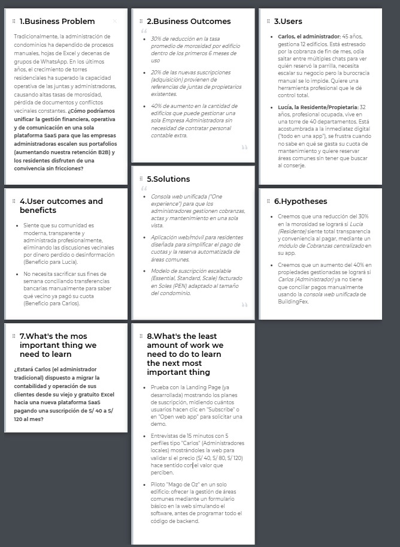</p>

<a id="1-3-segmentos-objetivo"></a>
## 1.3. Segmentos objetivo.

La modernización del sector de la gestión de propiedades demuestra que implementar soluciones tecnológicas es fundamental no solo para llevar un control contable, sino para garantizar la armonía residencial y el mantenimiento del valor de los inmuebles. El uso de plataformas digitales elimina la fricción diaria y profesionaliza la labor de los comités vecinales.

En base a la estructura de nuestra plataforma SaaS y los planes de suscripción establecidos, los segmentos objetivos de BuildingFex son:

- **Segmento 1: Empresas y agencias administradoras de inmuebles (Property Managers).** Compañías que buscan escalar sus operaciones y gestionar múltiples torres residenciales o condominios bajo una misma consola web estandarizada y eficiente.
- **Segmento 2: Juntas de propietarios de condominios y torres residenciales.** Edificios autogestionados por los propios vecinos (desde pequeñas comunidades de 10 unidades hasta complejos de 80 departamentos) que requieren organizar sus cobros, áreas comunes y comunicaciones con total transparencia y seguridad.

**Capítulo II: Requirements Elicitation & Analysis**

**2.1. Competidores**

### Condo Control
Es una plataforma SaaS especializada en la gestión de comunidades residenciales, principalmente en Norteamérica. Permite administrar unidades, gestionar comunicaciones internas, controlar reservas de áreas comunes y llevar registros de visitantes. También ofrece herramientas básicas de reportes y gestión operativa.

### Buildium
Plataforma digital enfocada en la administración de propiedades residenciales y asociaciones. Incluye herramientas para la gestión financiera, cobranza automatizada, generación de reportes y administración de mantenimiento.

### ComunidadFeliz
Plataforma orientada al mercado latinoamericano para la gestión de condominios. Permite gestionar cobros, comunicaciones, reservas de espacios y reportes financieros dentro de una misma plataforma.

**2.1.1. Análisis competitivo**

| | **BuildingFex** | **Condo Control** | **Buildium** | **ComunidadFeliz** |
|---|---|---|---|---|
| **Perfil** | | | | |
| *Overview* | Plataforma SaaS web para administración integral de edificios en Perú. Centraliza procesos operativos, financieros y de comunicación. | Plataforma SaaS para comunidades residenciales en Norteamérica. Permite gestionar operaciones, comunicación y reservas. | Software de gestión inmobiliaria enfocado en propiedades y asociaciones, con fuerte enfoque financiero. | Plataforma orientada a la administración de condominios en Latinoamérica, integrando cobros, comunicación y reservas. |
| *Ventaja competitiva*<br>¿Qué valor ofrece a los clientes? | - Centralización total en una sola plataforma<br>- Adaptado al contexto peruano<br>- Simplicidad y transparencia | - Mejora la organización operativa<br>- Experiencia en el mercado | - Optimización financiera y de cobros<br>- Marca consolidada | - Enfoque en LATAM<br>- Facilidad de uso en gestión de condominios |
| **Perfil de Marketing** | | | | |
| *Mercado objetivo* | Administradoras y juntas de edificios en Perú. | Condominios en EE.UU. y Canadá. | Empresas inmobiliarias y property managers. | Edificios y condominios en Latinoamérica. |
| *Estrategias de marketing* | - Marketing digital<br>- Alianzas locales<br>- Enfoque educativo del sector | - Marketing B2B tradicional y digital | - Posicionamiento global<br>- Marca fuerte | - Marketing digital regional |
| **Perfil de Producto** | | | | |
| *Productos & Servicios* | Plataforma modular: cobranza, reservas, accesos, incidencias, comunicación, etc. | Gestión de comunidad + comunicación + reservas | Gestión financiera + mantenimiento | Gestión de condominios + comunicación + reservas |
| *Precios & Costos* | Suscripción SaaS escalable (planes accesibles) | Suscripción (alto costo) | Suscripción premium | Suscripción accesible |
| *Canales de distribución* | Web (principal) | Web + móvil | Web + móvil | Web + móvil |

| **Análisis SWOT** | | | | |
|---|---|---|---|---|
| **Fortalezas** | - Plataforma todo en uno<br>- Simplicidad y buena UX<br>- Adaptado a Perú | - Plataforma robusta<br>- Experiencia en el mercado | - Fuerte en finanzas<br>- Marca consolidada | - Presencia en LATAM<br>- Adaptación regional |
| **Debilidades** | - Startup nueva<br>- Sin posicionamiento fuerte<br>- Recursos limitados | - No adaptado a Perú<br>- Costos elevados | - Complejo para usuarios no técnicos<br>- No centrado en comunidad | - Menor diferenciación<br>- Funcionalidades menos avanzadas |
| **Oportunidades** | - Baja digitalización en Perú<br>- Crecimiento del sector<br>- Adopción tecnológica | - Expansión internacional | - Crecimiento inmobiliario | - Expansión en Perú |
| **Amenazas** | - Entrada de competidores internacionales<br>- Resistencia al cambio | - Soluciones locales más adaptadas | - Plataformas más simples | - Nuevas startups locales |

**2.1.2. Estrategias y tácticas frente a competidores**

### Diferenciación por adaptación al mercado peruano
A diferencia de plataformas como Condo Control y Buildium, que están orientadas a mercados internacionales, BuildingFex se diseñará específicamente para el contexto peruano. Se integrarán métodos de pago locales, manejo en moneda nacional (PEN) y funcionalidades alineadas a la realidad de las juntas de propietarios. Esta adaptación será comunicada como un valor diferencial clave en campañas de marketing.

### Plataforma integral “todo en uno”
Mientras algunos competidores se enfocan solo en ciertos aspectos (finanzas, comunicación o gestión operativa), BuildingFex ofrecerá una solución unificada que integra cobranza, reservas, control de accesos, incidencias y comunicación en una sola plataforma. Esto permitirá reducir la dependencia de herramientas dispersas como Excel o WhatsApp, destacando la eficiencia y centralización como ventaja competitiva.

### Enfoque en transparencia y confianza como propuesta de valor
Frente a uno de los principales problemas del sector (falta de transparencia en el uso del dinero), BuildingFex destacará sus módulos de reportes financieros y trazabilidad como un elemento diferenciador clave, generando confianza entre vecinos y juntas de propietarios.

**2.2. Entrevistas**

A continuación, presentamos las preguntas diseñadas para las entrevistas de validación. Las hemos estructurado en dos bloques: un grupo de preguntas transversales para ambos segmentos (para entender el perfil general y uso de tecnología) y preguntas específicas enfocadas en los dolores particulares de cada tipo de administrador.

### Información a recolectar (transversal a los 2 segmentos)

#### 1. Datos demográficos y profesionales básicos
- ¿Cuál es su edad?
- ¿En qué distrito reside o en qué zona opera principalmente?
- ¿Cuál es su ocupación principal o cargo actual?
- ¿Cuál es su nivel educativo o formación profesional?

#### 2. Contexto de gestión y equipo de trabajo
- ¿Cuenta con el apoyo de un equipo administrativo, conserjes o contadores en su día a día?
- ¿Con qué frecuencia coordina con ellos para revisar temas del edificio?
- ¿Quién se encarga específicamente de hacer los cobros y cuadrar las cuentas?

#### 3. Estilo de trabajo y relación con la tecnología
- ¿Cómo describiría un día típico gestionando los temas del condominio?
- ¿Qué tareas administrativas le consumen más tiempo a la semana?
- ¿Cómo se considera respecto al uso de nuevas plataformas o software: le resulta fácil, regular o prefiere lo tradicional?

#### 4. Dispositivos de preferencia y canales digitales
- ¿Qué dispositivo utiliza más para gestionar el edificio: la computadora de escritorio/laptop o el celular?
- ¿Qué herramientas usa actualmente para comunicarse con los vecinos (WhatsApp, correos, murales físicos)?
- ¿Cómo prefiere organizar los datos financieros: cuadernos, Excel, algún software genérico?

#### 5. Objetivos y motivaciones
- ¿Qué es lo más importante para usted al momento de entregar las cuentas a fin de mes?
- ¿Qué le motivaría a cambiar su método actual por una plataforma digital de pago por suscripción?
- ¿Qué significa para usted tener "tranquilidad" en la gestión de un edificio?

#### 6. Frustraciones y problemas actuales
- ¿Qué dificultades reales tiene hoy en día para cobrar puntualmente el mantenimiento?
- ¿Cómo maneja actualmente el control de las reservas de áreas comunes y el registro de visitas? ¿Le genera problemas?
- ¿Cuál es la queja más frecuente que recibe por parte de los residentes?

#### 7. Background y experiencia
- ¿Podría contarme brevemente cómo empezó a administrar edificios o cómo asumió el cargo en la directiva?
- ¿Recuerda alguna "historia de terror" o conflicto grave relacionado con cuentas poco claras o vecinos morosos?
- Si pudiera, ¿qué proceso de su gestión diaria automatizaría de inmediato?

**2.2.1. Diseño de entrevistas**

### Segmento 1: Junta de Directiva (Propietarios que administran su propio edificio)

**Objetivo:**  
Entender la carga que representa administrar el edificio "ad honorem" o como tarea extra, la fricción directa con sus propios vecinos y su necesidad de una herramienta muy simple que no requiera conocimientos contables.

#### Preguntas principales
- Al ser vecino y directivo a la vez, ¿cómo maneja la incomodidad de tener que cobrarle la mora a alguien con quien se cruza en el ascensor?
- ¿Cuánto tiempo de su vida personal o fines de semana le dedica a cuadrar los pagos de mantenimiento?
- ¿Alguna vez han tenido problemas de desconfianza por parte de otros vecinos respecto a cómo se gasta el dinero?
- ¿Qué tan útil sería para la junta que el sistema aplique las multas y envíe recordatorios de pago automáticamente sin que ustedes den la cara?
- ¿Qué barreras cree que tendrían los vecinos más mayores de su edificio para usar una app para ver sus recibos?

#### Preguntas complementarias
- ¿Cómo se organizan actualmente cuando un vecino quiere reservar la zona de parrillas o el salón de usos múltiples?
- Si la directiva cambia el próximo año, ¿qué tan difícil es pasarle toda la información (cuentas, morosos, historial) a la nueva gestión?

### Segmento 2: Empresas de Gestión de Edificios (Administradores profesionales)

**Objetivo:**  
Explorar cómo manejan el volumen (varios edificios a la vez), cómo estandarizan sus procesos para no tener que contratar un contador por cada edificio nuevo, y cómo un software les ayudaría a escalar su negocio.

#### Preguntas principales
- ¿Cuántos edificios o condominios maneja su empresa actualmente en total?
- ¿Qué proceso se vuelve un "cuello de botella" cuando intentan sumar un nuevo edificio a su cartera de clientes?
- ¿Cómo consolidan actualmente la información financiera de distintos edificios para rendir cuentas a cada junta de propietarios?
- ¿Han perdido algún contrato de administración por problemas de comunicación o falta de transparencia percibida por los vecinos?
- En términos de negocio, ¿valorarían más una herramienta que les ahorre horas hombre en contabilidad, o una que mejore la experiencia del residente con una buena app?

#### Preguntas complementarias
- ¿Han intentado usar algún software de administración antes? ¿Qué les gustó o disgustó de esa experiencia?
- ¿Qué tan importante es para su empresa poder ofrecer a los condominios integraciones con pasarelas de pago o bancos locales para automatizar la conciliación?

**2.2.2. Registro de entrevistas**

### Segmento 1: Junta de Directiva (Propietarios que administran su propio edificio)

#### Entrevista 1

| Campo | Detalle |
|------|--------|
| **Segmento** | Junta de Directiva |
| **Nombre** | Ismael |
| **Apellidos** | Paredes |
| **Edad** | 73 |
| **Distrito** | Jesus Maria |
| **Screenshot** |  |
| **URL** | https://upcedupe-my.sharepoint.com/:v:/g/personal/u202316829_upc_edu_pe/IQAjOrj36WAbS7yjtkqR3BOjAYmhb5EJho0nURxlr5DQ3h0?e=ruuATc |
| **Duración** | 6:02 |
| **Resumen** | Prefiere trato personal antes que automatización en cobranzas. Maneja deudas mediante conversación y confianza directa. Percibe que la confianza reduce conflictos entre vecinos. Considera que el software puede ser útil, pero no indispensable en edificios pequeños. Tiene preocupaciones sobre privacidad y seguridad de datos. Ve la digitalización como tendencia, pero prioriza el factor humano. |

#### Entrevista 2

| Campo | Detalle |
|------|--------|
| **Segmento** | Junta de Directiva |
| **Nombre** | Valeria |
| **Apellidos** | Carpio |
| **Edad** | 28 |
| **Distrito** | Lima |
| **Screenshot** |  |
| **URL** | https://upcedupe-my.sharepoint.com/:v:/g/personal/u202217853_upc_edu_pe/IQACC1SIKVjvTagwZh1y0u4aAXk8Tw2TAlffNsDCWQMPQrc?e=pekn9G&nav=eyJyZWZlcnJhbEluZm8iOnsicmVmZXJyYWxBcHAiOiJTdHJlYW1XZWJBcHAiLCJyZWZlcnJhbFZpZXciOiJTaGFyZURpYWxvZy1MaW5rIiwicmVmZXJyYWxBcHBQbGF0Zm9ybSI6IldlYiIsInJlZmVycmFsTW9kZSI6InZpZXcifX0%3D |
| **Duración** | 5:51 |
| **Resumen** | La administración ejecuta, la junta planifica y supervisa. Ella dedica tiempo a presupuestos y proyección financiera. Identifica la falta de comunicación como principal problema. Reconoce la importancia de la transparencia financiera. Considera útil la automatización (recordatorios, pagos), pero como apoyo. Valora el software por su capacidad de organización y control. |

#### Entrevista 3

| Campo | Detalle |
|------|--------|
| **Segmento** | Junta de Directiva |
| **Nombre** | Antonio |
| **Apellidos** | Chan |
| **Edad** | 50 |
| **Distrito** | Jesus Maria |
| **Screenshot** | 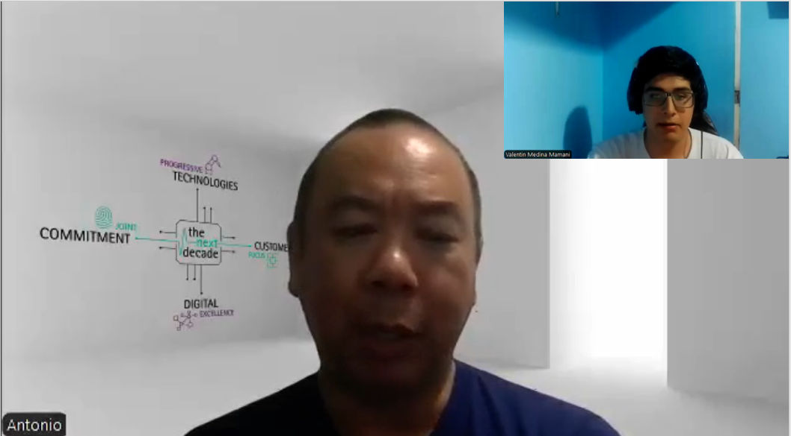 |
| **URL** | https://upcedupe-my.sharepoint.com/:v:/g/personal/u202316829_upc_edu_pe/IQCeaFiAnHVMS4osYS6VReweAdCzF57CR0YvpEt6g_Fkdjc?e=Vk1CG6&nav=eyJyZWZlcnJhbEluZm8iOnsicmVmZXJyYWxBcHAiOiJTdHJlYW1XZWJBcHAiLCJyZWZlcnJhbFZpZXciOiJTaGFyZURpYWxvZy1MaW5rIiwicmVmZXJyYWxBcHBQbGF0Zm9ybSI6IldlYiIsInJlZmVycmFsTW9kZSI6InZpZXcifX0%3D |
| **Duración** | 5:51 |
| **Resumen** | La administración ejecuta, la junta planifica y supervisa. Dedica tiempo a presupuestos y proyección financiera. Identifica la falta de comunicación como principal problema. Reconoce la importancia de la transparencia financiera. Considera útil la automatización (recordatorios, pagos), pero como apoyo. Valora el software por su capacidad de organización y control. |

### Segmento 2: Empresas de Gestión de Edificios (Administradores profesionales)

#### Entrevista 4

| Campo | Detalle |
|------|--------|
| **Segmento** | Empresas de Gestión de Edificios |
| **Nombre** | Manuel |
| **Apellidos** | Mera |
| **Edad** | 45 |
| **Distrito** | San Borja |
| **Screenshot** |  |
| **URL** | [upc-pre-202610-1asi0730-6818-BuildingFex-needfinding-sprint-4.mp4](https://upcedupe-my.sharepoint.com/:v:/g/personal/u202312510_upc_edu_pe/IQAEMbg8JmgaQaVqskOQem9iAb1I7oRMsDqavQquDJIMQeA?e=dLkD0t&nav=eyJyZWZlcnJhbEluZm8iOnsicmVmZXJyYWxBcHAiOiJTdHJlYW1XZWJBcHAiLCJyZWZlcnJhbFZpZXciOiJTaGFyZURpYWxvZy1MaW5rIiwicmVmZXJyYWxBcHBQbGF0Zm9ybSI6IldlYiIsInJlZmVycmFsTW9kZSI6InZpZXcifX0%3D) |
| **Duración** | 17:37 |
| **Resumen** | Manuel es un profesional que trabaja de forma remota y reside en un edificio de departamentos. Relata incidentes de gas y electricidad con procesos frustrantes: depende de recomendaciones, búsquedas en Google o apoyo limitado del conserje. Su principal problema es la falta de confianza en técnicos y la dificultad para encontrar especialistas calificados rápidamente. |
| **Personalidad** | - Precavido y analítico: investiga antes de contratar.<br>- Pragmático: busca soluciones directas.<br>- Escéptico: desconfía de servicios informales. |
| **Marcas** | - WhatsApp: comunicación y contactos.<br>- Excel: control de cuentas e información. |
| **Dispositivos** | - Smartphone: comunicación y búsquedas rápidas.<br>- Laptop: trabajo e investigación. |
| **Flujos principales** | - Búsqueda y selección de confianza<br>- Gestión de la emergencia<br>- Validación y pago<br>- Post-servicio (garantía) |

#### Entrevista 5

| Campo | Detalle |
|------|--------|
| **Segmento** | Empresas de Gestión de Edificios |
| **Nombre** | Carlos |
| **Apellidos** | Chang |
| **Edad** | 24 |
| **Distrito** | San Borja |
| **Screenshot** |  |
| **URL** | [upc-pre-202610-1asi0730-6818-BuildingFex-needfinding-sprint-5.mp4](https://upcedupe-my.sharepoint.com/:v:/g/personal/u202312510_upc_edu_pe/IQAb0fPmezaQR4uOkVXODq7XAYk47uCjZoA2l1mIjnWkvAA?nav=eyJyZWZlcnJhbEluZm8iOnsicmVmZXJyYWxBcHAiOiJTdHJlYW1XZWJBcHAiLCJyZWZlcnJhbFZpZXciOiJTaGFyZURpYWxvZy1MaW5rIiwicmVmZXJyYWxBcHBQbGF0Zm9ybSI6IldlYiIsInJlZmVycmFsTW9kZSI6InZpZXcifX0%3D&e=qppxed) |
| **Duración** | 12:12 |
| **Resumen** | Administrador general de 24 años que gestiona 18 edificios (~700 departamentos) en Lima Moderna. Depende fuertemente de procesos manuales y Excel. Su principal problema es la conciliación bancaria y la cobranza. Ve la digitalización como clave para reducir horas-hombre y escalar su negocio, siempre que el software esté adaptado al contexto peruano y automatice pagos. |
| **Personalidad** | - Pragmático y enfocado en eficiencia (busca reducir carga administrativa).<br>- Detallista y orientado a la confianza financiera.<br>- Cauteloso con software nuevo (prefiere soluciones simples e intuitivas). |
| **Marcas** | - Excel: base actual de gestión financiera.<br>- WhatsApp: comunicación operativa diaria.<br>- Yape / Plin: clave para automatizar cobros. |
| **Dispositivos** | - Laptop/PC: tareas complejas (reportes, cuentas).<br>- Smartphone: uso diario para coordinación y emergencias. |
| **Flujos principales** | - Conciliación de pagos y cobranza<br>- Gestión de reservas<br>- Onboarding de edificios<br>- Mantenimiento e incidencias |

#### Entrevista 6

| Campo | Detalle |
|------|--------|
| **Segmento** | Empresas de Gestión de Edificios |
| **Nombre** | Adrian |
| **Apellidos** | Delgado |
| **Edad** | 24 |
| **Distrito** | Surco |
| **Screenshot** |    |
| **URL** | [upc-pre-202610-1asi0730-6818-BuildingFex-needfinding-sprint-6.mp4](https://upcedupe-my.sharepoint.com/:v:/g/personal/u202312510_upc_edu_pe/IQCU3cNsBGklT4-T2l_crjfeAfIA-zu4Aj5K_0AmkObByA8?nav=eyJyZWZlcnJhbEluZm8iOnsicmVmZXJyYWxBcHAiOiJTdHJlYW1XZWJBcHAiLCJyZWZlcnJhbFZpZXciOiJTaGFyZURpYWxvZy1MaW5rIiwicmVmZXJyYWxBcHBQbGF0Zm9ybSI6IldlYiIsInJlZmVycmFsTW9kZSI6InZpZXcifX0%3D&e=12dNB5) |
| **Duración** | 17:04 |
| **Resumen** | Adrián es un Asistente de Operaciones de 24 años que actúa como el brazo ejecutor y la mano derecha en la gestión de 18 edificios. A diferencia de un perfil tradicional, es un nativo digital que sufre con los procesos analógicos de su propia empresa. Su día a día es altamente reactivo y caótico: pasa horas persiguiendo comprobantes de pago, actualizando hojas de cálculo desde su celular y actuando como mediador en conflictos por reservas mal anotadas. Ve en la adopción de una plataforma moderna la clave no solo para automatizar su carga operativa (y recuperar su tiempo libre), sino para mejorar radicalmente la experiencia del residente, un factor que ya les ha costado contratos en el pasado por parecer "anticuados". |
| **Personalidad** | - Nativo Digital y Dinámico: Le frustra la dependencia del papel y los procesos lentos.<br>- Orientado a la Experiencia del Usuario (UX): Entiende perfectamente que la retención del negocio depende de tener a los residentes contentos.<br>- Resolutivo pero Saturado: Tiene la iniciativa de mejorar los procesos (como migrar de Excel a Google Sheets por su cuenta). |
| **Marcas** | - WhatsApp: Su centro principal de operaciones.<br>- Google Sheets: La herramienta que impuso en su equipo para poder trabajar desde el celular, reemplazando al Excel tradicional.<br>- Yape: Crítico en su operativa diaria. |
| **Dispositivos** | - Smartphone: Es su herramienta de trabajo principal absoluto. <br>- Laptop/Computadora: Su uso está estrictamente relegado a tareas pesadas que no puede hacer desde su celular. |
| **Flujos principales** | - Recaudación y Verificación de Pagos.<br>- Gestión de Áreas Comunes.<br>- Onboarding y Creación de Base de Datos.<br>- Consolidación y Reportes. |


**2.2.3. Análisis de entrevistas**

### Segmento 1: Junta de Directiva (Propietarios que administran su propio edificio)

---

#### Entrevista a Ismael Paredes

Entrevistamos al doctor **Ismael Paredes**, de 73 años, quien forma parte de la junta directiva de un edificio ubicado en el distrito de **Jesús María**. Nos comenta que cuenta con el apoyo de un equipo conformado por un abogado, contador y otros miembros de la junta, lo que le permite distribuir las responsabilidades administrativas.

En cuanto a la gestión de cobranzas, menciona que evita métodos impersonales y prefiere el trato directo con los vecinos. Señala que ha conversado personalmente con los principales deudores, logrando acuerdos basados en la confianza mutua. Considera que este enfoque ha sido efectivo y ha permitido mantener una convivencia armoniosa.

Respecto a la transparencia, reconoce que puede existir cierta desconfianza inicial por parte de algunos vecinos sobre el uso del dinero, pero afirma que esta disminuye con el tiempo a medida que se construye confianza mediante la interacción directa.

Sobre el uso de herramientas tecnológicas, comenta que ha utilizado previamente un software de administración, pero decidió dejar de usarlo debido a su costo y porque considera que, dado el tamaño del edificio, una gestión más directa resulta suficiente. Además, muestra cierta resistencia a la automatización total, especialmente en temas sensibles como la cobranza, ya que considera importante comprender la situación personal de cada vecino antes de tomar decisiones.

Sin embargo, reconoce que la integración con pasarelas de pago puede ser útil, aunque expresa preocupación por la privacidad de la información y el posible mal uso de datos financieros por terceros, especialmente en contextos de ciberseguridad.

En general, el entrevistado valora más la confianza, el trato humano y la gestión personalizada por encima de la automatización completa, aunque reconoce que existe una tendencia hacia la digitalización en la administración de edificios.

---

#### Entrevista a Antonio Chan

Entrevistamos a **Antonio Chan**, de 50 años, miembro de la junta directiva de un edificio ubicado en el distrito de **Jesús María**. Nos comenta que, a diferencia de lo que suele pensarse, la junta directiva no se encarga directamente de la cobranza, sino que esta función recae principalmente en la administración del edificio, la cual opera bajo lineamientos establecidos por la junta y aprobados en asamblea de propietarios.

En cuanto a la gestión del tiempo, señala que, aunque la administración ejecuta las operaciones diarias, la junta directiva invierte una cantidad considerable de tiempo en la planificación financiera, especialmente en la elaboración de presupuestos, proyección de gastos e ingresos, y definición de las cuotas de mantenimiento. Estas decisiones deben ser aprobadas en asamblea para su posterior ejecución.

Respecto a la confianza, menciona que uno de los principales problemas en los edificios es la falta de comunicación entre los propietarios, lo que genera desinformación, dudas y cuestionamientos sobre el uso del dinero. Indica que esta falta de información puede provocar conflictos innecesarios dentro de la comunidad.

Sobre la automatización, considera que el uso de sistemas para enviar recordatorios de pago y aplicar multas es útil como mecanismo de apoyo, ya que ayuda a reforzar el cumplimiento de las obligaciones de los residentes. Sin embargo, señala que la junta directiva siempre debe mantener un rol activo y dar la cara ante cualquier situación.

En relación al uso de software, comenta que durante su gestión no utilizaban herramientas digitales, pero reconoce que actualmente existen soluciones que aportan valor, especialmente en la organización, control de pagos, acceso a información financiera y mejora de la transparencia, lo cual considera un aspecto clave para evitar conflictos entre vecinos.

En general, el entrevistado destaca la importancia de la comunicación, la transparencia y la organización financiera en la gestión de edificios, y reconoce que la tecnología puede ser un apoyo importante para mejorar estos aspectos.

---

#### Entrevista a Valeria Carpio

Entrevistamos a **Valeria Carpio** ss un miembro de la junta directiva de un edificio en Lima que gestiona tareas administrativas como pagos, coordinación con el conserje y atención a vecinos, apoyándose en un contador externo.

Dedica gran parte de su tiempo a cobros, seguimiento de morosos y organización de cuentas usando Excel y WhatsApp, lo que le genera desorden, falta de claridad y conflictos con vecinos, además de incomodidad al cobrarles personalmente; enfrenta problemas como morosidad, mala comunicación, control deficiente de áreas comunes y dificultad para transferir información a nuevas gestiones, por lo que valoraría una plataforma digital simple que automatice cobros, recordatorios y registros, mejore la transparencia y le ahorre tiempo reduciendo errores.


### Segmento 2: Empresas de Gestión de Edificios (Administradores profesionales)

---

#### Resumen

Los administradores de edificios y asistentes de operaciones entrevistados presentan un perfil altamente operativo y enfocado en la eficiencia del negocio. Aunque manejan un volumen fuerte de información y coordinan con cientos de residentes, su día a día está saturado de tareas manuales repetitivas, especialmente la conciliación de pagos y la resolución de conflictos vecinales. 

La tecnología es su entorno natural (son nativos digitales que operan casi todo el día desde el smartphone), pero se ven frenados por la dependencia de herramientas improvisadas como Excel, cuadernos físicos o plataformas que no se adaptan al contexto local.

Se apoyan fundamentalmente en WhatsApp para apagar "incendios" diarios y coordinar con los conserjes, y en hojas de cálculo para el back-office. Para ellos, la tranquilidad significa automatizar el cobro y lograr que el edificio funcione en piloto automático, lo que les permitiría escalar su cartera de clientes y proyectar una imagen de total transparencia ante las juntas de propietarios.

---

#### Edad de entrevistados

| Entrevistado                         | Edad |
|------------------------------------|------|
| Manuel Mera         | 45   |
| Adrián Delgado                     | 24   |
| Carlos Chang | 24   |
| **Media**                          | **31** |

---

#### Personalidad

- **Administradores operativos:**  
  Pragmáticos, dinámicos y enfocados en el rendimiento; buscan reducir desesperadamente las "horas hombre" invertidas en trabajo manual para poder hacer crecer el negocio de la empresa inmobiliaria.

- **Nativos digitales saturados:**  
  Orientados a la inmediatez y a la experiencia del usuario (UX). Prefieren trabajar en la nube y desde el celular, sintiendo profunda frustración por los procesos burocráticos, el uso de papel y los sistemas contables anticuados.

- **Gestores de comunidad:**  
  Detallistas y muy conscientes de su reputación. Saben que la confianza lo es todo; un error en las cuentas o parecer poco transparentes les cuesta contratos, por lo que valoran la claridad visual en los reportes.

---

#### Marcas y canales de comunicación

| Marca / Canal          | Frecuencia Absoluta | Frecuencia Relativa |
|-----------------------|--------------------|---------------------|
| WhatsApp              | 3                  | 42.8%               |
| Excel / Google Sheets | 3                  | 42.8%               |
| Yape / Plin           | 1                  | 14.4%               |
| **Total**             | **7**              | **100%**            |

---

#### Dispositivos

| Dispositivo           | Frecuencia Absoluta | Frecuencia Relativa |
|----------------------|--------------------|---------------------|
| Smartphone           | 3                  | 50%                 |
| Laptop / Computadora | 3                  | 50%                 |
| **Total**            | **6**              | **100%**            |

---

#### Flujos principales

| Flujo de trabajo                                               | Frecuencia Absoluta | Frecuencia Relativa |
|----------------------------------------------------------------|--------------------|---------------------|
| Conciliación bancaria y validación manual de pagos             | 3                  | 33.3%               |
| Coordinación diaria con conserjes y atención de incidencias    | 3                  | 33.3%               |
| Gestión y mediación por reservas de áreas comunes              | 2                  | 22.2%               |
| Levantamiento de información (onboarding) de nuevos edificios  | 1                  | 11.2%               |
| **Total**                                                      | **9**              | **100%**            |

---

**2.3. Needfinding**

**2.3.1. User Personas**

A partir de la información recopilada en las entrevistas, hemos construido dos User Personas que representan nuestros segmentos objetivos principales. Estos arquetipos ideales nos permiten empatizar con las necesidades, frustraciones y metas reales de los usuarios que interactuarán con la plataforma BuildingFex.

### User Persona 1: Segmento: Junta directiva

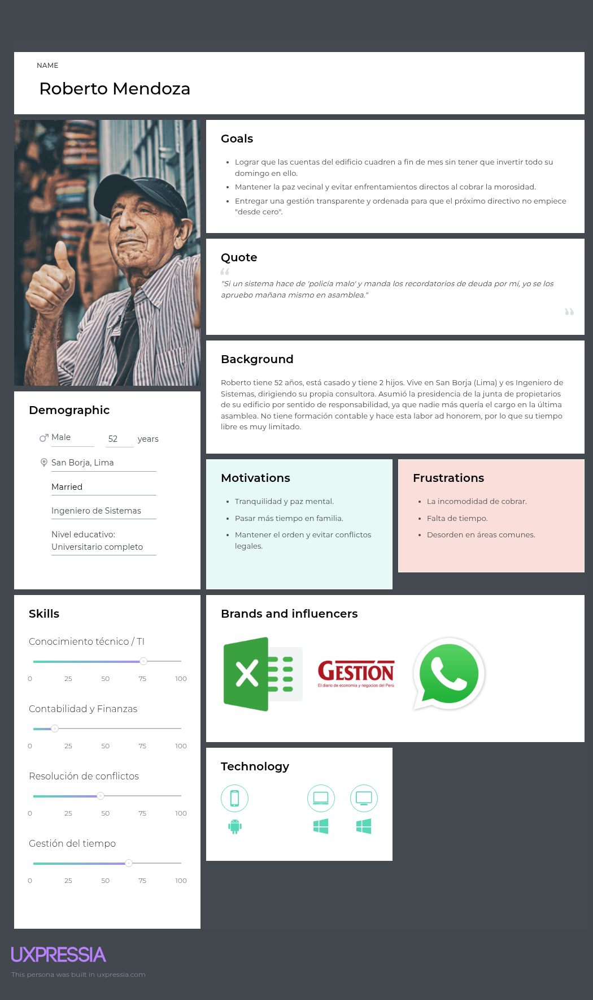

### User Persona 2: Segmento: Empresas de Gestión de Edificios

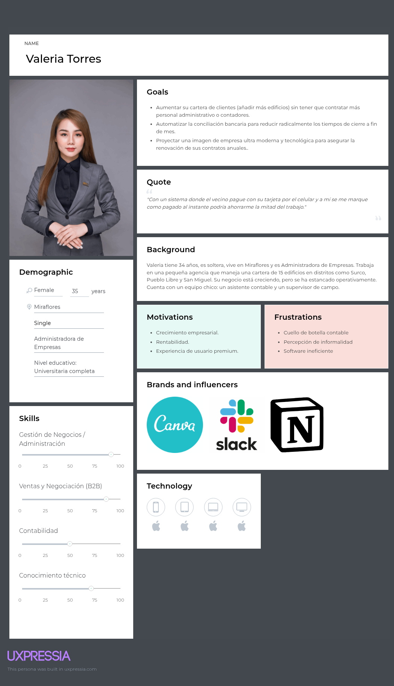

**2.3.2. User task matrix**

Esta sección permite identificar las tareas clave que realizan los usuarios de los segmentos objetivos, evaluando su frecuencia e importancia. El análisis resalta coincidencias, diferencias y puntos críticos que la plataforma BuildingFex debe atender, especialmente en los cuellos de botella operativos de cada perfil.

| Tarea (Taks) | Directivo Roberto (Frecuencia) | Directivo Roberto (Importancia) | Administradora Valeria (Frecuencia) | Administradora Valeria (Importancia) |
|------|-------------------------------|---------------------------------|------------------------------------|--------------------------------------|
| Generar y enviar recibos | Baja (mensual) | Alta | Alta (varios edificios) | Muy alta |
| Conciliación bancaria | Media (fin de mes) | Muy alta | Muy alta (diario/semanal) | Muy alta |
| Recordatorios a morosos | Baja (evita hacerlo) | Alta | Alta (constante) | Alta |
| Reportes financieros | Baja (mensual) | Alta | Media (por edificio) | Muy alta |
| Reservas áreas comunes | Media (fines de semana) | Media | Media (supervisión) | Media |
| Incidencias y quejas | Alta (diario WhatsApp) | Media | Muy alta (diario) | Alta |
| Configuración inicial | Muy baja (una vez) | Alta | Media (nuevos clientes) | Muy alta |
| Dashboard (estado) | Media (revisión rápida) | Alta | Alta (diario) | Muy alta |

Análisis de la matriz:

Por un lado, la conciliación bancaria y el envío de recordatorios a morosos son tareas de muy alta importancia para ambos segmentos. Para el directivo representan una carga emocional (incomodidad vecinal) y pérdida de tiempo libre, mientras que para el administrador representan un freno económico (necesidad de contratar más personal contable). BuildingFlex debe priorizar la automatización absoluta de estas dos tareas.

Por otro lado, mientras el directivo realiza la carga de datos inicial solo una vez en su vida, el administrador lo hace cada vez que consigue un nuevo cliente. Por ello, el módulo de Onboarding o importación masiva desde Excel debe ser tan robusto como sencillo, para satisfacer la necesidad de crecimiento de las empresas administradoras

**2.3.3. User journey mapping**

En esta sección se presenta el User Journey Mapping para la plataforma de gestión de condominios BuildingFlex, destacando las interacciones clave de los usuarios desde que descubren su problema hasta la etapa final de su ciclo en la plataforma.

Se detallan las acciones, problemas y emociones de cada etapa, lo que nos permite identificar oportunidades clave para mejorar el desarrollo.

### Segmento 1: Junta Directiva

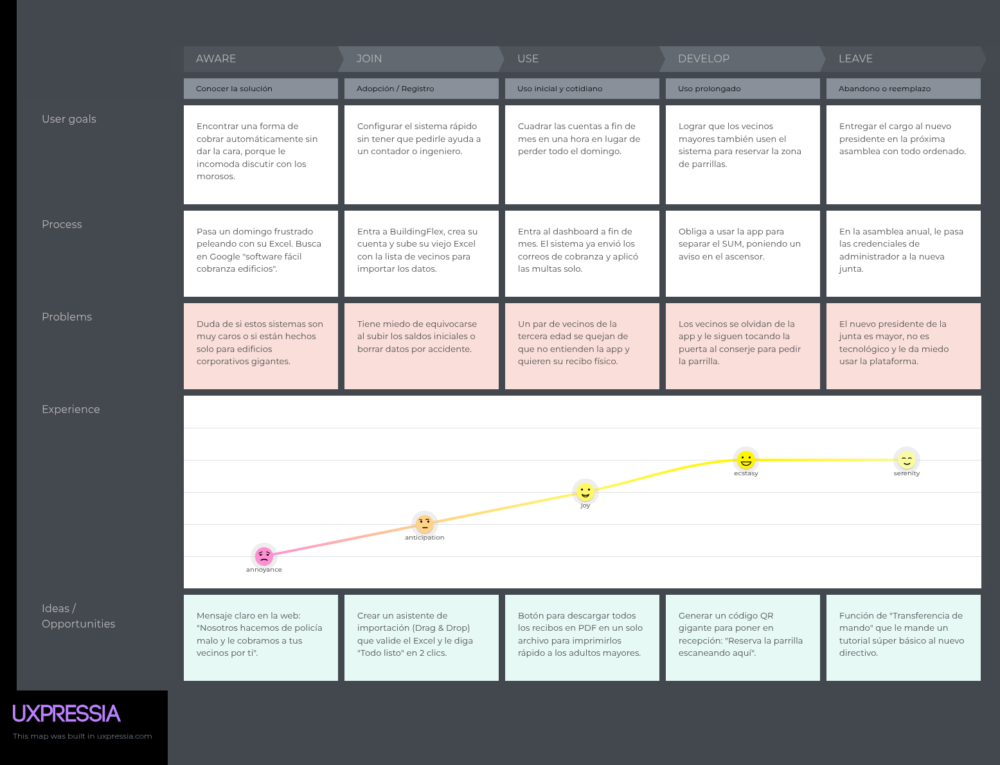

### Segmento 2: Empresa de gestión de edificios

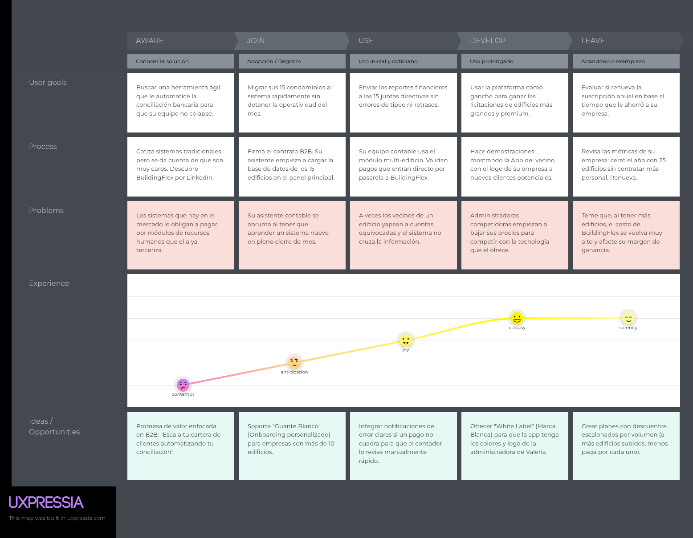

**2.3.4. Empathy Mapping**

### User Persona 1 Empathy Map: Segmento: Junta directiva

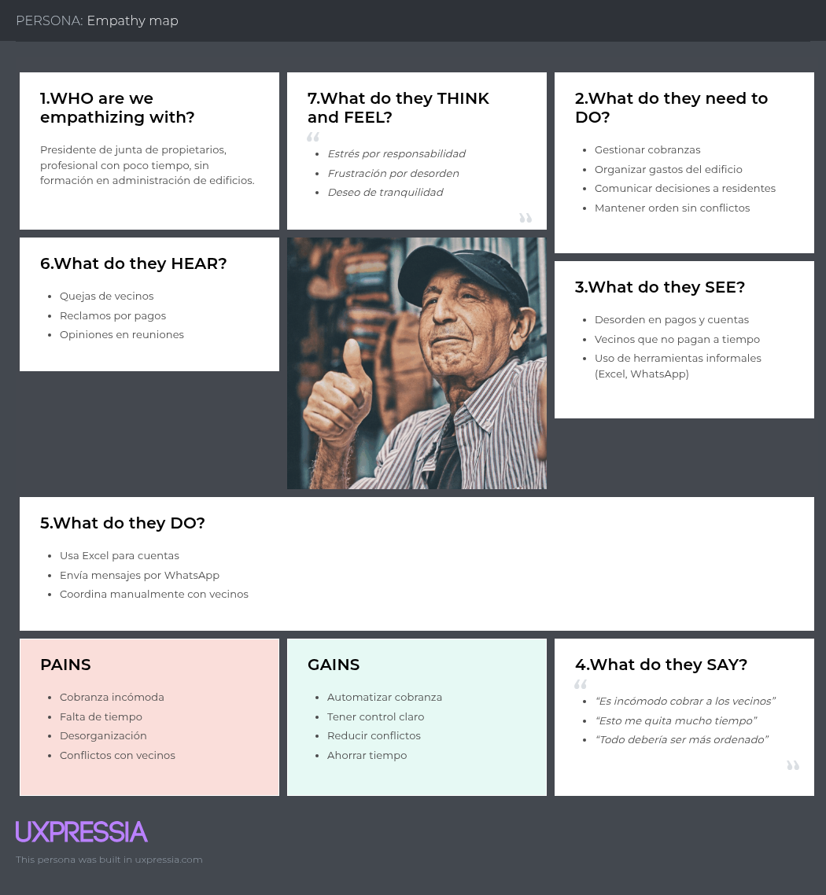

### User Persona 2: Segmento: Empresas de Gestión de Edificios

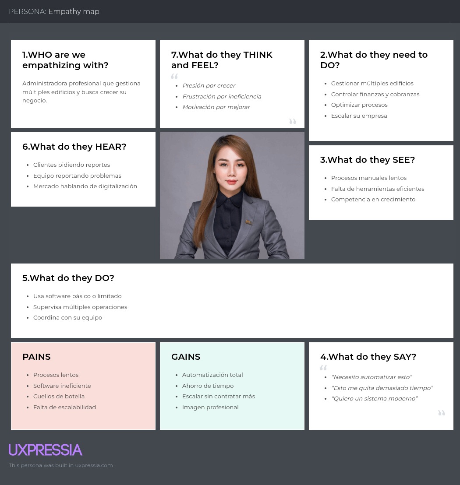

**2.4. Big Picture EventStorming**

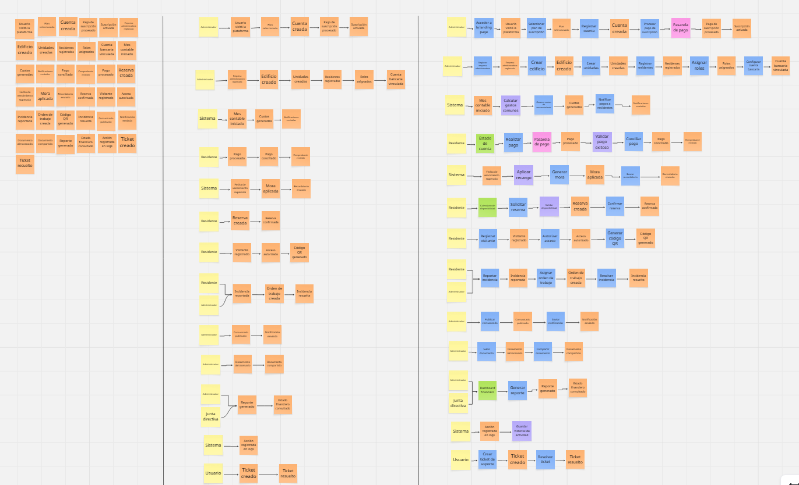

link del Big Picture EventStorming https://miro.com/welcomeonboard/bXdOWFFHWU1GWVdZa1JWK2k4TDNWdTdoYUpIQjB3R0hnZnpuVTNkM2dkN1Joc3pvd0ZRSGhuY3NXenU3T2pvVXBBcTg3bThxeUY3dXh6R2RPWUxpVFBwcVNPb3FvbThENEoxMWVKblRPSFVjK3dudjNpSnRlVE5mdU1jeFNoRy9Bd044SHFHaVlWYWk0d3NxeHNmeG9BPT0hdjE=?share_link_id=905759698205

**2.5. Ubiquitous Language**

1. **Building (Edificio)**  
   A physical property composed of one or more units that are managed under a single administration within the platform.

2. **Unit (Unidad / Departamento)**  
   An individual property within a building, such as an apartment or office, assigned to a resident or owner.

3. **Resident (Residente)**  
   A person who lives in a unit, either as an owner or tenant, and interacts with the building services.

4. **Owner (Propietario)**  
   A person who legally owns a unit and is responsible for financial obligations such as maintenance fees.

5. **Tenant (Inquilino)**  
   A person who occupies a unit but does not own it, usually paying rent to the owner.

6. **Board Member (Miembro de la junta directiva)**  
   A person elected by residents to oversee building management and make administrative decisions.

7. **Building Administrator (Administrador del edificio)**  
   A person or company responsible for the operational and financial management of one or more buildings.

8. **Maintenance Fee (Cuota de mantenimiento)**  
   A recurring payment required from unit owners or residents to cover building expenses.

9. **Payment (Pago)**  
   A transaction made by a resident or owner to fulfill financial obligations such as maintenance fees.

10. **Outstanding Balance (Morosidad / Deuda pendiente)**  
    The amount of unpaid fees or charges owed by a resident or owner.

11. **Common Area (Área común)**  
    Shared spaces within a building, such as gyms, meeting rooms, or recreational areas.

12. **Reservation (Reserva)**  
    A request made by a resident to use a common area at a specific date and time.

13. **Maintenance Request (Solicitud de mantenimiento)**  
    A report submitted by a resident or administrator regarding an issue that requires repair or attention.

14. **Work Order (Orden de trabajo)**  
    A task created to resolve a maintenance request, assigned to a responsible party.

15. **Announcement (Comunicado)**  
    An official message published by the administration for residents or board members.

16. **Visitor (Visitante)**  
    A person who is authorized to enter the building temporarily.

17. **Access Control (Control de accesos)**  
    The process of managing and recording entry and exit of visitors or residents.

18. **Subscription Plan (Plan de suscripción)**  
    A pricing model that defines the features and limits available to a building or administrator.

19. **Report (Reporte)**  
    A structured summary of financial or operational data related to the building.

20. **Provider (Proveedor)**  
    An external party that offers services such as maintenance, cleaning, or security for the building.

**Capítulo III: Requirements Specification**

**3.1. User Stories**

### EPICS

| EPIC ID | Título | Descripción |
|--------|--------|-------------|
| EP-01 | Adquisición y Presentación Comercial (Landing Page) | Portal público donde los clientes visualizan beneficios, planes de suscripción y acceden o contactan la plataforma. |
| EP-02 | Gestión de Onboarding y Configuración | Configuración inicial: registro de administradora, creación del edificio e importación masiva de residentes desde Excel. |
| EP-03 | Facturación y Cobranza Mensual | Generación masiva de recibos mensuales y notificación a residentes por correo. |
| EP-04 | Pagos y Conciliación Automática | Pago online con integración a pasarela y conciliación automática de deudas. |
| EP-05 | Gestión de Morosidad | Aplicación automática de multas y envío de recordatorios periódicos. |
| EP-06 | Gestión de Áreas Comunes y Visitas | Consulta de disponibilidad, reservas y generación de códigos QR para visitas. |
| EP-07 | Reportes Financieros (Dashboard) | Visualización en tiempo real de ingresos, egresos y morosidad. |

### EPICS & USER STORIES

| ID | Título | Descripción | Criterios de Aceptación | Epic |
|----|--------|------------|-------------------------|------|
| EP-01 | Adquisición y Presentación Comercial | Portal público con beneficios, pricing y acceso a la app. | — | — |
| US-01 | Ver propuesta de valor | Como admin quiero entender el beneficio del sistema. | Ver mensaje claro en landing. | EP-01 |
| US-02 | Ver módulos | Como admin quiero ver funcionalidades. | Mostrar módulos como cobranzas y reservas. | EP-01 |
| US-03 | Entender funcionalidades | Como junta quiero evaluar utilidad. | Mostrar descripción clara por módulo. | EP-01 |
| US-04 | Ver planes | Como admin quiero ver precios. | Mostrar planes con precios. | EP-01 |
| US-05 | Comparar planes | Como junta quiero comparar opciones. | Mostrar diferencias entre planes. | EP-01 |
| US-06 | Suscribirme | Como usuario quiero iniciar compra. | Redirige a registro y compra. | EP-01 |
| US-07 | Ver beneficios | Como admin quiero conocer ventajas. | Mostrar beneficios clave. | EP-01 |
| US-08 | FAQ | Como usuario quiero resolver dudas. | Mostrar preguntas desplegables. | EP-01 |
| US-09 | Buscar ayuda | Como usuario quiero buscar info. | Mostrar resultados relevantes. | EP-01 |
| US-010 | Navegar | Como usuario quiero moverme fácil. | Navegación fluida por menú. | EP-01 |
| US-011 | Cambiar idioma | Como usuario quiero cambiar idioma. | Contenido cambia automáticamente. | EP-01 |
| US-012 | Acceder a app | Como usuario quiero ingresar. | Redirige a plataforma SaaS. | EP-01 |
| US-013 | Navegación móvil | Como usuario quiero usar móvil. | Menú accesible y usable. | EP-01 |

---

| ID | Título | Descripción | Criterios de Aceptación | Epic |
|----|--------|------------|-------------------------|------|
| EP-02 | Onboarding y Configuración | Configuración inicial del sistema. | — | — |
| US-014 | Crear edificio | Registrar nuevo condominio. | Se crea panel exclusivo. | EP-02 |
| US-015 | Importar residentes | Subir Excel de vecinos. | Se crean cuentas y envían correos. | EP-02 |

---

| ID | Título | Descripción | Criterios de Aceptación | Epic |
|----|--------|------------|-------------------------|------|
| EP-03 | Facturación Mensual | Generación de recibos. | — | — |
| US-016 | Generar recibos | Crear recibos masivos. | Se generan en estado pendiente. | EP-03 |

---

| ID | Título | Descripción | Criterios de Aceptación | Epic |
|----|--------|------------|-------------------------|------|
| EP-04 | Pagos y Conciliación | Pagos online y conciliación. | — | — |
| US-017 | Pago online | Pagar mantenimiento. | Pago exitoso con pasarela. | EP-04 |
| US-018 | Conciliación automática | Marcar pago automático. | Estado cambia a pagado. | EP-04 |

---

| ID | Título | Descripción | Criterios de Aceptación | Epic |
|----|--------|------------|-------------------------|------|
| EP-05 | Gestión de Morosidad | Multas y recordatorios. | — | — |
| US-019 | Aplicar mora | Penalizar retrasos. | Se añade mora automática. | EP-05 |

---

| ID | Título | Descripción | Criterios de Aceptación | Epic |
|----|--------|------------|-------------------------|------|
| EP-06 | Áreas y Visitas | Reservas y accesos. | — | — |
| US-020 | Reservar áreas | Reservar parrilla. | Se bloquea horario. | EP-06 |
| US-021 | QR visitas | Generar acceso. | QR válido por 24h. | EP-06 |

---

| ID | Título | Descripción | Criterios de Aceptación | Epic |
|----|--------|------------|-------------------------|------|
| EP-07 | Dashboard Financiero | Visualización financiera. | — | — |
| US-022 | Ver dashboard | Consultar métricas. | Mostrar ingresos y deudas. | EP-07 |

**3.2 Impact Mapping**


**3.3 Product Backlog**

# User Stories - Story Points

| #Orden | User Story ID | Descripción | Story Points (1/2/3/5/8) |
|--------|--------------|-------------|---------------------------|
| 01 | US01 | Como administrador de edificios, quiero entender rápidamente el beneficio del sistema para decidir si me interesa | 1 |
| 02 | US02 | Como administrador, quiero visualizar las funcionalidades disponibles para entender qué puedo gestionar. | 2 |
| 03 | US03 | Como junta directiva, quiero leer descripciones de cada módulo para evaluar su utilidad. | 1 |
| 04 | US04 | Como administrador, quiero ver los planes de suscripción para evaluar costos. | 2 |
| 05 | US05 | Como junta directiva, quiero comparar características entre planes para elegir el adecuado. | 3 |
| 06 | US06 | Como usuario interesado, quiero tener un botón de suscripción para iniciar el proceso de compra. | 2 |
| 07 | US07 | Como administrador, quiero conocer ventajas del sistema para confiar en la solución. | 1 |
| 08 | US08 | Como usuario interesado, quiero revisar preguntas frecuentes para resolver dudas rápidamente. | 1 |
| 09 | US09 | Como usuario, quiero buscar información específica dentro de la sección de ayuda para encontrar respuestas precisas. | 3 |
| 10 | US10 | Como usuario, quiero usar el menú de navegación para moverme fácilmente por la landing. | 2 |
| 11 | US11 | Como usuario, quiero cambiar el idioma para entender mejor el contenido de la plataforma. | 3 |
| 12 | US12 | Como usuario interesado o registrado, quiero tener un botón visible para acceder a la aplicación web. | 1 |
| 13 | US13 | Como junta directiva, quiero navegar fácilmente desde mi celular para acceder rápidamente a la información. | 3 |
| 14 | US14 | Como administrador, quiero registrar un nuevo edificio en el sistema, para empezar a gestionar sus finanzas de manera independiente. | 5 |
| 15 | US15 | Como administrador, quiero subir un archivo Excel con los datos de los vecinos, para no tener que registrar departamento por departamento manualmente. | 5 |
| 16 | US16 | Como administrador, quiero generar los recibos de mantenimiento de todos los departamentos con un solo clic, para ahorrar tiempo al inicio de cada mes. | 5 |
| 17 | US17 | Como residente, quiero pagar mi cuota de mantenimiento usando mi tarjeta desde la plataforma, para evitar hacer transferencias bancarias manuales. | 8 |
| 18 | US18 | Como administrador, quiero que el sistema marque automáticamente como "Pagado" un recibo abonado por la web, para evitar cruzar vouchers manualmente. | 5 |
| 19 | US19 | Como administrador, quiero que el sistema aplique una multa automática a los recibos vencidos, para penalizar la morosidad sin tener que discutir con el vecino. | 5 |
| 20 | US20 | Como residente, quiero reservar la zona de parrillas desde la plataforma, para asegurar mi turno sin buscar al conserje. | 3 |
| 21 | US21 | Como residente, quiero generar un código QR de invitación, para que mis visitas puedan ingresar rápido y el conserje los valide. | 5 |
| 22 | US22 | Como administrador, quiero ver un resumen visual de los ingresos y el porcentaje de morosidad, para conocer la salud financiera del edificio rápidamente. | 5 |

---

## Capítulo IV: Product Design

**4.1. Style Guidelines**

En esta sección se define un repositorio centralizado y debidamente organizado para el uso de todo el equipo, el cual incluye recursos como assets, tipografías y demás elementos necesarios. Su finalidad es asegurar una presentación coherente, estandarizada y alineada en todo el proyecto.

**4.1.1. General Style Guidelines**

Buscamos transmitir **transparencia, solidez y eficiencia**. Para reflejar la idea de una gestión inmobiliaria moderna y una administración libre de conflictos, integramos una identidad visual basada en estructuras arquitectónicas y una paleta de colores que proyecta profesionalismo y autoridad en el manejo de activos y finanzas.

La identidad visual de **BuildingFex** se construye sobre la base de:

- **Misión:** Transformar la administración de condominios y edificios en una experiencia digital eficiente, transparente y automatizada, permitiendo a las administradoras escalar su gestión y a los residentes disfrutar de una convivencia organizada y moderna.
- **Visión:** Consolidarnos como la plataforma SaaS líder en el mercado inmobiliario peruano, reconocida por integrar innovación tecnológica y transparencia financiera que impacte positivamente en la plusvalía de los inmuebles y la armonía de las comunidades. 

**Logo**

El logotipo de **BuildingFex** proyecta una imagen de **seguridad, estabilidad y orden**. Utiliza una iconografía de líneas geométricas que forman la silueta de torres residenciales, simbolizando el respaldo tecnológico a la infraestructura física. Se emplean tonos azul oscuro para reforzar el profesionalismo y la confianza en la gestión de fondos comunes.


**Typography**

La tipografía debe transmitir **claridad, modernidad y precisión**, elementos vitales al manejar estados de cuenta y registros de seguridad. Por esta razón, hemos seleccionado **Montserrat** y **Inter**:

- **Montserrat** → Para títulos, encabezados y mensajes de marca. Su estructura geométrica refleja solidez y una estética de software B2B moderno.
- **Inter** → Para párrafos, tablas de datos, formularios y texto funcional. Fue elegida por su altísima legibilidad en pantallas y dispositivos móviles, facilitando la lectura de cifras financieras y avisos oficiales.


**Tipografía de Diseño (Font Scale)**

| **Tipo de Texto** | **Fuente** | **Tamaño** | **Peso** |
| --- | --- | --- | --- |
| **Display 1** | Inter | 54px | Bold |
| **Display 2** | Inter | 48px | Bold |
| **Heading 1** | Poppins | 32px | Bold |
| **Heading 2** | Inter | 28px | Bold |
| **Heading 3** | Inter | 24px | SemiBold |
| **Heading 4** | Inter | 20px | SemiBold |
| **Paragraph 1** | Inter | 18px | Bold |
| **Paragraph 2** | Inter | 16px | Bold |
| **Text** | Inter | 16px | Regular |
| **Text Small** | Inter | 12px | Light |

**Colors**

Elegimos los siguientes colores buscando plasmar una paleta que influya **seguridad, calma y profesionalismo**:

- **Base**: `#F5F5F5` → Fondo neutro, limpio y profesional.
- **Muted**: `#CCD0DA` → Gris suave para elementos secundarios.
- **CC Bold Green**: `#36837B` → Verde profundo para estados positivos y acciones principales.
- **CC Green**: `#26B5A6` → Verde vibrante para alertas de éxito y botones CTA.
- **CC Red**: `#E63946` → Rojo para alertas críticas y errores.
- **CC Dark Blue**: `#1A2A33` → Azul oscuro para textos importantes y encabezados.
- **Text Primary**: `#0D0D0D` → Negro para texto principal.
- **Text Secondary**: `#333333` → Gris oscuro para subtítulos.
- **Text Secondary-2**: `#FAFAFF` → Blanco para textos sobre fondos oscuros.
- **Text CC**: `#416072` → Azul grisáceo para etiquetas y estados.
- **Text CC (alerta)**: `#F66D77` → Rosa rojizo para notificaciones de riesgo.


**Spacing**

En este proyecto el espaciado cumple un papel clave para mantener la **legibilidad, accesibilidad y equilibrio visual**. Por ello:

- **Párrafos:** Se añade un espacio de 16px entre líneas y 24px entre párrafos.
- **Elementos interactivos:** 8px–12px de separación entre botones, enlaces u otros componentes.
- **Márgenes y padding:** 16px–24px alrededor del contenido para evitar saturación visual.
- **Base modular:** Sistema de espaciado en múltiplos de 8px para consistencia en todas las vistas.

**Communication Tone**

| **Dimensión** | **Nivel Adoptado** |
| --- | --- |
| Divertido/Serio | Medio-Serio |
| Formal/Casual | Semi-Formal |
| Respetuoso/Irreverente | Muy Respetuoso |
| Entusiasta/Sereno | Sereno y Empático |

Decidimos mantener una comunicación **clara, cálida y profesional**, porque este enfoque nos permite conectar de manera efectiva con el público, usamos lenguaje humano, evitamos tecnicismos innecesarios y priorizamos la empatía en cada mensaje.

**4.1.2. Web Style Guidelines**

Para garantizar que la plataforma se adapte a diferentes tamaños de pantalla (Desktop, Tablet, Mobile), se empleará **CSS con media queries**. Esto permite que la barra de navegación y los dashboards financieros se ajusten automáticamente.

**Principios de Interacción:**

- **Jerarquía visual clara:** Las métricas de morosidad y estados de cuenta siempre visibles.
- **Acciones prioritarias:** Botones de **"Registrar Pago"**, **"Generar Invitación QR"** y **"Reservar Área Común"** con alto contraste.
- **Navegación intuitiva:** Menú superior/lateral con acceso a Dashboard, Unidades, Cobranzas, Visitas y Reportes.
- **Feedback visual (Chips de estado):**
    - **Verde (#26B5A6):** Cuota pagada / Espacio disponible.
    - **Rojo (#E63946):** Unidad morosa / Incidencia crítica.
    - **Azul (#416072):** Trámite en proceso.

| **Dispositivo** | **Ancho mínimo** | **Ejemplo de uso** |
| --- | --- | --- |
| Mobile | ≥ 320px | Teléfonos |
| Tablet | ≥ 768px | iPad / tablets genéricas |
| Laptop | ≥ 1024px | Monitores y laptops |
| Wide Screen | ≥ 1440px | Pantallas grandes o TV |

La interfaz prioriza:

- **Jerarquía visual clara**: Alertas y métricas vitales siempre visibles.
- **Acciones prioritarias**: Botones de “Registrar ”, “Ver alertas críticas” y “Comunicar ” con alto contraste.
- **Navegación intuitiva**: Menú superior con acceso rápido a Dashboard, , Alertas, Reportes y Configuración.
- **Feedback visual**: Chips de estado (verde = estable, amarillo = advertencia, rojo = crítico) y animaciones sutiles para confirmaciones.

**4.2. Information Architecture**

**4.2.1. Organization Systems**

Nuestro propósito es garantizar una **experiencia de usuario coherente, intuitiva y sin fricciones** en la plataforma web, adaptada a las necesidades de nuestros dos segmentos principales: **Administradores/Juntas de Propietarios** y **Residentes**.

La estructura visual ha sido diseñada estratégicamente para facilitar el **control financiero transparente**, la **seguridad en los accesos** y la **gestión de activos comunes** de manera eficiente.

Para lograr esto, aplicamos los siguientes sistemas:

1. **Organización Jerárquica:** El contenido se despliega desde lo general (Dashboard del edificio) hacia lo particular (Detalle de una unidad o historial de un residente).
2. **Organización por Audiencia:** * **Vista Administrador:** Enfocada en la gestión masiva de datos, reportes financieros y configuración de edificios.
    - **Vista Residente:** Simplificada para el autoservicio (pagos, reservas y consultas de documentos).
3. **Organización Secuencial:** Flujos paso a paso para procesos críticos como el **Módulo de Cobranza** o el **Módulo de Gestión de Incidencias**, asegurando que no se omitan pasos importantes en la trazabilidad.

**Flujo de Usuario de funcionalidades** 

La arquitectura de **BuildingFex** ha sido diseñada para optimizar la operatividad del administrador y facilitar el autoservicio del residente, estructurándose de la siguiente manera:

- **Landing Page:** Punto de entrada para nuevos clientes (administradoras y juntas). Presenta la propuesta de valor basada en transparencia financiera, beneficios de automatización y llamados a la acción (CTA) para seleccionar un plan (Essential, Standard, Scale).
- **Inicio de Sesión / Registro:**
    - **Crear cuenta manual:** Formulario para administradores y residentes con validación de unidad (torre/departamento).
    - **Registro con Google:** Opción rápida para acceso de residentes.
    - **Validación de identidad:** Registro de DNI y verificación para garantizar que solo propietarios u ocupantes autorizados accedan a la información del edificio.
- **Dashboard (Residente):**
    - **Gestión de pagos:** Visualización de recibos de mantenimiento y botones de pago.
    - **Reservas:** Calendario de áreas comunes (parrillas, SUM, gimnasio).
    - **Seguridad:** Generación de códigos QR para pre-registro de visitas.
    - **Comunicación:** Acceso a anuncios oficiales y documentos del condominio.
- **Dashboard (Administrador):**
    - **Consola de edificios:** Vista de todas las torres y unidades bajo su gestión.
    - **Control de morosidad:** Filtros por niveles de deuda y alertas de cobro.
    - **Monitoreo de incidencias:** Gráficos de tickets de mantenimiento internos pendientes.
    - **Gestión financiera:** Generación masiva de reportes y estados de cuenta en PDF.
- **Perfil y Preferencias:**
    - **Configuración de la unidad:** Actualización de datos de contacto y vehículos.
    - **Idioma y accesibilidad:** Ajuste de interfaz (EN/ES) y preferencias de lectura.
    - **Gestión de notificaciones:** Configuración de alertas por correo o push para avisos de cobranza.
- **Soporte y Tutoriales:**
    - **Guías interactivas:** Tutoriales sobre cómo reservar áreas o pagar cuotas.
    - **FAQ:** Preguntas frecuentes sobre el uso de la plataforma.
    - **Soporte Técnico (Help Desk):** Contacto directo para incidencias con la herramienta BuildingFex.

Este flujo garantiza que los **residentes** tengan el control total sobre sus obligaciones y beneficios, y que los **administradores** tomen decisiones informadas, logrando una gestión transparente y eficiente.

**4.2.2. Labeling Systems**

Los sistemas de etiquetado de **BuildingFex** siguen una estructura clara, consistente y centrada en el lenguaje del administrador y el residente. Se priorizan verbos de acción y sustantivos comprensibles para evitar confusiones en la gestión financiera.

**Navegación principal (App):**

| **Sección** | **Contenido** |
| --- | --- |
| **Inicio** | Panel principal con métricas de cobranza y alertas de seguridad. |
| **Pagos** | Registro de cuotas de mantenimiento, historial y comprobantes. |
| **Reservas** | Calendario de áreas comunes (SUM, parrillas, gimnasio). |
| **Visitas** | Registro de invitados, generación de códigos QR y autorizaciones. |
| **Incidencias** | Reporte de fallas (mantenimiento) y seguimiento de reparación. |
| **Documentos** | Actas de junta, reglamentos internos y estados financieros. |
| **Comunicados** | Avisos oficiales de la administración y noticias del edificio. |
| **Perfil** | Datos de la unidad, vehículos registrados y configuración. |

**Call to Action (CTA):**

- **Para Residentes:** “Pagar mantenimiento”, “Reservar área”, “Invitar visita”, “Reportar falla”.
- **Para Administradores:** “Generar recibos”, “Ver morosidad”, “Aprobar gasto”, “Publicar aviso”.

**4.2.3. SEO Tags and Meta Tags**

La **Landing Page** está diseñada para atraer a empresas administradoras y juntas de propietarios. Las etiquetas se centran en captar tráfico interesado en **administración de edificios, software para condominios y transparencia financiera**.

HTML

```
<title>BuildingFex – Software SaaS para Administración de Edificios</title>

<meta name="description" content="BuildingFex es la plataforma integral que automatiza la cobranza de mantenimiento, gestiona reservas de áreas comunes y mejora la transparencia en condominios y edificios residenciales.">

<meta name="keywords" content="administración de edificios, software condominios, gestión inmobiliaria, cuotas de mantenimiento, control de visitas, reserva de áreas comunes, transparencia financiera, SaaS inmobiliario Perú">

<meta name="author" content="Startup BuildingFex – Equipo 1ASI0730">
```

### 4.2.4. Searching Systems

**BuildingFex** incorpora sistemas de búsqueda y filtrado inteligentes diseñados para que administradores y residentes encuentren registros financieros o de seguridad de forma rápida.

- **Búsqueda global en registros:** Disponible en el dashboard de ambos roles. Permite buscar por fecha, número de unidad (departamento), tipo de concepto (mantenimiento, multas, reservas) o nombre de propietario.
- **Filtros avanzados por contexto:**
    - **Administradores:** Filtrar unidades por nivel de morosidad, filtrar gastos por proveedor o filtrar incidencias por estado (pendiente, en proceso, resuelto).
    - **Residentes:** Filtrar historial de pagos por año o filtrar disponibilidad de áreas comunes por tipo de espacio.
- **Panel interactivo con selección visual:** Los administradores pueden interactuar con los gráficos de morosidad para seleccionar un mes específico y ver el listado detallado de unidades deudoras automáticamente.

**4.2.5. Navigation Systems**

La navegación de **BuildingFex** es intuitiva y adaptable, priorizando las tareas críticas según el rol del usuario.

**Estructura de la Landing Page:**

- **Inicio:** Propuesta de valor y CTAs de registro.
- **Soluciones:** Detalle de módulos (Cobranzas, Seguridad, Reservas).
- **Planes:** Tabla comparativa: **Essential, Standard y Scale**.
- **Testimonios:** Experiencias de juntas de propietarios y administradores.
- **Contacto:** Soporte técnico y ventas.

**Navegación en la Aplicación (por rol):**

- **Para Residentes (Barra inferior en móvil):** Inicio (Dashboard), Pagos (Finanzas), Reservas (Calendario), Visitas (QR) y Soporte.
- **Para Administradores (Sidebar lateral en Web):** Dashboard, Gestión de Unidades, Cobranzas, Proveedores, Reportes y Auditoría.

**CTAs estratégicos:**

- **Color Teal (#26B5A6):** Acciones principales de éxito (Registrar pago, Autorizar visita).
- **Color Rojo (#E63946):** Acciones de riesgo o críticas (Eliminar registro, Reportar incidencia urgente).
- **Ubicación fija:** Botones flotantes para acciones rápidas como "Generar QR" para el residente.

**Beneficio clave:** Reduce el tiempo de gestión administrativa, evita errores en la conciliación de pagos y permite que el residente complete sus obligaciones en menos de 3 clics.


**4.3. Landing Page UI Design**

La interfaz de la **Landing Page de BuildingFex** es clave para el proyecto, pues constituye la primera impresión del producto ante administradores y juntas de propietarios. Su diseño limpio, moderno y funcional transmite **confianza, solidez y profesionalismo** —valores esenciales en la gestión inmobiliaria y financiera—, combinando una tipografía clara (**Poppins e Inter**), una paleta de colores en tonos **Deep Navy y Teal**, y botones estratégicos que destacan las acciones principales según el plan elegido. Esta estructura estética y técnica atrae de inmediato a los visitantes, proyectando una plataforma SaaS robusta y confiable que los impulsa a digitalizar la administración de sus edificios.

**4.3.1. Landing Page Wireframe**

> ** Enlace al prototipo interactivo en Figma:**
> 
> 
> [https://www.figma.com/design/TQT3UEzzMXhelZfd0bPylJ/ChroniCare?node-id=0-1&t=eNHIEflEvJ79drV8-1](https://www.figma.com/design/0k3SyuVUNtf05VdscXvbR2/Sin-t%C3%ADtulo?node-id=0-1&t=4PVAGkbTTyat0EHZ-1)
> 

Los wireframes representan la estructura básica y funcional de la landing page de **BuildingFex**, abstrayendo los elementos visuales finales para centrarse en la arquitectura de la información. Su objetivo es definir la jerarquía de contenido, estableciendo dónde se ubicarán las propuestas de valor, la tabla de planes (**Essential, Standard, Scale**) y los flujos de navegación hacia el registro de administradores y residentes.

Esta etapa es fundamental para validar la disposición de los componentes clave, como el menú de navegación adaptativo y las secciones de beneficios, asegurando que el mensaje de **transparencia y eficiencia** sea el foco principal antes de la aplicación de la identidad visual y los estilos finales.

---

**Header y Hero**


*Define la primera impresión del usuario: logo, menú de navegación, llamado a acción principal  y espacio para imagen/video hero. Diseñado para captar atención en menos de 3 segundos y comunicar el valor central: prevención, adherencia y cuidado continuo.*

---

**¿Qué es BuildingFex?**


*Sección explicativa que comunica el propósito : conectar clientes y para mejorar la adherencia, prevenir complicaciones.*

---

**Funcionalidades Clave**


*Usa tarjetas modulares con ícono, título y descripción corta.*

---

**Footer**


*Contiene enlaces legales (Términos, Privacidad), contacto y logos de alianzas con instituciones de. Es la base de confianza y cierre de la página.*

---

**4.3.2. Landing Page Mock-up.**

> **🔗 Enlace al diseño final en Figma:**
> 
> 
> [https://www.figma.com/design/TQT3UEzzMXhelZfd0bPylJ/ChroniCare?node-id=0-1&t=eNHIEflEvJ79drV8-1](https://www.figma.com/design/0k3SyuVUNtf05VdscXvbR2/Sin-t%C3%ADtulo?node-id=0-1&t=4PVAGkbTTyat0EHZ-1)
> 

Los mock-ups son la versión visual final de la landing page, con colores, tipografías, imágenes reales y microinteracciones definidas. Representan la identidad de marca y la experiencia estética que el usuario final verá: **calma, confianza, claridad y cuidado humano**.

---

**Header y Hero**

*Header con fondo suave en tonos teal y blanco Tipografía Poppins en negrita para el título principal, botón CTA en teal (#26B5A6) con hover effect y sombra sutil. Transmite seguridad, accesibilidad y acompañamiento.*


---

**¿Qué es BuildingFex?**

*Diseño limpio  gradientes suaves y tarjetas con bordes redondeados.  Comunica empatía, prevención y tecnología al servicio .*


---

**Metodo de ingreso**

 Cards con todos nuestros planes de pago. con pequeños detalles que resaltan la profesionalidad del sitio. 


---

**Videos sobre el equipo y el producto** 

Se podrán visualizar los espacios donde estaran los videos sobre el producto y el equipo de desarrollo.


---

**Puntos Fuertes**


Sección de cards explicando al cliente por que somos mejores que la competencia.

---

**Preguntas** 


Se ve un buen diseño en la sección de preguntas con la barra de búsqueda a la izquierda y las preguntas a la derecha con pequeños detalles que resaltan el interfaz. 

## **4.4. Web Applications UX/UI Design.**
feat/capitulo-1

**4.4.1 Web Applications Wireframes**

Primero en esta seccion va el Login.


Residente:

En esta seccion se presenta el wireframe del dashboard de residente.
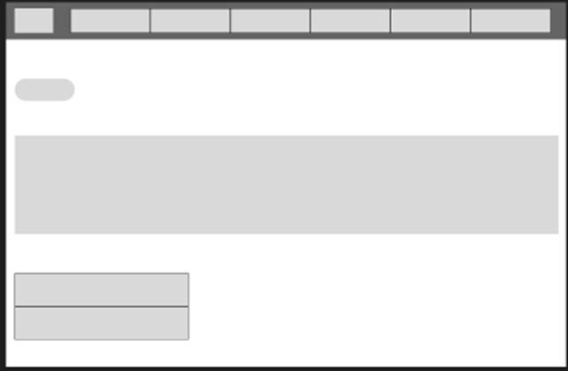

Administrador:

En esta seccion presentamos el wireframe del dashboard de administrador.
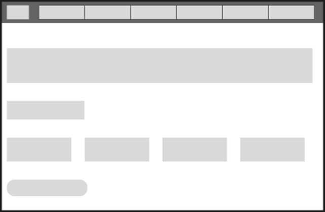

Despues de ambos dashboards estan las ventanas del menu rapido en base a los modulos.

Esta es la seccion de Finanzas.
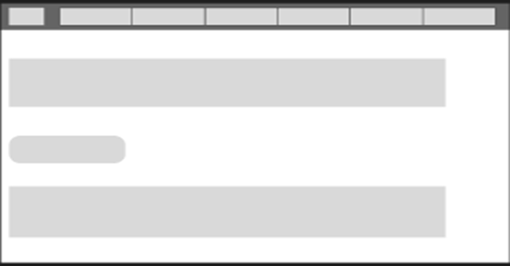

Esta es la seccion de Servicios.
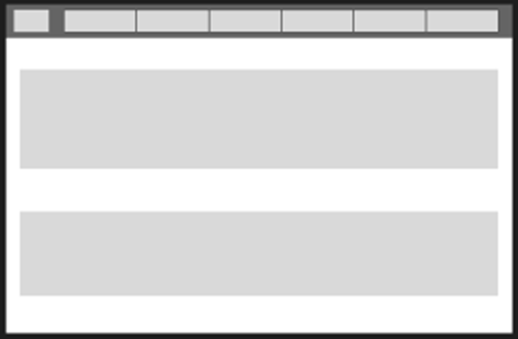

Esta es la seccion de Incidencias.
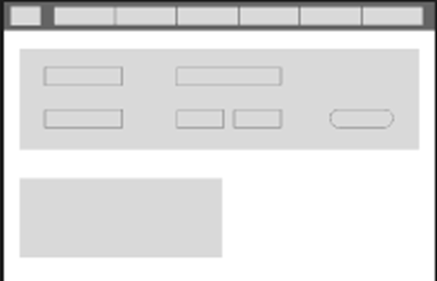

Esta es la seccion de Informacion.
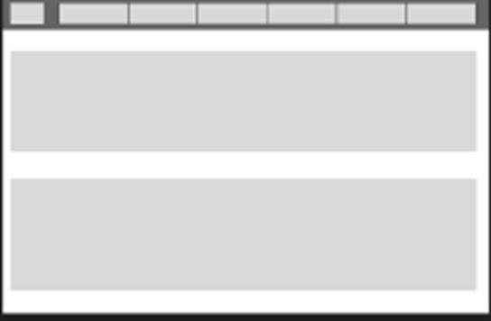

Esta es la seccion de Gestion Avanzada.
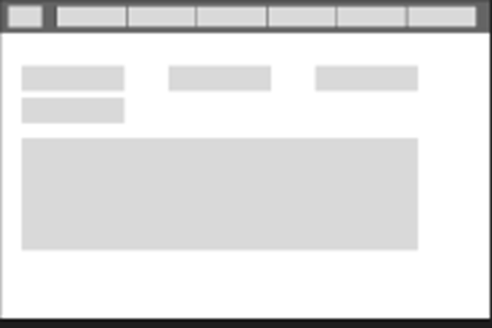

Finalmente, esta es la seccion de Soporte Tecnico.
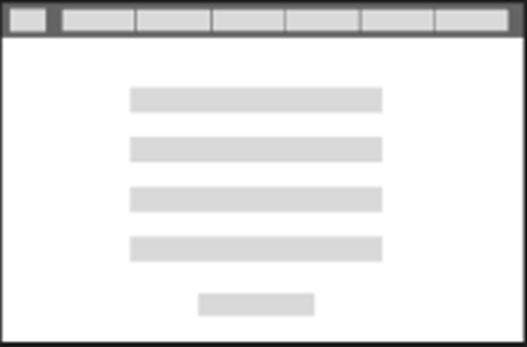

**4.4.2 Web Applications Wireflow Diagrams.**

En esta seccion se presenta el wireflow el cual consta de dos flows.

Un flow que va cuando elijes la opcion de "Residente" y otro el cual aparece cuando presionas la opcion "Adminitrador", mostrandote de inicio el dashboard de la opcion elejida.
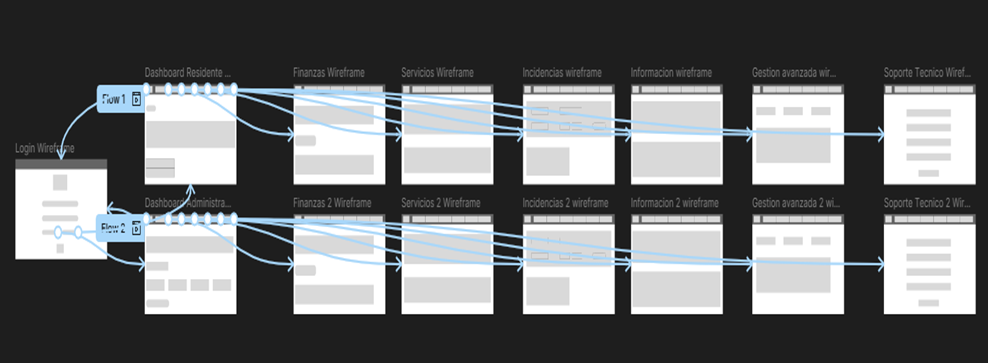

**4.4.3 Web Applications Mock-ups.**

Aqui en esta parte se van a mostrar los Mock-ups realizados para nuestra aplicacion web.

Login:

Se muestra el aspecto del login el cual tiene la opcion de ingresar DNI y elegir entre residente y administrador o de iniciar sesion con Google.
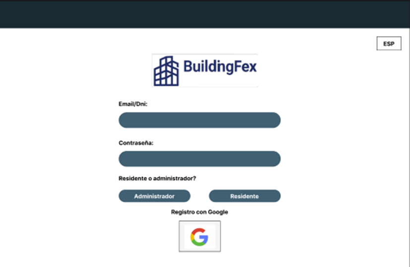

Dashboard Residente:

En esta ventana se puede ver el bloque de pagos , el registro de reservas y comunicados oficiales.
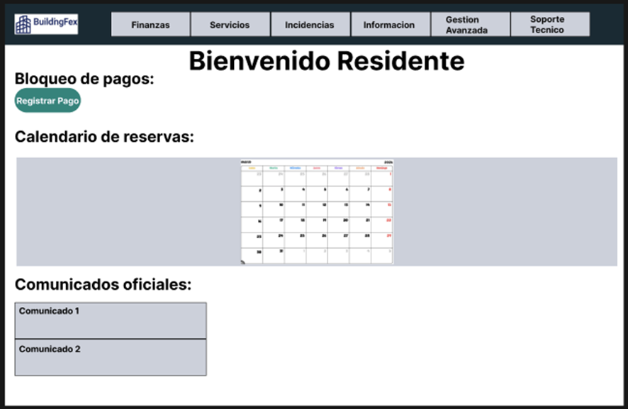

Dashboard Administrador:

En esta ventana se puede ver la vista general, el indicador de morosidad, lista de incidencias y reportes.
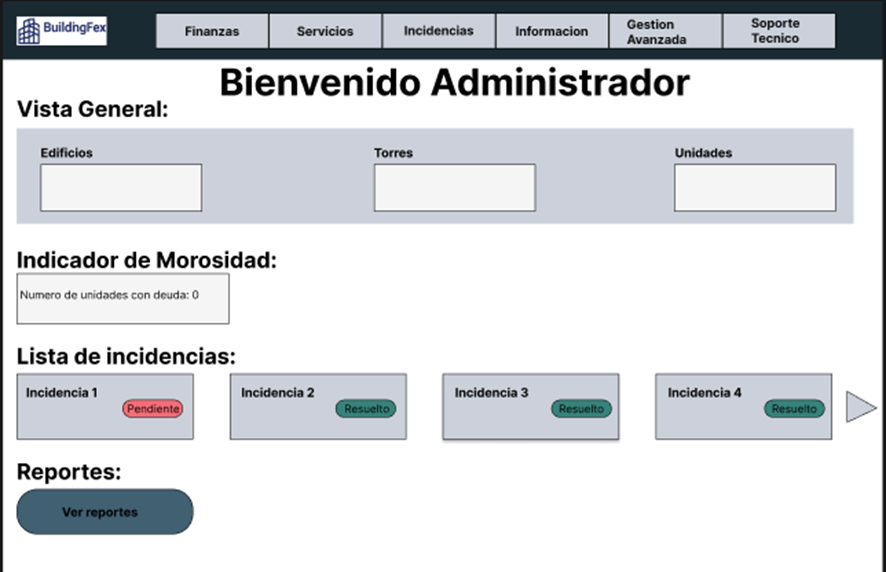

Finanzas:

En esta seccion se puede ver la lista de cuotas, el pago en linea el cual posee campos para rellenar y los reoprtes financieros.
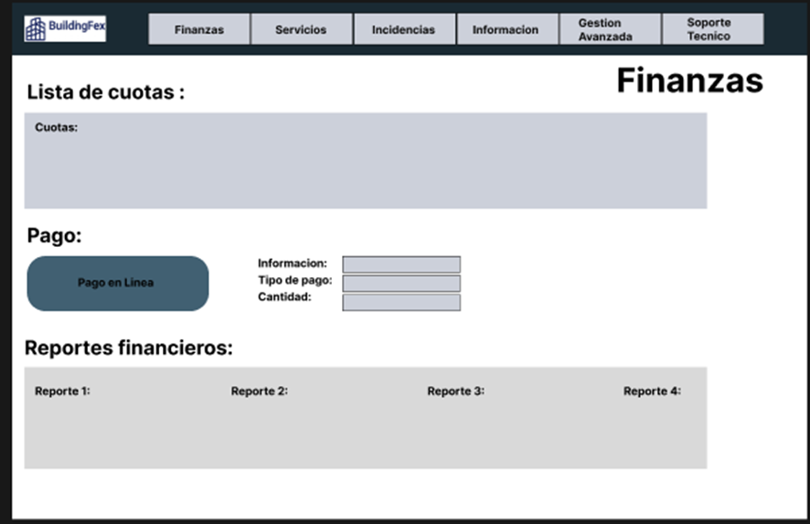

Servicios:

En esta ventana se puede observar las reglas de uso de espacios y el registro de visitantes.
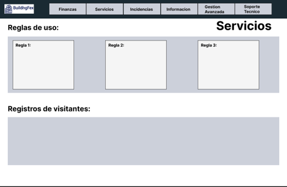

Incidencias:

En la seccion incidencias se puede reportar alguna falla con un formulario y seguir ordenes de trabajo.
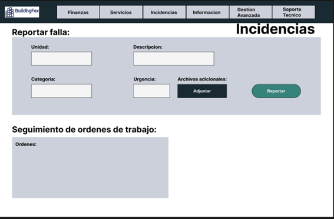

Informacion:

En informacion se encuentran los comunicados oficiales y una biblioteca de actas y reglamentos en la cual se pueden descargar los documentos.
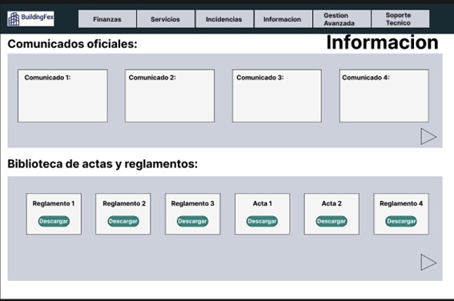

Gestion Avanzada:

En gestion se puede ver datos como ocupacion, morosidad y el numero de las reservas realizadas. Aparte tambien se puede ver el historial de acciones recientes.
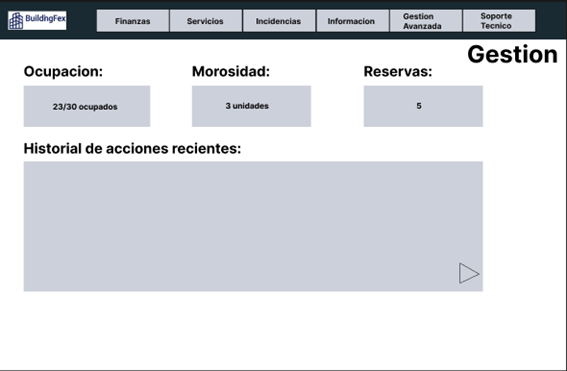

Soporte Tecnico:

Aqui se puede ver las preguntas frecuentes acerca de la aplicacion y un boton que te lleva al chat de soporte.
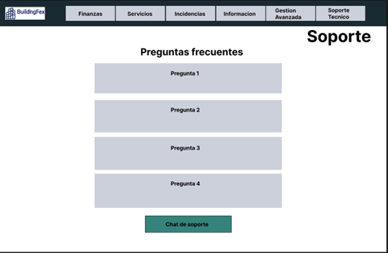

**4.4.4 Web Applications User Flow Diagrams.**
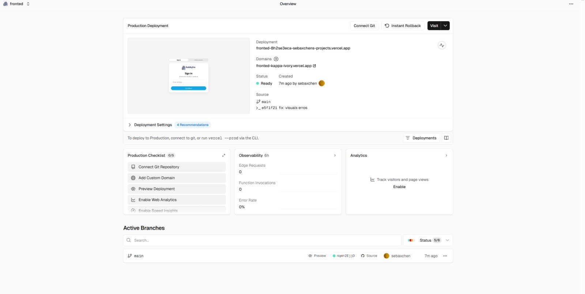

**4.5 Web Applications Prototyping.**

Link del video: https://1drv.ms/v/c/2f673bdd57dbed09/IQB_rKkNDW1USLRHOQByi1UUAX_XYLIKf3Bej1yj7cWdlxY?e=2NKZFR

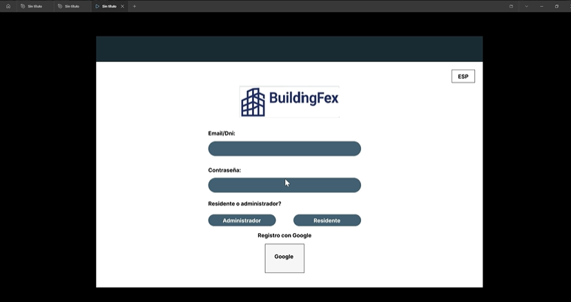

**4.6 Domain-Driven Software Architecture.**

**4.6.1. Design-Level EventStorming**

link del desiogn-level eventa storming: https://miro.com/app/board/uXjVJF4TquY=/?share_link_id=348452297177

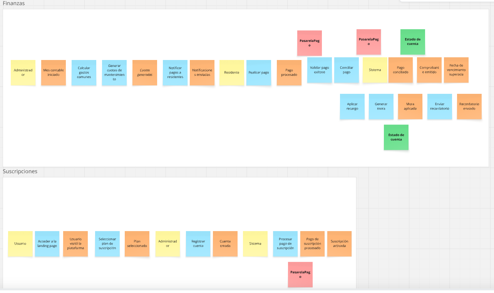

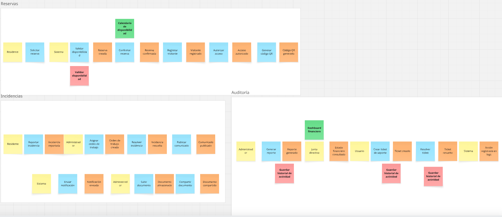

**4.6.2 Software Architecture Context Diagram**

Este diagrama de contexto representa cómo funciona la plataforma BuildingFex: los visitantes envian consultas y revisan informacion de suscripciones, mientras que los administradores analizan las respuestas. El sistema central, la aplicacion, se conecta con un API externo para obtener datos de edificios y con Firebase Cloud Messaging para enviar notificaciones push, mostrando así el flujo de interaccion entre usuarios, la plataforma y servicios externos.
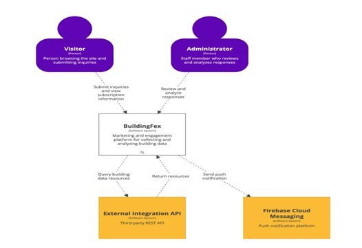

**4.6.3 Software Architecture Container Diagrams**

Este diagrama de BuildingFex resume la estructura del sistema: los usuarios interactuan con una aplicación web Angular que envia solicitudes al API Gateway, el cual distribuye el trafico hacia tres modulos principales (reportes, contactos/marketing y planes de suscripcion), cada uno con su propia base de datos. Ademas, el sistema se conecta con un API externo para obtener datos de edificios y con Firebase para enviar notificaciones push. En conjunto, muestra cómo fluye la informacion entre usuarios, aplicación, bases de datos y servicios externos.
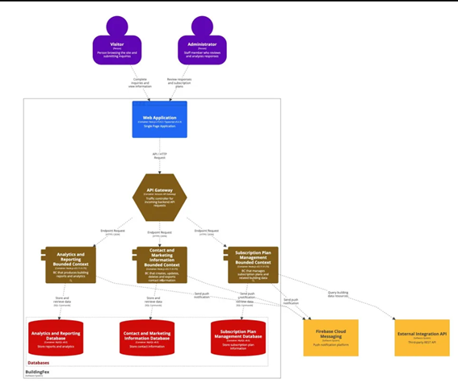

**4.6.4 Software Architecture Components Diagrams**

Analytics y Reporting: 

Este diagrama de componentes del contexto se puede resumir asi: las solicitudes entran por el API Gateway, pasan a los controladores de análisis y reportes, que llaman a servicios de negocio para procesar comandos y consultas. Estos servicios interactuan con repositorios y finalmente con la base de datos de Analytics y Reporting, donde se almacenan y recuperan los datos. En conjunto, muestra cómo se organiza la logica de negocio y el acceso a datos para gestionar reportes y analisis.
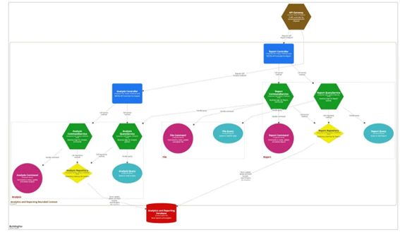

Contactos y Marketing:

Este diagrama del contexto envian las solicitudes entran por el API Gateway y son procesadas por controladores de contacto, consentimiento y consultas. Estos generan comandos y queries que se gestionan en el bounded context de Consent and Marketing Information, con almacenamiento en bases de datos y envio de notificaciones mediante Firebase Cloud. En conjunto, refleja como se manejan contactos, consentimientos y marketing dentro de BuildingFex.
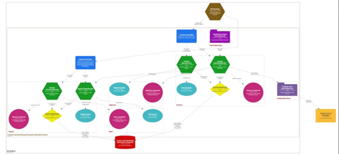

Gestion de planes de suscripcion: 

Las solicitudes entran por el API Gateway y son procesadas por el SubscriptionPlan Controller, que delega la logica al ContextFacade y a los servicios de comandos y consultas. Estos interactuan con el repositorio y la base de datos de planes de suscripcion, ademas de integrarse con un API externo para obtener recursos adicionales.
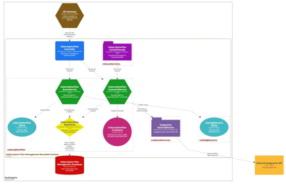

**4.7 Software Object-Oriented Design**

**4.7.1 Class Diagrams**

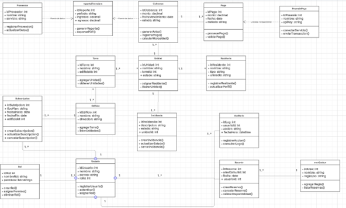

link del diagrama de clases: https://lucid.app/lucidchart/0e5d0675-677f-461e-8020-3401e9e97f08/edit?viewport_loc=1382%2C-730%2C3262%2C1630%2C0_0&invitationId=inv_8b86276f-d74e-47d9-a568-db771c638a2d

El diagrama de clases representa la estructura principal de un sistema para gestión de condominios. Incluye entidades de usuarios y roles para controlar accesos, suscripciones para manejar planes de servicio, y la estructura fisica de edificios, torres y unidades vinculadas a residentes. En el area financiera se modelan cobranzas, pagos, pasarelas de pago y reportes, mientras que en operaciones se incluyen reservas de areas comunes e incidencias de mantenimiento. Finalmente, la clase de auditoria asegura trazabilidad de todas las acciones. Las relaciones muestran como los usuarios interactuan con suscripciones, unidades y reservas, conectando la gestion administrativa, financiera y operativa en un solo ecosistema.

**4.7.2 Class Dictionary**
# Class Dictionary

## Usuario
Representa a la persona que accede al sistema.
- **Atributos**:
    - idUsuario (int)
    - nombre (string)
    - correo (string)
    - rolId (int)
- **Operaciones**:
    - registrarUsuario()
    - autenticar()
    - asignarRol()

## Rol
Define los permisos y funciones que puede realizar un usuario.
- **Atributos**:
    - idRol (int)
    - nombreRol (string)
    - permisos (list<string>)
- **Operaciones**:
    - crearRol()
    - asignarPermiso()
    - eliminarRol()

## Suscripcion
Modela el plan contratado por un usuario para un edificio.
- **Atributos**:
    - idSuscripcion (int)
    - tipoPlan (string)
    - fechaInicio (date)
    - fechaFin (date)
    - edificioId (int)
    - usuarioId (int)
- **Operaciones**:
    - crearSuscripcion()
    - actualizarSuscripcion()
    - cancelarSuscripcion()

## Edificio
Representa un condominio o complejo.
- **Atributos**:
    - idEdificio (int)
    - nombre (string)
    - direccion (string)
- **Operaciones**:
    - agregarTorre()
    - listarUnidades()

## Torre
Agrupa las unidades dentro de un edificio.
- **Atributos**:
    - idTorre (int)
    - nombre (string)
    - edificioId (int)
- **Operaciones**:
    - agregarUnidad()
    - obtenerUnidades()

## Unidad
Representa un departamento o espacio habitable.
- **Atributos**:
    - idUnidad (int)
    - numero (string)
    - torreId (int)
    - estado (string)
- **Operaciones**:
    - asignarResidente()
    - liberarUnidad()

## Residente
Perfil de ocupante (dueno o inquilino) vinculado a una unidad.
- **Atributos**:
    - idResidente (int)
    - nombre (string)
    - tipo (string)
    - unidadId (int)
    - usuarioId (int)
- **Operaciones**:
    - registrarResidente()
    - actualizarPerfil()

## Cobranza
Registra las cuotas de mantenimiento y pagos pendientes.
- **Atributos**:
    - idCobranza (int)
    - monto (decimal)
    - fechaVencimiento (date)
    - estado (string)
    - unidadId (int)
- **Operaciones**:
    - generarAviso()
    - registrarPago()
    - calcularMorosidad()

## Pago
Representa la transaccion realizada por un residente.
- **Atributos**:
    - idPago (int)
    - monto (decimal)
    - fecha (date)
    - metodo (string)
    - cobranzaId (int)
- **Operaciones**:
    - procesarPago()
    - validarPago()

## PasarelaPago
Conecta con servicios externos de pago.
- **Atributos**:
    - idPasarela (int)
    - nombre (string)
    - apiKey (string)
    - pagoId (int)
- **Operaciones**:
    - conectarServicio()
    - enviarTransaccion()

## ReporteFinanciero
Consolida informacion de ingresos y egresos.
- **Atributos**:
    - idReporte (int)
    - periodo (string)
    - ingresos (decimal)
    - egresos (decimal)
    - cobranzaId (int)
    - proveedorId (int)
- **Operaciones**:
    - generarReporte()
    - exportarPDF()

## Proveedor
Representa a contratistas o empresas que brindan servicios al edificio.
- **Atributos**:
    - idProveedor (int)
    - nombre (string)
    - servicio (string)
- **Operaciones**:
    - registrarProveedor()
    - actualizarDatos()

## Reserva
Gestiona la ocupacion de areas comunes.
- **Atributos**:
    - idReserva (int)
    - fecha (date)
    - usuarioId (int)
    - areaComunId (int)
- **Operaciones**:
    - crearReserva()
    - cancelarReserva()
    - validarDisponibilidad()

## AreaComun
Espacios compartidos como piscina, gimnasio o salon de eventos.
- **Atributos**:
    - idArea (int)
    - nombre (string)
    - reglasUso (string)
- **Operaciones**:
    - agregarRegla()
    - listarReservas()

## Incidencia
Registra problemas o solicitudes de mantenimiento.
- **Atributos**:
    - idIncidencia (int)
    - descripcion (string)
    - estado (string)
    - unidadId (int)
- **Operaciones**:
    - crearIncidencia()
    - actualizarEstado()
    - cerrarIncidencia()

## Auditoria
Garantiza trazabilidad de las acciones en el sistema.
- **Atributos**:
    - idLog (int)
    - usuarioId (int)
    - accion (string)
    - fechaHora (datetime)
- **Operaciones**:
    - registrarAccion()
    - consultarLogs()

**4.8 Database Design**

**4.8.1 Database Diagram**
  
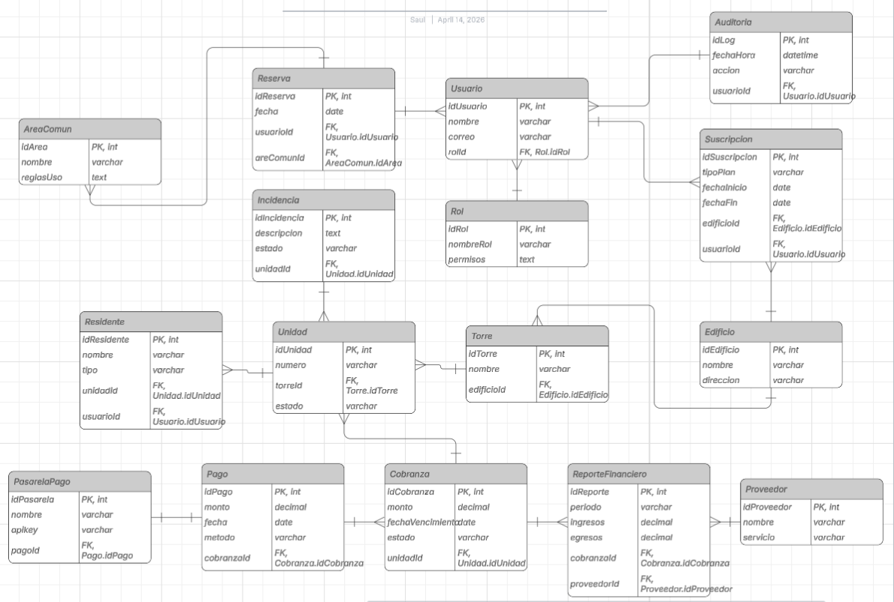

link del diagrama de base de datos: https://lucid.app/lucidchart/ea565e2d-77c5-40ea-87f3-28e6c02e7d20/edit?viewport_loc=-343%2C16%2C2936%2C1439%2C0_0&invitationId=inv_712e52ef-1985-4328-a3eb-e1548cc8c4e8
  
## Capítulo V: Product Implementation, Validation & Deployment

Este capítulo documenta **únicamente el alcance de la entrega TB1** del curso: configuración del entorno y despliegue del *landing*, implementación del **Sprint 1** (landing en Vue + informe técnico en el repositorio **Report**) y evidencias de validación previstas para esa misma entrega. No incluye **sprints ni productos de entregas posteriores** (aplicación web completa, APIs, base de datos en producción, etc.); esas fases se describirán en los capítulos correspondientes cuando correspondan a **TB2** u otras entregas.

**5.1. Software Configuration Management**

**5.1.1. Software Development Environment Configuration**

Para el desarrollo del proyecto se utilizaron herramientas estándar: editor de código (**Visual Studio Code** u otro IDE compatible), **Git** para control de versiones, **GitHub** como repositorio remoto bajo la organización [BuildingFex](https://github.com/BuildingFex), navegadores actualizados para pruebas de la landing, y **Vue.js** como **framework frontend** para la implementación del *landing* y la interfaz. El entorno incluye **Node.js** y gestor de paquetes (**npm**) para dependencias, junto con el *tooling* habitual del ecosistema Vue (por ejemplo **Vite** como empaquetador y servidor de desarrollo). El equipo alinea versiones mediante el `README` del proyecto y documentación en los repositorios del equipo: informe en [https://github.com/BuildingFex/Report.git](https://github.com/BuildingFex/Report.git) y *landing* en [https://github.com/BuildingFex/LandingPage.git](https://github.com/BuildingFex/LandingPage.git).

**5.1.2. Source Code Management**

El código fuente y el informe se versionan en GitHub: [BuildingFex — Report](https://github.com/BuildingFex/Report.git) (informe) y [BuildingFex — LandingPage](https://github.com/BuildingFex/LandingPage.git) (landing). Se trabaja con ramas de características (`feature/*`), integración mediante *pull requests* y trazabilidad de cambios con mensajes en formato **Conventional Commits** (ver 5.1.3).

**5.1.3. Source Code Style Guide & Conventions**

| Lenguaje | Referencia adoptada | Convenciones aplicadas |
| --- | --- | --- |
| **HTML** | [HTML Style Guide and Coding Conventions](https://google.github.io/styleguide/htmlcssguide.html) | Uso de minúsculas, indentación de 2 espacios, atributos entre comillas dobles, elementos semánticos (`<header>`, `<main>`, `<section>`, `<article>`, `<nav>`), nombres de clases e IDs en `kebab-case` (ej. `building-card`, `pricing-section`). Se prioriza accesibilidad mediante atributos `alt`, `aria-*` y estructura lógica. |
| **CSS** | [Google HTML/CSS Style Guide](https://google.github.io/styleguide/htmlcssguide.html) | Nombres de clases en `kebab-case` (ej. `btn-primary`, `plan-card`), convenciones tipo BEM para modularidad (`block__element--modifier`), orden coherente de propiedades, comentarios en inglés para estilos complejos, evitación de selectores profundamente anidados. |
| **JavaScript / TypeScript** | [Google JavaScript Style Guide](https://google.github.io/styleguide/jsguide.html) | Uso de `const` y `let` en lugar de `var`, funciones flecha, desestructuración, módulos ES6 (`import`/`export`), nombres en `lowerCamelCase`, tipado explícito cuando aplica, y organización por carpetas (`components/`, `services/`, `utils/`, etc.). |
| **Vue.js** | [Vue.js — Style Guide](https://vuejs.org/style-guide/) | Componentes en `PascalCase`, nombres de archivo alineados a la guía oficial, separación clara de plantilla, script y estilos (p. ej. SFC), uso coherente de Composition API u Options API, `props`/`emits` definidos, estructura por carpetas (`components/`, `views/`, `composables/` o `assets/`), e internacionalización con recursos en `src` cuando aplique. |


Además, se aplica **Conventional Commits** para los mensajes de Git, en inglés, con formato:

`<tipo>(<alcance>): <descripción breve>`

Ejemplo:

- `docs(chapter-5): update sprint 1 evidence in README`

En la **TB1**, el *landing* puede validarse con **ESLint** (por ejemplo `eslint-plugin-vue`), **Prettier** y el propio *lint* de Vite/Vue. Se promueve el **inglés** en mensajes de commit y comentarios técnicos acordes al proyecto.

**5.1.4. Software Deployment Configuration**

Para el **TB1**, el despliegue del *landing* se realiza en **Vercel** como plataforma de *hosting* y despliegue continuo: integración con el repositorio [LandingPage](https://github.com/BuildingFex/LandingPage.git) en GitHub, *build* automático del proyecto **Vue** en cada cambio a la rama principal, publicación del sitio y URL pública verificable. La **URL de producción** del *landing* es [https://landingpage-wine-three.vercel.app/](https://landingpage-wine-three.vercel.app/). Se documentan rama de despliegue, comando de *build* (p. ej. `npm run build`), directorio de salida y revisión por *pull request* antes de integrar a `main`. La evidencia concreta (capturas del panel de Vercel, dominio o URL) se presenta en la sección de Sprint 1 (5.2.1.7).

**5.2. Implementación (TB1): Landing Page e informe técnico**

En el marco de la **TB1**, el equipo ejecutó un **único sprint de implementación** alineado al **Product Backlog** (Capítulo III) para el alcance de esta entrega: **Landing Page** pública en **Vue** + **Vite**, desplegada en **Vercel**, y **informe del proyecto** en Markdown en el repositorio [Report](https://github.com/BuildingFex/Report.git). La metodología incluyó planificación (*Sprint Planning*), trabajo colaborativo (p. ej. **Discord**), revisión de avances y evidencias en GitHub. No se incluye en esta sección desarrollo de aplicación web completa, APIs ni base de datos; ese alcance corresponde a entregas posteriores al **TB1**.

**5.2.1. Sprint 1** *(alcance TB1)*

Este *Sprint* concentró el **100 % del alcance de implementación de la TB1**: **Landing Page de BuildingFex** y **estructuración del informe técnico** (este documento), con bases visuales, funcionales y documentales. Se priorizó una versión usable y accesible de la página de inicio, organización de repositorios, convenciones de código y documentación, con enfoque colaborativo y ágil.

### 5.2.1.1. Sprint Planning 1

| **Sprint #** | **Sprint 1** |
| --- | --- |
| ***Sprint Planning Background*** |  |
| **Date** | 2025-09-06 |
| **Time** | 14:00 (GMT-5) |
| **Location** | Reunión virtual por Discord (Lima, Perú) |
| **Prepared By** | Sebastian Martin Beingolea Montalvo |
| **Attendees (to planning meeting)** | Sebastian Martin Beingolea Montalvo, Villanueva Rodríguez Giuseppe Adrián, Saul Ortega Muñoz, Alejandro Manuel Jave Chang, Valentin Nicolas Medina Mamani |
| **Sprint n – 1 Review Summary** | No aplica: es el primer *Sprint* del proyecto. |
| **Sprint n – 1 Retrospective Summary** | No aplica: es el primer *Sprint* del proyecto. |
| ***Sprint Goal & User Stories*** |  |
| **Sprint 1 Goal** | Our focus is on delivering a professional, responsive, and accessible landing page for **BuildingFex** that clearly communicates the product’s purpose and value for building administrators and resident communities. We believe it delivers a credible first impression to stakeholders and future users. This will be confirmed when the landing is deployed with a public URL, includes the agreed sections (value proposition, plans, FAQ, contact), and uses semantic HTML with coherent styling and documented source code in the repository. |
| **Sprint 1 Velocity** | 25 |
| **Sum of Story Points** | 25 |

### 5.2.1.2. Aspect Leaders and Collaborators

En esta sección se presentan los aspectos funcionales y técnicos abordados durante el *Sprint 1*: **desarrollo de la Landing Page** y **estructuración del informe técnico**. Para cada aspecto se asignó un **Líder (L)** y **Colaboradores (C)**.

| Team Member (Last Name, First Name) | GitHub (organización / usuario) | LP | ID | IN | DO | RI |
| --- | --- | --- | --- | --- | --- | --- |
| Villanueva Rodríguez Giuseppe Adrián | [BuildingFex](https://github.com/BuildingFex) | L | C | C | C | C |
| Alejandro Manuel Jave Chang | [BuildingFex](https://github.com/BuildingFex) | C | L | C | C | C |
| Sebastian Martin Beingolea Montalvo | [BuildingFex](https://github.com/BuildingFex) | C | C | L | C | C |
| Saul Ortega Muñoz | [BuildingFex](https://github.com/BuildingFex) | C | C | C | L | C |
| Valentin Nicolas Medina Mamani | [BuildingFex](https://github.com/BuildingFex) | C | C | C | C | L |

**Leyenda de aspectos**

- **LP**: *Landing Page Implementation* — Interfaz con **Vue.js** (componentes, estilos y secciones públicas).
- **ID**: *Interface Design & Figma alignment* — Alineación con lineamientos visuales del informe de diseño.
- **IN**: *Informe técnico* — Redacción y estructura del informe en el repositorio [**Report**](https://github.com/BuildingFex/Report.git) (`Informe/README.md`).
- **DO**: *Deployment & hosting* — Despliegue del *landing* y verificación de URL pública.
- **RI**: *Repository initialization* — Organización del repositorio [**LandingPage**](https://github.com/BuildingFex/LandingPage.git), `README`, `.gitignore` y convenciones.


### 5.2.1.3. Sprint Backlog 1

| # Orden | User Story Id | Título | Descripción | Story Points |
| --- | --- | --- | --- | --- |
| 1 | US01 | Propuesta de valor | Como administrador de edificios, quiero entender rápidamente el beneficio del sistema para decidir si me interesa. | 1 |
| 2 | US02 | Funcionalidades visibles | Como administrador, quiero visualizar las funcionalidades disponibles para entender qué puedo gestionar. | 2 |
| 3 | US03 | Descripción por módulo | Como junta directiva, quiero leer descripciones de cada módulo para evaluar su utilidad. | 1 |
| 4 | US04 | Planes de suscripción | Como administrador, quiero ver los planes de suscripción para evaluar costos. | 2 |
| 5 | US05 | Comparar planes | Como junta directiva, quiero comparar características entre planes para elegir el adecuado. | 3 |
| 6 | US06 | Botón de suscripción | Como usuario interesado, quiero tener un botón de suscripción para iniciar el proceso de compra. | 2 |
| 7 | US07 | Ventajas del sistema | Como administrador, quiero conocer ventajas del sistema para confiar en la solución. | 1 |
| 8 | US08 | FAQ | Como usuario interesado, quiero revisar preguntas frecuentes para resolver dudas rápidamente. | 1 |
| 9 | US09 | Búsqueda en ayuda | Como usuario, quiero buscar información específica dentro de la sección de ayuda para encontrar respuestas precisas. | 3 |
| 10 | US10 | Navegación | Como usuario, quiero usar el menú de navegación para moverme fácilmente por la landing. | 2 |
| 11 | US11 | Idioma | Como usuario, quiero cambiar el idioma para entender mejor el contenido de la plataforma. | 3 |
| 12 | US12 | Acceso a la app | Como usuario interesado o registrado, quiero tener un botón visible para acceder a la aplicación web. | 1 |
| 13 | US13 | Experiencia móvil | Como junta directiva, quiero navegar fácilmente desde mi celular para acceder rápidamente a la información. | 3 |

### Estado final del Sprint 1

Los ítems planificados para el alcance del *Sprint 1* en **TB1** (landing e informe) se completaron y verificaron según el backlog acordado. La **Landing Page de BuildingFex** queda publicada y documentada como evidencia de esta entrega.

> **Tablero de Trello** *(seguimiento del Sprint 1):* [https://trello.com/invite/b/69d46e0c565b9336710264c1/ATTIeea024ea9d5c9244fbb7b5b49dad4fe6737FC921/aplicacion-web](https://trello.com/invite/b/69d46e0c565b9336710264c1/ATTIeea024ea9d5c9244fbb7b5b49dad4fe6737FC921/aplicacion-web)

**Evidencia del tablero en Trello** :

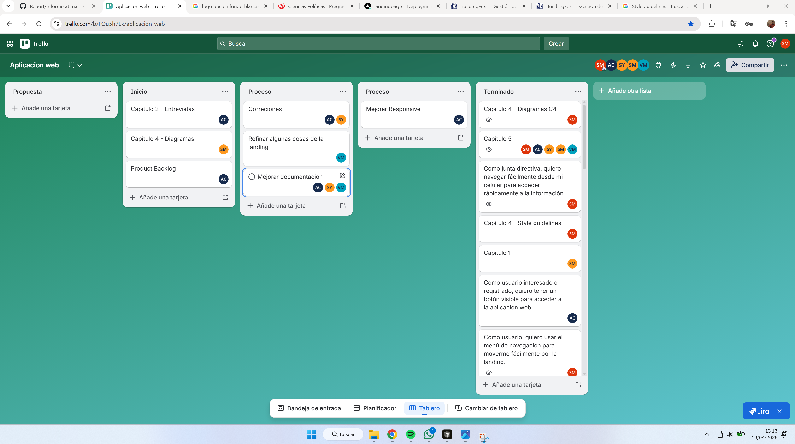

### 5.2.1.4. Development Evidence for Sprint Review

Durante este *Sprint* el equipo avanzó en la **Landing Page de BuildingFex** desarrollada con **Vue.js**: secciones de valor, planes, FAQ, navegación y ajustes de accesibilidad y responsividad según el diseño del Capítulo IV. Los commits del repositorio [BuildingFex/LandingPage](https://github.com/BuildingFex/LandingPage.git) reflejan entregas incrementales y revisión entre pares.

| Repository | Branch | Commit Id | Commit Message | Commit Message Body | Committed on (Date) |
| --- | --- | --- | --- | --- | --- |
| `BuildingFex/LandingPage` | `main` | *(hash)* | `chore(repo): initial project structure` | Estructura inicial de carpetas y assets. | *(fecha)* |
| `BuildingFex/LandingPage` | `feature/landing-sections` | *(hash)* | `feat(landing): add hero and value proposition` | Secciones principales y CTA. | *(fecha)* |
| `BuildingFex/LandingPage` | `feature/landing-sections` | *(hash)* | `feat(landing): add pricing and FAQ sections` | Tabla de planes y preguntas frecuentes. | *(fecha)* |
| `BuildingFex/LandingPage` | `feature/styles` | *(hash)* | `style(landing): responsive layout and tokens` | Ajustes responsive y consistencia visual. | *(fecha)* |
| `BuildingFex/LandingPage` | `feature/i18n` | *(hash)* | `feat(i18n): language toggle and copy` | Soporte de idioma / textos según alcance. | *(fecha)* |
| `BuildingFex/LandingPage` | `main` | *(hash)* | `docs(landing): update README with run instructions` | Documentación de uso y despliegue. | *(fecha)* |


### 5.2.1.5. Execution Evidence for Sprint Review

En este *Sprint* se implementó la **Landing Page de BuildingFex** con **Vue.js**, alineada con las historias US01–US13 del alcance del landing: propuesta de valor, módulos, planes, FAQ, navegación, acceso a la aplicación y uso en móvil. La página es **responsive**, con criterios de accesibilidad y SEO acordes al Capítulo IV, y se publica en **Vercel**.

> **Enlace a la versión desplegada (producción):** [https://landingpage-wine-three.vercel.app/](https://landingpage-wine-three.vercel.app/)

> **Enlace al video de demostración:** *(URL del video acordado con el curso.)*

La evidencia del tablero **Trello** del *Sprint 1* se muestra en **5.2.1.3** (*Sprint Backlog 1*), junto al enlace al tablero.


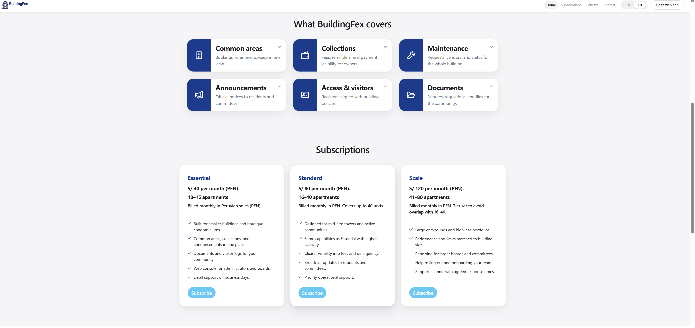

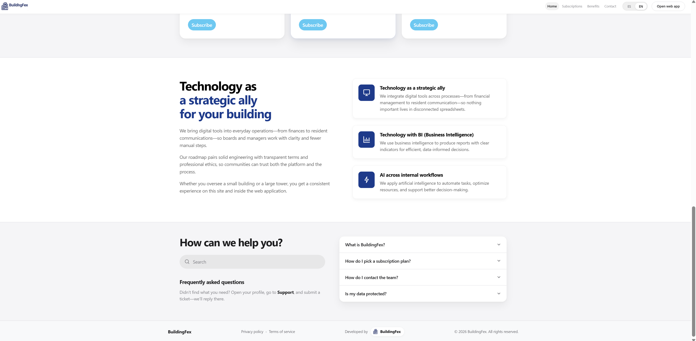

### 5.2.1.6. Services Documentation Evidence for Sprint Review

En la **TB1** el entregable es el *landing* estático; **no aplica** documentación OpenAPI ni exposición de *web services* en producción, porque ese alcance **no forma parte de la TB1**.

### 5.2.1.7. Software Deployment Evidence for Sprint Review

Se configuró un flujo de **CI/CD** con **GitHub** y **Vercel**: el repositorio [BuildingFex/LandingPage](https://github.com/BuildingFex/LandingPage.git) queda vinculado al proyecto en Vercel; cada *push* o *merge* a la rama de producción (p. ej. `main`) dispara el *build* del proyecto **Vue** y el despliegue automático a la URL pública [https://landingpage-wine-three.vercel.app/](https://landingpage-wine-three.vercel.app/). Se utilizó un flujo tipo **GitFlow** o ramas `feature/*` con *pull requests* hacia `main` / `develop` según lo definido por el equipo.

#### 1. Repositorio y ramas

- `main`: versión estable desplegable.
- `develop` *(opcional)*: integración continua.
- `feature/*`: desarrollo por funcionalidad.

#### 2. Integración con Vercel

Configuración típica del proyecto en **Vercel**:

- **Framework preset:** Vue (o Vite según el asistente de importación del repositorio).
- **Rama de producción:** `main` (o la definida en el equipo).
- **Comando de *build*:** `npm run build` (o el script definido en `package.json`).
- **Directorio de salida:** `dist/` (o el que indique la plantilla Vue/Vite del proyecto).
- **Variables de entorno:** en el panel de Vercel si el *landing* las requiere.

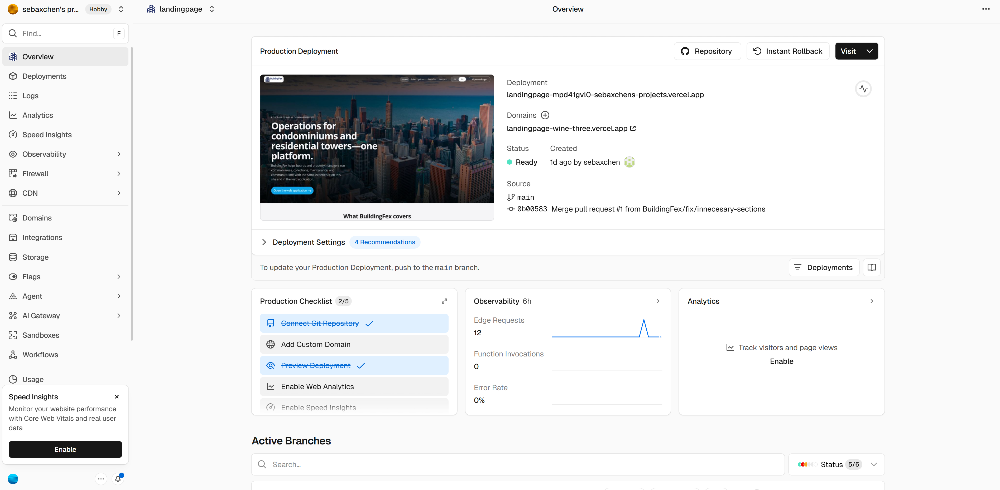


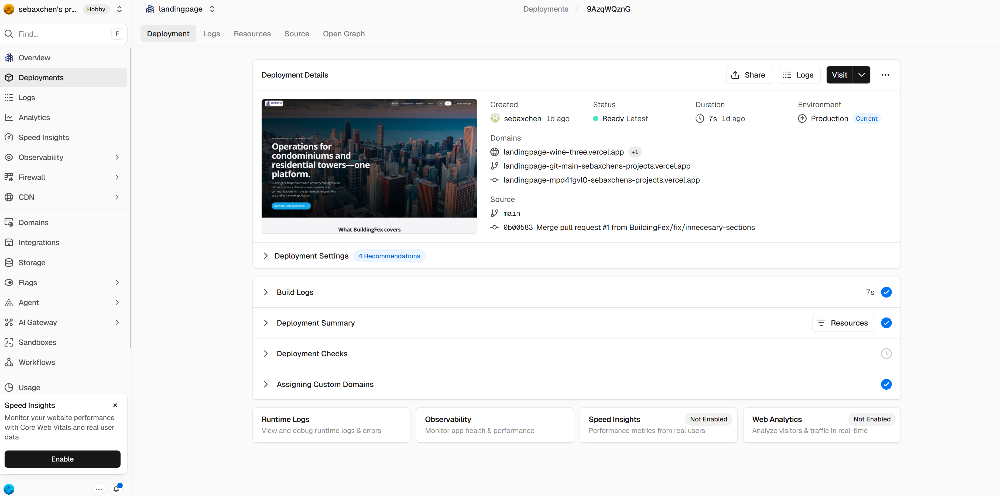

### Sitio desplegado

> **URL de producción:** [https://landingpage-wine-three.vercel.app/](https://landingpage-wine-three.vercel.app/)

El sitio incluye las secciones desarrolladas para la **TB1** dentro del *Sprint 1* (hero, beneficios, planes, FAQ, contacto y enlaces de acceso según diseño), con navegación clara y diseño alineado a **BuildingFex**. El despliegue en Vercel está conectado al código en [https://github.com/BuildingFex/LandingPage.git](https://github.com/BuildingFex/LandingPage.git).

### 5.2.1.8. Team Collaboration Insights during Sprint


## Bibliografía

Enlaces y plataformas utilizadas por el equipo durante el proyecto **BuildingFex** (planificación, código, despliegue y documentación colaborativa).

| Recurso | Enlace |
| --- | --- |
| **Trello** — tablero del *Sprint 1* (TB1) | [https://trello.com/invite/b/69d46e0c565b9336710264c1/ATTIeea024ea9d5c9244fbb7b5b49dad4fe6737FC921/aplicacion-web](https://trello.com/invite/b/69d46e0c565b9336710264c1/ATTIeea024ea9d5c9244fbb7b5b49dad4fe6737FC921/aplicacion-web) |
| **GitHub** — organización BuildingFex | [https://github.com/BuildingFex](https://github.com/BuildingFex) |
| **GitHub** — repositorio del informe (Report) | [https://github.com/BuildingFex/Report.git](https://github.com/BuildingFex/Report.git) |
| **GitHub** — repositorio de la *landing page* (LandingPage) | [https://github.com/BuildingFex/LandingPage.git](https://github.com/BuildingFex/LandingPage.git) |
| **Vercel** — sitio en producción (*landing*) | [https://landingpage-wine-three.vercel.app/](https://landingpage-wine-three.vercel.app/) |
| **Vercel** — plataforma de despliegue | [https://vercel.com/](https://vercel.com/) |
| **Google Docs** — documentos colaborativos | [https://docs.google.com/](https://docs.google.com/) |
| **Google Drive** — almacenamiento y compartición de archivos | [https://drive.google.com/](https://drive.google.com/) |
| **Vue.js** — *framework* del *frontend* | [https://vuejs.org/](https://vuejs.org/) |
| **Vite** — herramienta de desarrollo y *build* | [https://vitejs.dev/](https://vitejs.dev/) |
| **Node.js** — entorno de ejecución JavaScript | [https://nodejs.org/](https://nodejs.org/) |
| **Discord** — comunicación del equipo *(si aplica)* | [https://discord.com/](https://discord.com/) |


---

## Anexos

Compendio de **evidencias gráficas** citadas en el informe. Las figuras **permanecen insertadas en sus capítulos y secciones originales**; aquí solo se listan de nuevo como anexo, con la misma ruta relativa (desde `Informe/README.md`).

### Anexo A — Portada e identificación

- 

### Anexo B — Colaboración en repositorios (TB1)

- 
- 
- 
- 
- 
- 

### Anexo D — Registro visual de entrevistas

- 
- 
- 
- 
- 
- 

### Anexo E — Needfinding, mapas y *Event Storming* (As-Is)

- 
- 
- 
- 
- 
- 
- 
- 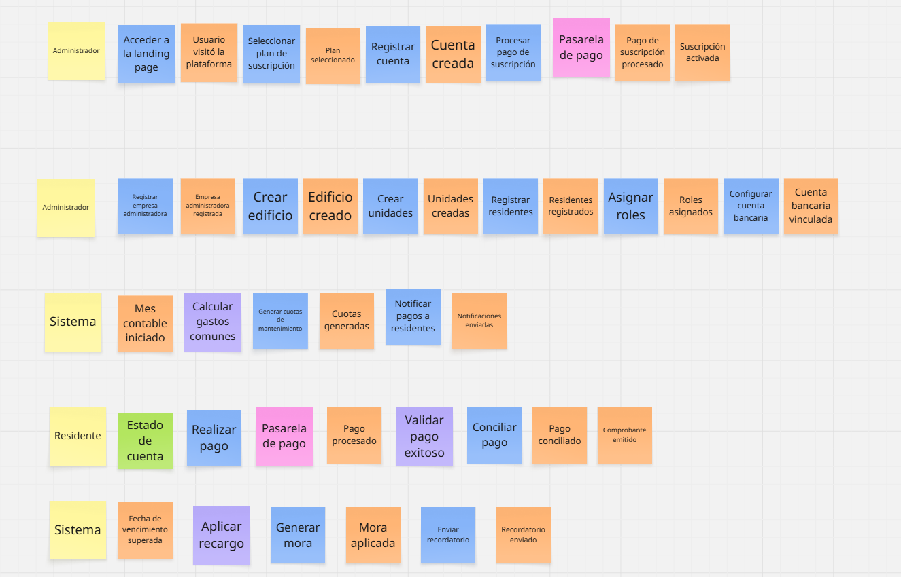
- 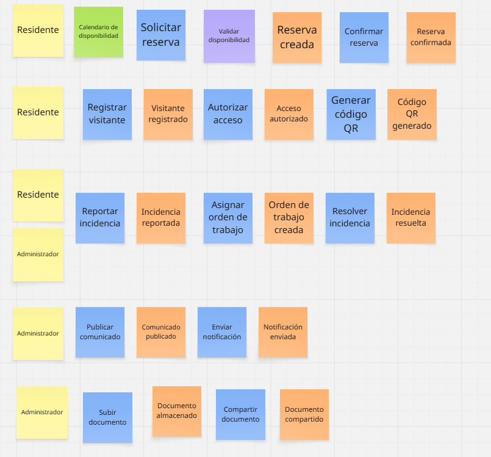
- 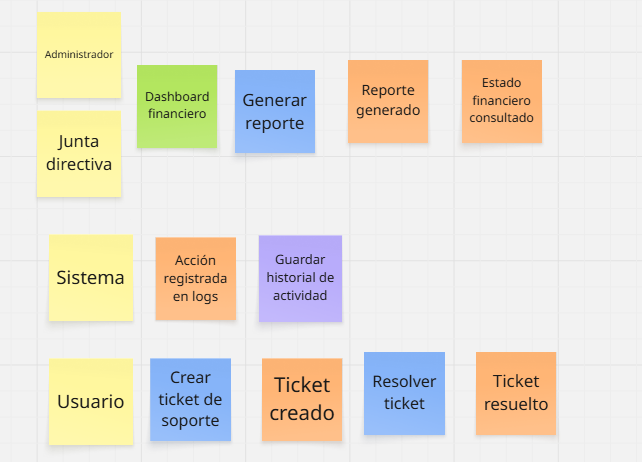
- 

### Anexo F — *Style guidelines* y secciones de *landing*

- 
- 
- 
- 
- 
- 
- 
- 
- 
- 
- 
- 
- 

### Anexo G — *Wireframes*, *wireflow* y *mock-ups* (aplicación web)

- 
- 
- 
- 
- 
- 
- 
- 
- 
- 
- 
- 
- 
- 
- 
- 
- 
- 
- 
- 
- 

### Anexo H — Arquitectura de software y modelo de datos

- 
- 
- 
- 
- 
- 
- 
- 
- 

### Anexo I — Evidencias del *Sprint 1* (TB1): Trello, *landing* desplegada y Vercel

- 
- 
- 
- 
- 
- 
- 