**Capítulo IV: Product Design**

**4.1. Style Guidelines**

En esta sección se define un repositorio centralizado y debidamente organizado para el uso de todo el equipo, el cual incluye recursos como assets, tipografías y demás elementos necesarios. Su finalidad es asegurar una presentación coherente, estandarizada y alineada en todo el proyecto.

**4.1.1. General Style Guidelines**

Buscamos transmitir **transparencia, solidez y eficiencia**. Para reflejar la idea de una gestión inmobiliaria moderna y una administración libre de conflictos, integramos una identidad visual basada en estructuras arquitectónicas y una paleta de colores que proyecta profesionalismo y autoridad en el manejo de activos y finanzas.

La identidad visual de **BuildingFex** se construye sobre la base de:

- **Misión:** Transformar la administración de condominios y edificios en una experiencia digital eficiente, transparente y automatizada, permitiendo a las administradoras escalar su gestión y a los residentes disfrutar de una convivencia organizada y moderna.
- **Visión:** Consolidarnos como la plataforma SaaS líder en el mercado inmobiliario peruano, reconocida por integrar innovación tecnológica y transparencia financiera que impacte positivamente en la plusvalía de los inmuebles y la armonía de las comunidades.

**Logo**

El logotipo de **BuildingFex** proyecta una imagen de **seguridad, estabilidad y orden**. Utiliza una iconografía de líneas geométricas que forman la silueta de torres residenciales, simbolizando el respaldo tecnológico a la infraestructura física. Se emplean tonos azul oscuro para reforzar el profesionalismo y la confianza en la gestión de fondos comunes.


**Typography**

La tipografía debe transmitir **claridad, modernidad y precisión**, elementos vitales al manejar estados de cuenta y registros de seguridad. Por esta razón, hemos seleccionado **Montserrat** y **Inter**:

- **Montserrat** → Para títulos, encabezados y mensajes de marca. Su estructura geométrica refleja solidez y una estética de software B2B moderno.
- **Inter** → Para párrafos, tablas de datos, formularios y texto funcional. Fue elegida por su altísima legibilidad en pantallas y dispositivos móviles, facilitando la lectura de cifras financieras y avisos oficiales.

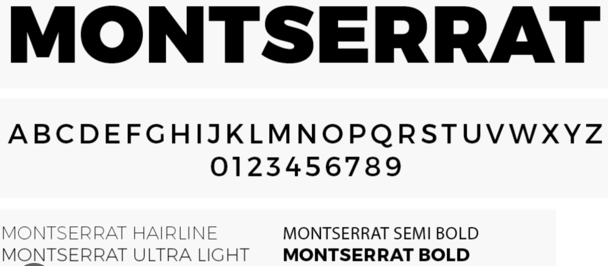

**Tipografía de Diseño (Font Scale)**

| **Tipo de Texto** | **Fuente** | **Tamaño** | **Peso** |
| --- | --- | --- | --- |
| **Display 1** | Inter | 54px | Bold |
| **Display 2** | Inter | 48px | Bold |
| **Heading 1** | Poppins | 32px | Bold |
| **Heading 2** | Inter | 28px | Bold |
| **Heading 3** | Inter | 24px | SemiBold |
| **Heading 4** | Inter | 20px | SemiBold |
| **Paragraph 1** | Inter | 18px | Bold |
| **Paragraph 2** | Inter | 16px | Bold |
| **Text** | Inter | 16px | Regular |
| **Text Small** | Inter | 12px | Light |

**Colors**

Elegimos los siguientes colores buscando plasmar una paleta que influya **seguridad, calma y profesionalismo**:

- **Base**: `#F5F5F5` → Fondo neutro, limpio y profesional.
- **Muted**: `#CCD0DA` → Gris suave para elementos secundarios.
- **CC Bold Green**: `#36837B` → Verde profundo para estados positivos y acciones principales.
- **CC Green**: `#26B5A6` → Verde vibrante para alertas de éxito y botones CTA.
- **CC Red**: `#E63946` → Rojo para alertas críticas y errores.
- **CC Dark Blue**: `#1A2A33` → Azul oscuro para textos importantes y encabezados.
- **Text Primary**: `#0D0D0D` → Negro para texto principal.
- **Text Secondary**: `#333333` → Gris oscuro para subtítulos.
- **Text Secondary-2**: `#FAFAFF` → Blanco para textos sobre fondos oscuros.
- **Text CC**: `#416072` → Azul grisáceo para etiquetas y estados.
- **Text CC (alerta)**: `#F66D77` → Rosa rojizo para notificaciones de riesgo.

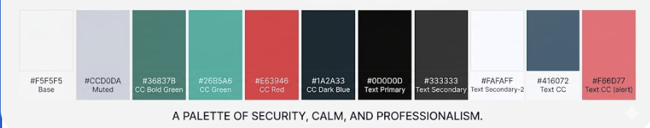

**Spacing**

En este proyecto el espaciado cumple un papel clave para mantener la **legibilidad, accesibilidad y equilibrio visual**. Por ello:

- **Párrafos:** Se añade un espacio de 16px entre líneas y 24px entre párrafos.
- **Elementos interactivos:** 8px–12px de separación entre botones, enlaces u otros componentes.
- **Márgenes y padding:** 16px–24px alrededor del contenido para evitar saturación visual.
- **Base modular:** Sistema de espaciado en múltiplos de 8px para consistencia en todas las vistas.

**Communication Tone**

| **Dimensión** | **Nivel Adoptado** |
| --- | --- |
| Divertido/Serio | Medio-Serio |
| Formal/Casual | Semi-Formal |
| Respetuoso/Irreverente | Muy Respetuoso |
| Entusiasta/Sereno | Sereno y Empático |

Decidimos mantener una comunicación **clara, cálida y profesional**, porque este enfoque nos permite conectar de manera efectiva con el público, usamos lenguaje humano, evitamos tecnicismos innecesarios y priorizamos la empatía en cada mensaje.

**4.1.2. Web Style Guidelines**

Para garantizar que la plataforma se adapte a diferentes tamaños de pantalla (Desktop, Tablet, Mobile), se empleará **CSS con media queries**. Esto permite que la barra de navegación y los dashboards financieros se ajusten automáticamente.

**Principios de Interacción:**

- **Jerarquía visual clara:** Las métricas de morosidad y estados de cuenta siempre visibles.
- **Acciones prioritarias:** Botones de **"Registrar Pago"**, **"Generar Invitación QR"** y **"Reservar Área Común"** con alto contraste.
- **Navegación intuitiva:** Menú superior/lateral con acceso a Dashboard, Unidades, Cobranzas, Visitas y Reportes.
- **Feedback visual (Chips de estado):**
    - **Verde (#26B5A6):** Cuota pagada / Espacio disponible.
    - **Rojo (#E63946):** Unidad morosa / Incidencia crítica.
    - **Azul (#416072):** Trámite en proceso.

| **Dispositivo** | **Ancho mínimo** | **Ejemplo de uso** |
| --- | --- | --- |
| Mobile | ≥ 320px | Teléfonos |
| Tablet | ≥ 768px | iPad / tablets genéricas |
| Laptop | ≥ 1024px | Monitores y laptops |
| Wide Screen | ≥ 1440px | Pantallas grandes o TV |

La interfaz prioriza:

- **Jerarquía visual clara**: Alertas y métricas vitales siempre visibles.
- **Acciones prioritarias**: Botones de “Registrar ”, “Ver alertas críticas” y “Comunicar ” con alto contraste.
- **Navegación intuitiva**: Menú superior con acceso rápido a Dashboard, , Alertas, Reportes y Configuración.
- **Feedback visual**: Chips de estado (verde = estable, amarillo = advertencia, rojo = crítico) y animaciones sutiles para confirmaciones.

**4.2. Information Architecture**

**4.2.1. Organization Systems**

Nuestro propósito es garantizar una **experiencia de usuario coherente, intuitiva y sin fricciones** en la plataforma web, adaptada a las necesidades de nuestros dos segmentos principales: **Administradores/Juntas de Propietarios** y **Residentes**.

La estructura visual ha sido diseñada estratégicamente para facilitar el **control financiero transparente**, la **seguridad en los accesos** y la **gestión de activos comunes** de manera eficiente.

Para lograr esto, aplicamos los siguientes sistemas:

1. **Organización Jerárquica:** El contenido se despliega desde lo general (Dashboard del edificio) hacia lo particular (Detalle de una unidad o historial de un residente).
2. **Organización por Audiencia:** * **Vista Administrador:** Enfocada en la gestión masiva de datos, reportes financieros y configuración de edificios.
    - **Vista Residente:** Simplificada para el autoservicio (pagos, reservas y consultas de documentos).
3. **Organización Secuencial:** Flujos paso a paso para procesos críticos como el **Módulo de Cobranza** o el **Módulo de Gestión de Incidencias**, asegurando que no se omitan pasos importantes en la trazabilidad.

**Flujo de Usuario de funcionalidades** 

La arquitectura de **BuildingFex** ha sido diseñada para optimizar la operatividad del administrador y facilitar el autoservicio del residente, estructurándose de la siguiente manera:

- **Landing Page:** Punto de entrada para nuevos clientes (administradoras y juntas). Presenta la propuesta de valor basada en transparencia financiera, beneficios de automatización y llamados a la acción (CTA) para seleccionar un plan (Essential, Standard, Scale).
- **Inicio de Sesión / Registro:**
    - **Crear cuenta manual:** Formulario para administradores y residentes con validación de unidad (torre/departamento).
    - **Registro con Google:** Opción rápida para acceso de residentes.
    - **Validación de identidad:** Registro de DNI y verificación para garantizar que solo propietarios u ocupantes autorizados accedan a la información del edificio.
- **Dashboard (Residente):**
    - **Gestión de pagos:** Visualización de recibos de mantenimiento y botones de pago.
    - **Reservas:** Calendario de áreas comunes (parrillas, SUM, gimnasio).
    - **Seguridad:** Generación de códigos QR para pre-registro de visitas.
    - **Comunicación:** Acceso a anuncios oficiales y documentos del condominio.
- **Dashboard (Administrador):**
    - **Consola de edificios:** Vista de todas las torres y unidades bajo su gestión.
    - **Control de morosidad:** Filtros por niveles de deuda y alertas de cobro.
    - **Monitoreo de incidencias:** Gráficos de tickets de mantenimiento internos pendientes.
    - **Gestión financiera:** Generación masiva de reportes y estados de cuenta en PDF.
- **Perfil y Preferencias:**
    - **Configuración de la unidad:** Actualización de datos de contacto y vehículos.
    - **Idioma y accesibilidad:** Ajuste de interfaz (EN/ES) y preferencias de lectura.
    - **Gestión de notificaciones:** Configuración de alertas por correo o push para avisos de cobranza.
- **Soporte y Tutoriales:**
    - **Guías interactivas:** Tutoriales sobre cómo reservar áreas o pagar cuotas.
    - **FAQ:** Preguntas frecuentes sobre el uso de la plataforma.
    - **Soporte Técnico (Help Desk):** Contacto directo para incidencias con la herramienta BuildingFex.

Este flujo garantiza que los **residentes** tengan el control total sobre sus obligaciones y beneficios, y que los **administradores** tomen decisiones informadas, logrando una gestión transparente y eficiente.

**4.2.2. Labeling Systems**

Los sistemas de etiquetado de **BuildingFex** siguen una estructura clara, consistente y centrada en el lenguaje del administrador y el residente. Se priorizan verbos de acción y sustantivos comprensibles para evitar confusiones en la gestión financiera.

**Navegación principal (App):**

| **Sección** | **Contenido** |
| --- | --- |
| **Inicio** | Panel principal con métricas de cobranza y alertas de seguridad. |
| **Pagos** | Registro de cuotas de mantenimiento, historial y comprobantes. |
| **Reservas** | Calendario de áreas comunes (SUM, parrillas, gimnasio). |
| **Visitas** | Registro de invitados, generación de códigos QR y autorizaciones. |
| **Incidencias** | Reporte de fallas (mantenimiento) y seguimiento de reparación. |
| **Documentos** | Actas de junta, reglamentos internos y estados financieros. |
| **Comunicados** | Avisos oficiales de la administración y noticias del edificio. |
| **Perfil** | Datos de la unidad, vehículos registrados y configuración. |

**Call to Action (CTA):**

- **Para Residentes:** “Pagar mantenimiento”, “Reservar área”, “Invitar visita”, “Reportar falla”.
- **Para Administradores:** “Generar recibos”, “Ver morosidad”, “Aprobar gasto”, “Publicar aviso”.

**4.2.3. SEO Tags and Meta Tags**

La **Landing Page** está diseñada para atraer a empresas administradoras y juntas de propietarios. Las etiquetas se centran en captar tráfico interesado en **administración de edificios, software para condominios y transparencia financiera**.

HTML

```
<title>BuildingFex – Software SaaS para Administración de Edificios</title>

<meta name="description" content="BuildingFex es la plataforma integral que automatiza la cobranza de mantenimiento, gestiona reservas de áreas comunes y mejora la transparencia en condominios y edificios residenciales.">

<meta name="keywords" content="administración de edificios, software condominios, gestión inmobiliaria, cuotas de mantenimiento, control de visitas, reserva de áreas comunes, transparencia financiera, SaaS inmobiliario Perú">

<meta name="author" content="Startup BuildingFex – Equipo 1ASI0730">
```

### 4.2.4. Searching Systems

**BuildingFex** incorpora sistemas de búsqueda y filtrado inteligentes diseñados para que administradores y residentes encuentren registros financieros o de seguridad de forma rápida.

- **Búsqueda global en registros:** Disponible en el dashboard de ambos roles. Permite buscar por fecha, número de unidad (departamento), tipo de concepto (mantenimiento, multas, reservas) o nombre de propietario.
- **Filtros avanzados por contexto:**
    - **Administradores:** Filtrar unidades por nivel de morosidad, filtrar gastos por proveedor o filtrar incidencias por estado (pendiente, en proceso, resuelto).
    - **Residentes:** Filtrar historial de pagos por año o filtrar disponibilidad de áreas comunes por tipo de espacio.
- **Panel interactivo con selección visual:** Los administradores pueden interactuar con los gráficos de morosidad para seleccionar un mes específico y ver el listado detallado de unidades deudoras automáticamente.

**4.2.5. Navigation Systems**

La navegación de **BuildingFex** es intuitiva y adaptable, priorizando las tareas críticas según el rol del usuario.

**Estructura de la Landing Page:**

- **Inicio:** Propuesta de valor y CTAs de registro.
- **Soluciones:** Detalle de módulos (Cobranzas, Seguridad, Reservas).
- **Planes:** Tabla comparativa: **Essential, Standard y Scale**.
- **Testimonios:** Experiencias de juntas de propietarios y administradores.
- **Contacto:** Soporte técnico y ventas.

**Navegación en la Aplicación (por rol):**

- **Para Residentes (Barra inferior en móvil):** Inicio (Dashboard), Pagos (Finanzas), Reservas (Calendario), Visitas (QR) y Soporte.
- **Para Administradores (Sidebar lateral en Web):** Dashboard, Gestión de Unidades, Cobranzas, Proveedores, Reportes y Auditoría.

**CTAs estratégicos:**

- **Color Teal (#26B5A6):** Acciones principales de éxito (Registrar pago, Autorizar visita).
- **Color Rojo (#E63946):** Acciones de riesgo o críticas (Eliminar registro, Reportar incidencia urgente).
- **Ubicación fija:** Botones flotantes para acciones rápidas como "Generar QR" para el residente.

**Beneficio clave:** Reduce el tiempo de gestión administrativa, evita errores en la conciliación de pagos y permite que el residente complete sus obligaciones en menos de 3 clics.

# FALTA

**4.3. Landing Page UI Design**

La interfaz de la **Landing Page de BuildingFex** es clave para el proyecto, pues constituye la primera impresión del producto ante administradores y juntas de propietarios. Su diseño limpio, moderno y funcional transmite **confianza, solidez y profesionalismo** —valores esenciales en la gestión inmobiliaria y financiera—, combinando una tipografía clara (**Poppins e Inter**), una paleta de colores en tonos **Deep Navy y Teal**, y botones estratégicos que destacan las acciones principales según el plan elegido. Esta estructura estética y técnica atrae de inmediato a los visitantes, proyectando una plataforma SaaS robusta y confiable que los impulsa a digitalizar la administración de sus edificios.

**4.3.1. Landing Page Wireframe**

> ** Enlace al prototipo interactivo en Figma:**
> 
> 
> [https://www.figma.com/design/TQT3UEzzMXhelZfd0bPylJ/ChroniCare?node-id=0-1&t=eNHIEflEvJ79drV8-1](https://www.figma.com/design/0k3SyuVUNtf05VdscXvbR2/Sin-t%C3%ADtulo?node-id=0-1&t=4PVAGkbTTyat0EHZ-1)
> 

Los wireframes representan la estructura básica y funcional de la landing page de **BuildingFex**, abstrayendo los elementos visuales finales para centrarse en la arquitectura de la información. Su objetivo es definir la jerarquía de contenido, estableciendo dónde se ubicarán las propuestas de valor, la tabla de planes (**Essential, Standard, Scale**) y los flujos de navegación hacia el registro de administradores y residentes.

Esta etapa es fundamental para validar la disposición de los componentes clave, como el menú de navegación adaptativo y las secciones de beneficios, asegurando que el mensaje de **transparencia y eficiencia** sea el foco principal antes de la aplicación de la identidad visual y los estilos finales.

---

**Header y Hero**

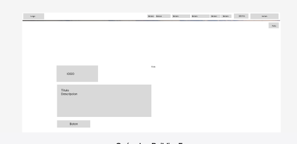

*Define la primera impresión del usuario: logo, menú de navegación, llamado a acción principal  y espacio para imagen/video hero. Diseñado para captar atención en menos de 3 segundos y comunicar el valor central: prevención, adherencia y cuidado continuo.*

---

**¿Qué es BuildingFex?**


*Sección explicativa que comunica el propósito : conectar clientes y para mejorar la adherencia, prevenir complicaciones.*

---

**Funcionalidades Clave**

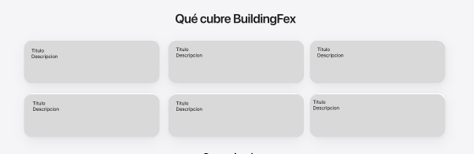

*Usa tarjetas modulares con ícono, título y descripción corta.*

---

**Footer**

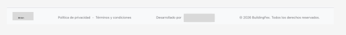

*Contiene enlaces legales (Términos, Privacidad), contacto y logos de alianzas con instituciones de. Es la base de confianza y cierre de la página.*

---

**4.3.2. Landing Page Mock-up.**

> **🔗 Enlace al diseño final en Figma:**
> 
> 
> [https://www.figma.com/design/TQT3UEzzMXhelZfd0bPylJ/ChroniCare?node-id=0-1&t=eNHIEflEvJ79drV8-1](https://www.figma.com/design/0k3SyuVUNtf05VdscXvbR2/Sin-t%C3%ADtulo?node-id=0-1&t=4PVAGkbTTyat0EHZ-1)
> 

Los mock-ups son la versión visual final de la landing page, con colores, tipografías, imágenes reales y microinteracciones definidas. Representan la identidad de marca y la experiencia estética que el usuario final verá: **calma, confianza, claridad y cuidado humano**.

---

**Header y Hero**

*Header con fondo suave en tonos teal y blanco Tipografía Poppins en negrita para el título principal, botón CTA en teal (#26B5A6) con hover effect y sombra sutil. Transmite seguridad, accesibilidad y acompañamiento.*

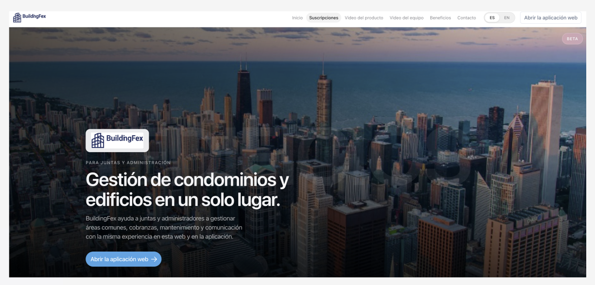

---

**¿Qué es BuildingFex?**

*Diseño limpio  gradientes suaves y tarjetas con bordes redondeados.  Comunica empatía, prevención y tecnología al servicio .*

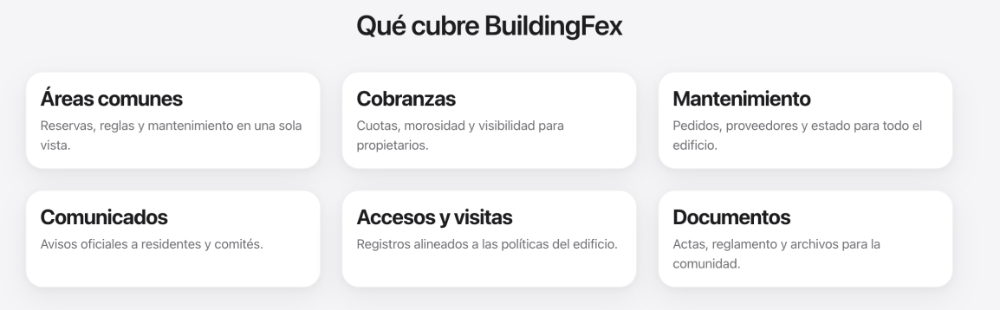

---

**Metodo de ingreso**

 Cards con todos nuestros planes de pago. con pequeños detalles que resaltan la profesionalidad del sitio. 

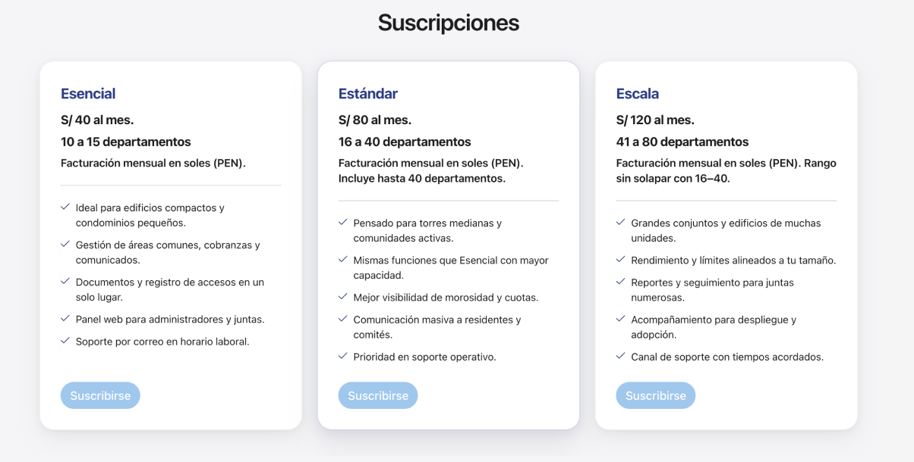

---

**Videos sobre el equipo y el producto** 

Se podrán visualizar los espacios donde estaran los videos sobre el producto y el equipo de desarrollo.

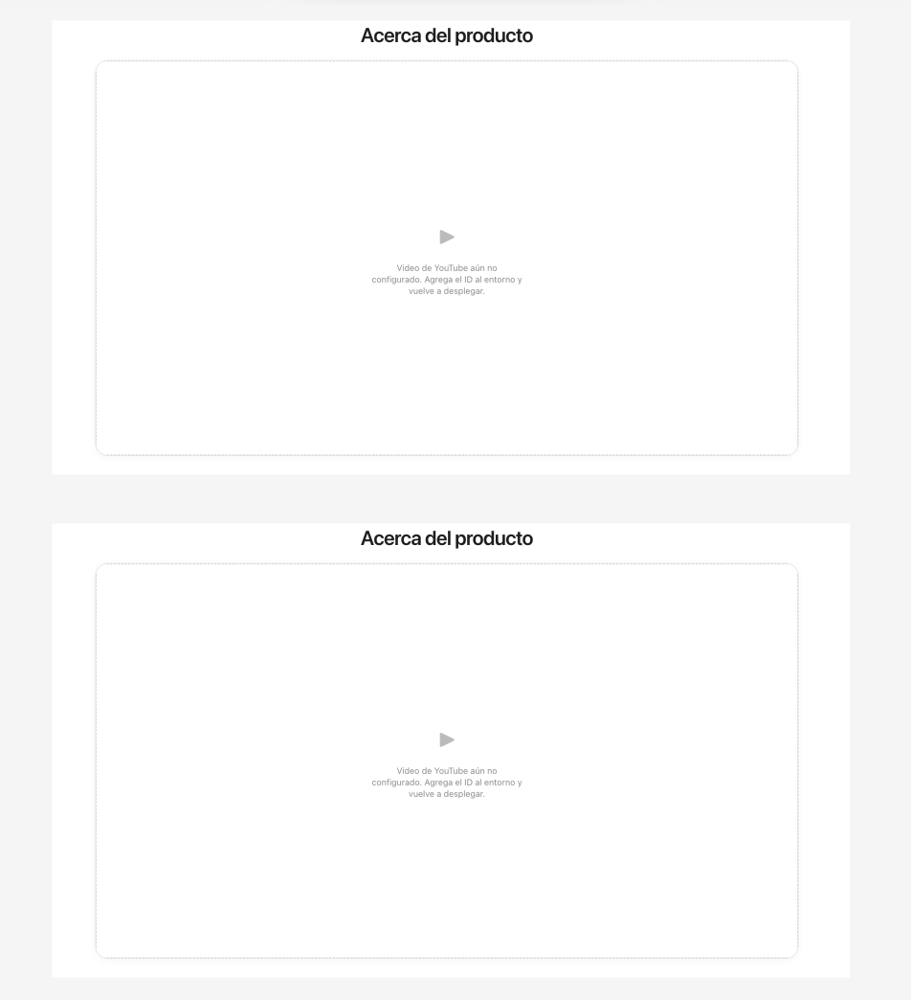

---

**Puntos Fuertes**

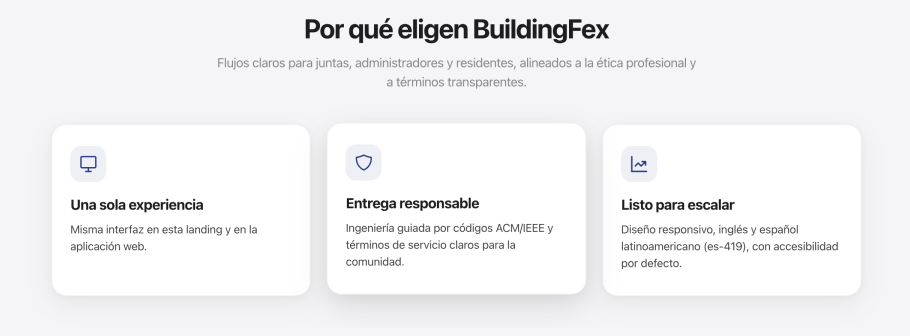

Sección de cards explicando al cliente por que somos mejores que la competencia.

---

**Preguntas** 

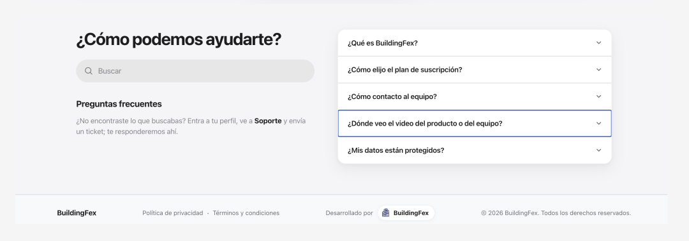

Se ve un buen diseño en la sección de preguntas con la barra de búsqueda a la izquierda y las preguntas a la derecha con pequeños detalles que resaltan el interfaz. 

## **4.4. Web Applications UX/UI Design.**